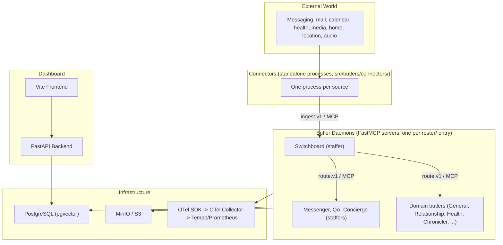

# Component Inventory

Every runtime piece in Butlers, what it owns, and its current stability. This is a snapshot:
a PR that adds or removes a butler, module, connector, port, or compose service updates this file
and [`deployment.md`](deployment.md) in the same change. Where an inventory would drift, this file
points at the authoritative listing instead of copying it.

---

## High-Level View

The roster is `ls roster/` (each directory with a `butler.toml`); staffers are the entries with
`type = "staffer"`.

---

## 1. Core Daemon (`src/butlers/daemon.py`)

The ButlerDaemon is the process-level orchestrator for a single butler. Every
butler in the roster runs one daemon instance.

| Sub-component | Source | Responsibility | Stability |
|---|---|---|---|
| **Spawner** | `core/spawner.py` | Generates ephemeral MCP configs, invokes LLM CLI via runtime adapter, enforces per-butler and global concurrency caps, logs sessions. | Stable |
| **Scheduler** | `core/scheduler.py` | Cron-driven task dispatch. Syncs TOML schedule definitions to DB on startup. Internal asyncio tick loop fires due tasks. | Stable |
| **State Store** | `core/state.py` | Key-value JSONB store. Arbitrary per-butler state accessible via MCP tools. | Stable |
| **Session Log** | `core/sessions.py` | Append-only record of every LLM CLI invocation: trigger source, duration, token counts, cost, tool calls. | Stable |
| **Runtime Config** | `core/runtime_config.py` | Per-butler `runtime_config` DB table and `RuntimeConfigAccessor`. Seeded from `[butler.runtime_seed]` in `butler.toml` on first boot; managed thereafter via dashboard. Holds cold fields (`core_groups`, `max_concurrent`, `max_queued`, TTL-cached, restart required) alongside hot fields (`catalog_read_sensitivity`, `tool_exposure_policy`) that apply to the next call or planned session without a restart; `tool_exposure_policy` is read per attempt via `get_tool_exposure_policy()`, which bypasses the TTL cache so a committed PATCH is visible even when the API and daemon are separate processes. Model selection fields (`model`, `runtime_type`, `args`, `session_timeout_s`) moved to `public.model_catalog` in migration `core_073`, resolved per complexity tier by `core/model_routing.py`. | Stable |
| **Route Inbox** | `core/route_inbox.py` | Durable work queue for async route dispatch. Persists `route.execute` payloads before returning `accepted`; fenced claims guard processing and ordinary recovery. Reclaimed dashboard processing work becomes ambiguous rather than automatically replaying an unprovable predecessor. | Stable |
| **Model Routing** | `core/model_routing.py` | Catalog-based dynamic model selection with per-butler overrides. Complexity tiers (trivial through discretion) map to model/runtime pairs. Token quota enforcement. | Maturing |
| **Runtime Adapters** | `core/runtimes/` | Pluggable adapters for Claude Code, Codex, Gemini, and OpenCode. Each adapter knows how to build CLI arguments, parse output, and extract cost data. | Maturing |
| **Healing substrate** | `core/healing/` | Error fingerprinting, severity scoring, `public.healing_attempts` CRUD and gates, worktree lifecycle, anonymizer, and the 10-gate dispatch engine used by QA (§4b). | Evolving |
| **Buffer** | `core/buffer.py` | In-memory queue with durable cold-path scanner for backpressure management. Switchboard ingestion hot path. | Stable |
| **Telemetry** | `core/telemetry.py` | OpenTelemetry tracing initialization. Single TracerProvider shared across all butlers in-process. TRACEPARENT propagation to spawned LLM sessions. | Stable |
| **Metrics** | `core/metrics.py` | OTel metric instruments for spawner concurrency, buffer health, route accept/process latency, scheduler dispatch, ingest outcomes, and durable domain-event delivery failures. | Maturing |
| **Skills** | `core/skills.py` | Discovers skill directories under `roster/{butler}/.agents/skills/`, reads system prompts, and injects them into spawned sessions. | Stable |
| **Audit** | `core/audit.py` | Append-only audit trail for security-relevant operations (tool gating, credential access). | Evolving |

### What the daemon owns

- Its FastMCP SSE/HTTP server on the configured port
- Its asyncpg connection pool scoped to its database schema
- Its scheduler loop and liveness reporter
- MCP client connection to the Switchboard (non-switchboard butlers)
- Module lifecycle (startup in topological order, shutdown in reverse)

---

## 2. Modules (`src/butlers/modules/`)

Modules are opt-in capability units. Each implements the `Module` ABC from
`modules/base.py` and adds domain-specific MCP tools without touching core
infrastructure. Dependencies between modules are resolved via topological sort
at startup.

The shared module set is `ls src/butlers/modules/`; which butler loads which module is the
`[modules.*]` tables in each `roster/{butler}/butler.toml`. For what each module provides, see
[`docs/modules/`](../../docs/modules/) (memory: [`docs/modules/memory.md`](../../docs/modules/memory.md),
which defines episodes, facts, and rules). `modules/registry.py` scans both
`src/butlers/modules/` and `roster/*/modules/` and orders startup by dependency.

### Roster-specific modules

Butlers in the roster can define their own modules under `roster/{butler}/modules/`.
These are discovered at startup by the registry via synthetic module names
(`butlers.modules._roster_{butler}`).

---

## 3. Connectors (`src/butlers/connectors/`)

Connectors are standalone processes that bridge external event sources to the
Switchboard. They are transport-only adapters: they normalize events to the
`ingest.v1` envelope format and submit via MCP. They do not classify or route.

The connector set is `ls src/butlers/connectors/` (one entry-point module or package per
source) and the connector services in `docker-compose.yml`. Health ports are in
[`deployment.md` §Port Assignments](deployment.md#port-assignments).

### Shared connector infrastructure

| Component | Source | Responsibility |
|---|---|---|
| **CachedMCPClient** | `connectors/mcp_client.py` | Reusable MCP client with lazy connect, health-check, and retry. All connectors use this to reach the Switchboard. |
| **Heartbeat** | `connectors/heartbeat.py` | Background task reporting liveness and operational stats to the Switchboard connector registry. Stable instance_id, configurable interval. |
| **ConnectorMetrics** | `connectors/metrics.py` | Prometheus counters/histograms for connector-level observability. |
| **CursorStore** | `connectors/cursor_store.py` | Durable checkpoint persistence for restart-safe resume. |
| **Discretion** | `connectors/discretion.py` | LLM-based filter evaluating messages in sliding context window. Fail-open. Owner messages bypass. |
| **DiscretionDispatcher** | `connectors/discretion_dispatcher.py` | Dispatches discretion calls to the configured LLM backend. |
| **FilteredEventBuffer** | `connectors/filtered_event_buffer.py` | Buffering layer between connector poll loop and MCP submission. |
| **GmailPolicy** | `connectors/gmail_policy.py` | Gmail-specific ingestion policy (label filtering, sender rules). |
| **HealthSocket** | `connectors/health_socket.py` | HTTP health/readiness endpoint shared by all connectors. |

---

## 4. Switchboard (`roster/switchboard/`)

The Switchboard is a special butler that serves as the central ingress router.
It runs as a standard ButlerDaemon with additional Switchboard-specific tools.

| Sub-component | Source | Responsibility | Stability |
|---|---|---|---|
| **Ingestion API** | `tools/ingestion/ingest.py` | Accepts `ingest.v1` envelopes from connectors. Entry point for all external events. | Stable |
| **Triage / Thread Affinity** | `tools/triage/thread_affinity.py` | Assigns incoming messages to existing conversation threads or creates new ones. | Maturing |
| **Classifier** | `tools/routing/classify.py` | LLM-based message classification. Determines target butler using capability matching, intent detection, and regex heuristics. | Maturing |
| **Router** | `tools/routing/route.py` | Dispatches classified messages to target butler via MCP `route.execute` call. | Stable |
| **Contracts** | `tools/routing/contracts.py` | Pydantic models for `ingest.v1` and `route.v1` envelope schemas. Defines source channels, providers, notify channels, and policy tiers. | Stable |
| **Butler Registry** | `tools/registry/` | Tracks which butlers are online, their capabilities, and liveness state. Eligibility sweep job. | Maturing |
| **Connector Registry** | `tools/connector/` | Tracks connector instances, heartbeats, and health state. | Maturing |
| **Identity Resolution** | `tools/identity/` | Maps channel identifiers to known contacts before routing. | Stable |
| **Notification** | `tools/notification/` | Outbound message delivery (Telegram, email) via `notify()` tool. | Stable |
| **Dead Letter** | `tools/dead_letter/` | Captures unroutable or failed messages for later inspection. | Evolving |
| **Extraction** | `tools/extraction/` | Structured data extraction from ingested content. | Evolving |
| **Backfill** | `tools/backfill/` | Historical message ingestion replay. | Evolving |
| **Operator** | `tools/operator/` | Administrative tools for Switchboard management. | Evolving |

---

Voice egress: Draft, see [RFC 0034](../legends-and-lore/rfcs/0034-messenger-voice-egress.md);
no topology yet.

---

## 4a. Chronicler (`roster/chronicler/`)

The Chronicler is a domain butler that reconstructs past time from
already-captured evidence across the ecosystem. It owns retrospective time
reconstruction with point events, overlapping episodes, correction overlays,
and source projection adapters. It is routing-eligible (Switchboard routes
explicit retrospective requests to it) but does not ingest externally, plan,
schedule, dispatch, or notify. Per RFC 0014.

| Sub-component | Source | Responsibility | Stability |
|---|---|---|---|
| **Source Adapters** | `src/butlers/chronicler/adapters/` | Per-source projection adapters (one module per source). Reads from approved migration-tracked source surfaces via scheduled jobs. No LLM per-event invocation. | Maturing |
| **Point Events Store** | `chronicler` schema | Stores instantaneous evidence with source provenance, precision, privacy, retention, and tombstone support. Idempotent replay via `(source_name, source_ref)` key. | Maturing |
| **Episodes Store** | `chronicler` schema | Stores span-shaped evidence. Overlapping episodes from different sources are preserved without merging. | Maturing |
| **Correction Overlay** | `chronicler.overrides` | User corrections layer on top of canonical projections without mutating canonical rows. Later override wins. | Maturing |
| **Chronicler API** | `roster/chronicler/api/` | Auto-discovered routes under `/api/chronicler/*`: events, episodes, episode detail, episode events, episode corrections, source-state, aggregate/by-category, aggregate/by-day, aggregate/day-close (GET), aggregate/day-close/refresh (POST). Distinct from the operational `/api/timeline` route. | Maturing |

---

## 4b. QA Staffer (`roster/qa/`)

The QA Staffer is a permanently-running infrastructure agent (type =
`"staffer"`) that acts as the system-wide SRE for the Butlers ecosystem. It
owns the patrol loop lifecycle, pluggable discovery source architecture, and
the unified quality assurance function: it discovers errors across multiple
channels, triages and deduplicates findings, dispatches investigation agents,
and raises anonymized PRs. It is excluded from user-message routing and daily
briefing contributions per the staffer archetype contract.

| Sub-component | Source | Responsibility | Stability |
|---|---|---|---|
| **Patrol Loop** | `src/butlers/core/qa/` | Scheduler-driven cycle (default 10 min). Creates a `public.qa_patrols` record, polls all enabled discovery sources, passes combined findings through triage, dispatches novel investigations up to concurrency cap, and updates the patrol record. Includes overlap prevention and crash recovery. | Maturing |
| **Discovery Sources** | `src/butlers/core/qa/sources/` | Pluggable `DiscoverySource` protocol. Ships with three v1 sources: `log_scanner` (reads `logs/butlers/`, `logs/connectors/`, `logs/uvicorn/` for ERROR/WARNING entries), `session_records` (queries `public.v_qa_recent_failures` SQL view), `butler_reports` (reactive in-memory buffer drained from `report_finding` MCP tool calls). All sources use tool-based filtering (no LLM per-event invocation). | Maturing |
| **Triage** | `src/butlers/core/qa/triage.py` | Source-agnostic deduplication. Cross-references each finding's fingerprint against active `healing_attempts`, `qa_dismissals`, and a local cooldown cache. Determines which findings are novel and warrant investigation dispatch. | Maturing |
| **Dispatch** | `src/butlers/core/qa/dispatch.py` | Unified investigation lifecycle. Applies the 10-gate sequence (no-recursion, opt-in, fingerprint, severity, novelty, cooldown, concurrency cap, circuit breaker, model resolution). Creates worktrees, spawns sandboxed investigation agents via the spawner, monitors deadlines, creates anonymized PRs via `BUTLERS_QA_GH_TOKEN`, records outcomes in `public.healing_attempts`. Subsumes and replaces per-butler self-healing dispatch. | Maturing |
| **Anonymizer** | `src/butlers/core/healing/anonymizer.py` | Strips user-identifiable content from error summaries and session messages before storage in `qa_findings` and before passing to investigation agents. | Evolving |
| **Dashboard** | `src/butlers/api/routers/qa.py` | QA dashboard routes under `/api/qa/*`: patrol list, patrol detail, investigation list, investigation detail, known issues, summary statistics. Frontend at `/qa` showing patrol history, investigation pipeline (Kanban), known issues tracker, and discovery source breakdown. | Maturing |

---

## 4c. Concierge Staffer (`roster/concierge/`)

Read-only staffer that answers system-plane questions about the fleet (what is running, session
cost, failures, spend) from typed read models, per
[RFC 0030](../legends-and-lore/rfcs/0030-system-plane-read-exception.md) and
`roster/concierge/MANIFESTO.md`. It owns no write tools and no domain data.

---

## 5. Dashboard

| Component | Source | Port | Stability |
|---|---|---|---|
| **FastAPI Backend** | `src/butlers/api/` | 41200 | Maturing |
| **Vite Frontend** | `frontend/` | 41173 (dev) | Maturing |

Shared routers live in `src/butlers/api/routers/`; per-butler routes in
`roster/{butler}/api/router.py` are auto-discovered by `src/butlers/api/router_discovery.py` and
mounted under `/api/{butler}/`. Response conventions are in
[`docs/api_and_protocols/response-conventions.md`](../../docs/api_and_protocols/response-conventions.md); the
frontend layout is [`frontend.md`](frontend.md).

---

## 6. Identity Subsystem

Cross-butler identity lives in `public.entities` (canonical person/actor registry with a `roles`
array). Channel identifiers (email, handles, chat ids) are triples in
`relationship.entity_facts`. `src/butlers/identity.py` provides the reverse lookup
(`resolve_contact_by_channel()`) used by Switchboard ingestion, `notify()`, and approval gates.
Authoritative description: [`docs/concepts/identity-model.md`](../../docs/concepts/identity-model.md).

Model routing tables (`public.model_catalog`, `public.butler_model_overrides`) are described in
[`docs/runtime/model-routing.md`](../../docs/runtime/model-routing.md).

---

## 7. Credential Management

| Component | Source | Responsibility | Stability |
|---|---|---|---|
| **CredentialStore** | `credential_store.py` | DB-first secret resolution (`butler_secrets` table) with env-var fallback. Dashboard secrets UI writes here. | Stable |
| **Credential Validation** | `credentials.py` | Startup-time validation of required secrets per module. | Stable |
| **Google OAuth** | `google_credentials.py`, `google_account_registry.py` | OAuth token management for Gmail and Calendar APIs. | Stable |
| **Startup Guard** | `startup_guard.py` | Pre-flight check for Google credentials before launching dependent components. | Stable |

---

## 8. Observability Stack

| Component | Role | Stability |
|---|---|---|
| **OpenTelemetry SDK** | In-process tracing and metrics instrumentation. | Stable |
| **OpenTelemetry Collector** | OTLP receiver and pipeline (`otel-collector` in `docker-compose.observability.yml`). | Stable (external) |
| **Tempo** | Distributed trace storage and query backend. | Stable (external) |
| **Prometheus** | Metrics scrape target for connector-level and butler-level metrics. | Stable (external) |

Trace context propagation: the Spawner injects `TRACEPARENT` into the environment
of spawned LLM CLI processes, creating a connected trace from ingestion through
classification, routing, and session execution.
