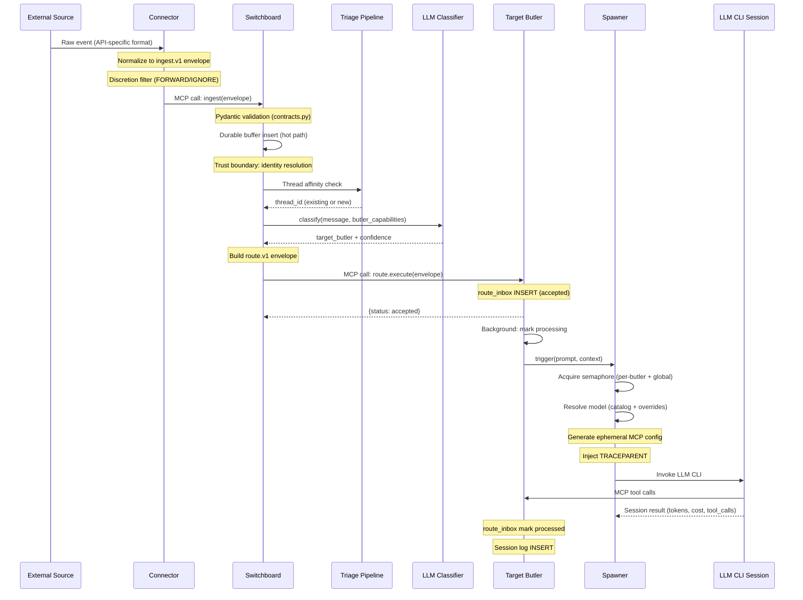
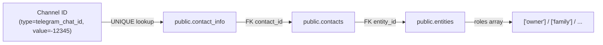
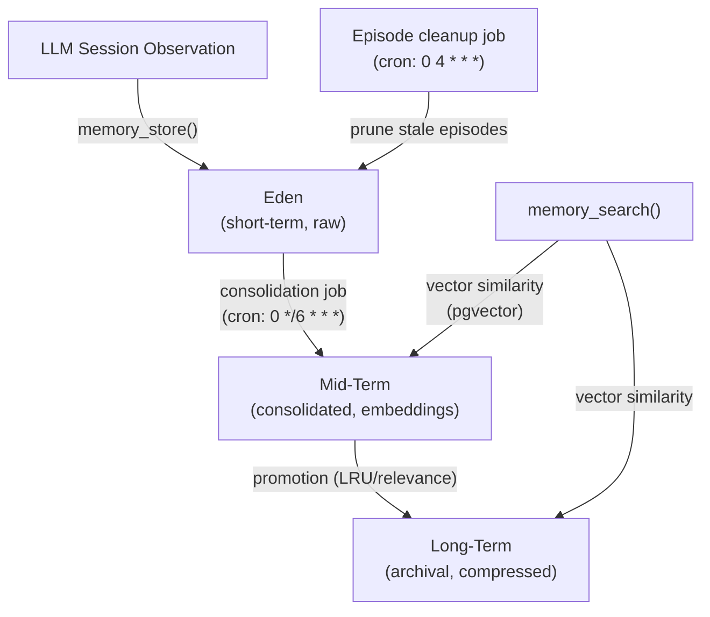
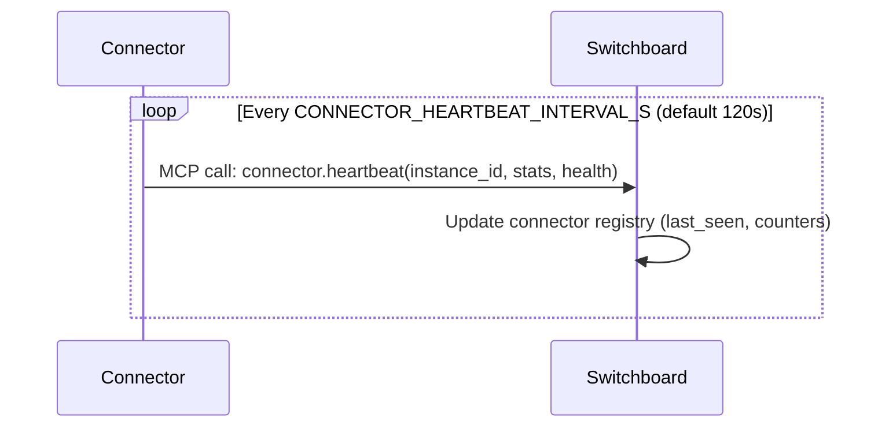
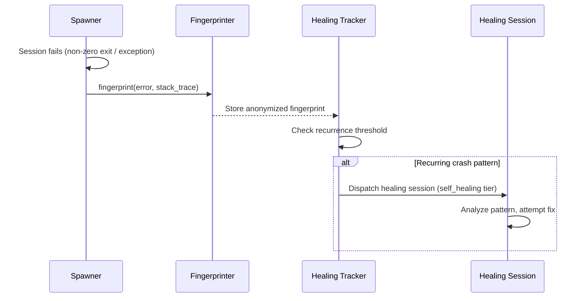
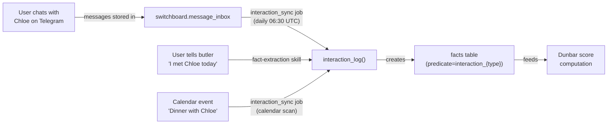

# Data Flow

Primary data paths through the Butlers system, with trust boundaries and
validation points marked.

---

## 1. Ingestion Flow (External Event to Butler Session)

This is the primary path for all externally-originated messages.



### Validation and trust boundaries

1. **Connector -> Switchboard**: The `ingest.v1` Pydantic model validates
   schema version, source channel, source provider, sender identity, and
   timestamp format. Invalid envelopes are rejected.

2. **Switchboard identity resolution**: Before routing, the Switchboard
   resolves the sender's channel identifier (e.g., telegram_chat_id) against
   `public.contact_info` to inject identity context (contact_id, roles,
   entity_id). Owner messages get elevated trust.

3. **Switchboard -> Target Butler**: The `route.v1` envelope is validated by
   Pydantic models. The target butler checks `trusted_route_callers` to ensure
   only the Switchboard can submit routes.

4. **LLM session boundary**: The spawned LLM CLI receives a locked-down MCP
   config pointing exclusively at its own butler's MCP server. It cannot reach
   other butlers or infrastructure directly.

---

## 2. Scheduled Task Flow

Butlers execute scheduled tasks independently of external events.

```mermaid
sequenceDiagram
    participant Loop as Scheduler Loop
    participant DB as Schedule DB
    participant Spawner as Spawner
    participant CLI as LLM CLI Session
    participant Butler as Butler MCP

    Loop->>DB: tick(): query due tasks
    DB-->>Loop: Due task list (cron match)

    alt dispatch_mode = "prompt"
        Loop->>Spawner: trigger(prompt=task.prompt)
        Spawner->>CLI: Invoke LLM CLI
        CLI->>Butler: MCP tool calls
        CLI-->>Spawner: Session result
    else dispatch_mode = "job"
        Loop->>Loop: Execute job function directly
        opt Job algorithm requires an LLM (memory consolidation)
            Loop->>Spawner: trigger via live daemon Spawner
            Spawner->>CLI: Invoke catalog-selected LLM CLI
            CLI-->>Spawner: Structured result
        end
    end

    Note over Loop: Sleep tick_interval_seconds
    Note over Loop: Repeat
```

The scheduler loop runs as an asyncio task within each butler daemon. The
default tick interval is 60 seconds. Schedule definitions in `butler.toml` are
synced to the database on startup.

Job-mode tasks (`dispatch_mode = "job"`) execute Python functions directly;
the scheduler does not automatically turn their payload into an LLM prompt.
Most jobs, including `memory_episode_cleanup` and `eligibility_sweep`, are
zero-LLM. `memory_consolidation` is the explicit exception: its deterministic
Python handler claims and groups episodes, then uses the daemon's live Spawner
once per non-empty `(tenant_id, butler)` group so model selection and timeouts
remain governed by the model catalog. A core-owned memory runtime hook resolves
the started module's pool and configured embedding engine at dispatch time;
this keeps private memory schemas such as `chronicler_mem` and the module's
per-model engine cache authoritative instead of falling back to the daemon's
domain pool or the default embedding model.

---

## 3. Response Flow (Outbound Delivery)

When an LLM session needs to communicate with the user, it calls the `notify()`
MCP tool.

```mermaid
sequenceDiagram
    participant CLI as LLM CLI Session
    participant Butler as Butler MCP
    participant Queue as Originating Butler Queue
    participant SW as Switchboard
    participant Module as Output Module
    participant Ext as External API

    CLI->>Butler: notify(channel, intent, message, request_context)
    Butler->>Butler: Resolve notify.v1 envelope and delivery policy

    alt routine implicit-owner send/insight held by Owner Attention Policy [start,end) or DND/sleeping
        Butler->>Queue: INSERT full notify.v1 envelope with deliver_at
        Note over Queue: Policy uses exact configured end; existing scheduler flushes stored envelope with no re-gate
        Queue->>SW: MCP call: notify(...)
    else immediate or existing non-owner delivery path
        Butler->>SW: MCP call: notify(...)
    end

    alt channel = "telegram"
        SW->>Module: Telegram module: send/reply/react
        Module->>Ext: Telegram Bot API
    else channel = "email"
        SW->>Module: Email module: send
        Module->>Ext: SMTP
    end
```

### Notify intents

| Intent | Behavior |
|---|---|
| `send` | Proactive outbound message (scheduled tasks, no request_context needed) |
| `insight` | Proactive insight delivery (same transport mechanics as `send`) |
| `reply` | Contextual response to an ingested message (requires request_context) |
| `react` | Emoji reaction on the source message (Telegram only, requires request_context) |

---

## 4. Identity Resolution Flow

Maps a raw channel identifier to a known contact with roles.



This flow is invoked:
- **Switchboard ingestion**: Before routing, to inject sender identity preambles.
- **notify()**: To resolve outbound recipients from contact_id.
- **Approval gates**: To determine whether the caller has sufficient role for
  auto-approval.

Source: `src/butlers/identity.py::resolve_contact_by_channel()`

---

## 5. Memory Flow

The tiered memory subsystem manages observations from sessions.



Memory is per-butler. Each butler that enables the memory module gets its own
Eden, Mid-Term, and Long-Term stores within its database schema. Vector search
uses pgvector extensions.

Source: `src/butlers/modules/memory/`

---

## 6. Connector Heartbeat Flow

Connectors report liveness to the Switchboard for fleet visibility.



The Switchboard runs an `eligibility_sweep` job every 5 minutes to mark
connectors as stale when their last heartbeat exceeds the TTL.

---

## 7. Self-Healing Flow

When an LLM session crashes, the healing subsystem captures and diagnoses.



Source: `src/butlers/core/healing/`

---

## 8. Relationship Interaction Flow (Dunbar Tier Computation)

The relationship butler computes Dunbar social tiers (5/15/50/150/500/1500)
dynamically from interaction facts using exponential decay scoring. Tiers are
**not** manually assigned; they emerge from communication frequency.

### Scoring engine

```
score(contact) = Σ exp(-λ × days_since_interaction_i)
                   × direction_weight
                   × type_weight
                   × (1 / group_size)
λ = ln(2) / 30   (30-day half-life)

direction_weight: outgoing=10.0, mutual=5.0, incoming/NULL=1.0  (RFC 0013 D1)
type_weight:      calendar_event/interview/email=0.2, others=1.0
group_size:       from fact metadata; defaults to 1.0 when absent (RFC 0013 D2)
```

Contacts are ranked by score. Top 5 → tier 5, ranks 6-15 → tier 15, etc.
Contacts with score = 0.0 are hard-assigned to tier 1500. Downward hysteresis
prevents thrashing near tier boundaries.

Source: `roster/relationship/tools/dunbar.py`

### Interaction facts

The scoring engine queries only facts matching:
- `entity_id = c.entity_id` (joined through `public.contacts`)
- `predicate LIKE 'interaction_%'` (e.g., `interaction_telegram_user_client`,
  `interaction_email`, `interaction_calendar_event`, `interaction_meeting`)
- `scope = 'relationship'`
- `validity = 'active'`

These facts are created by `interaction_log()` in
`roster/relationship/tools/interactions.py`. Facts use subject
`entity:{entity_id}` (subject key changed from `contact:{contact_id}` to
`entity:{entity_id}` in migration rel_018). The function deduplicates by
(entity_id, predicate, valid_at::date, direction) when `occurred_at` is
explicitly provided. Including `direction` allows an incoming and an outgoing
fact for the same contact on the same day to coexist (RFC 0013 D4).

### Passive interaction sync job



The `interaction_sync` background job runs daily at 06:30 UTC
(`cron = "30 6 * * *"`, `dispatch_mode = "job"` — no LLM spawned). It closes
the loop between communication data already in the system and the relationship
butler's tier computation.

#### Message-based sync (group-aware)

Queries `switchboard.message_inbox` grouped by
`(source_thread_identity, source_channel, DATE(received_at))` — a chat-centric
view per RFC 0013 D4. Monitored channels: `telegram_user_client`,
`whatsapp_user_client`, `email`.

Key behaviors:
- Messages where `request_context->>'interaction_eligible'` is `'false'` are
  skipped before grouping.
- Groups with `participant_count > 20` are skipped entirely (D3 gate).
  `participant_count` is read from `request_context` when available; otherwise
  falls back to the count of distinct senders in the group.
- Owner presence is detected via `public.entities.roles`. If the owner sent at
  least one message in the chat on that day, each non-owner contact receives
  both an **incoming** fact and an **outgoing** fact. Otherwise only incoming.
- For DM chats (`participant_count ≤ 2`), `group_size = 1` (full weight).
  Group chats use `group_size = participant_count`.
- Identity resolution uses `relationship.entity_facts` (has-email / has-handle
  predicates) to map sender identifiers to `entity_id` values.
  (`public.contact_info` was dropped in migration core_115 / bead bu-e2ja9.)
- Incoming and outgoing facts for the same contact on the same day use
  distinct `occurred_at` hour offsets so that the fact store's timestamp-level
  idempotency key is unique per (entity, channel, direction, day):
  incoming (telegram=0, whatsapp=1, email=2) and outgoing (+12 each).

#### Calendar-based sync

Queries `public.calendar_events` for confirmed events (`status = 'confirmed'`)
within the scan window. Declined events (owner's `responseStatus = 'declined'`)
are skipped. Attendee emails are resolved to `entity_id` via
`relationship.entity_facts` (has-email predicate). Each resolved attendee
receives an interaction fact with `type='calendar_event'`, `direction='mutual'`.

#### Scan window

Checkpoint-based: start is read from state key `interaction_sync.last_scan_at`.
First run defaults to `now() - 30 days`. Window is capped at 30 days to prevent
unbounded backfill after long outages. On completion, the job writes the scan
end time back to the state store.

---

## 6. Runtime Config Flow (Dashboard to Spawner)

Operational tuning (core_groups, concurrency, catalog read authority, tool
exposure policy) follows a seed-and-manage pattern. The toml is the seed
source; the DB table is the runtime source of truth; the dashboard is the
mutation interface. Model identity, runtime type, per-session timeouts, and
CLI args are owned by `public.model_catalog` (resolved per spawn), not by
`runtime_config`.

```
butler.toml [butler.runtime_seed]
    |
    | seed_if_empty() on first boot
    v
{schema}.runtime_config (DB table)
    |
    |--- GET/PATCH /api/butlers/{name}/runtime-config (dashboard)
    |
    v
RuntimeConfigAccessor
    |
    +---> _register_core_tools (startup): core_groups                          [COLD, TTL=30s cache]
    +---> Spawner constructor: max_concurrent, max_queued                      [COLD, TTL=30s cache]
    +---> catalog read (call time): catalog_read_sensitivity                   [HOT, TTL=30s cache]
    +---> per-attempt exposure plan: get_tool_exposure_policy()                [HOT, bypasses cache]

public.model_catalog (resolved per spawn via resolve_model)
    |
    +---> Spawner.trigger(): runtime_type, model, extra_args, session_timeout  [HOT]
```

**Write path:** Dashboard PATCH -> DB UPDATE. Cold fields become visible to a
cached reader only after the 30s TTL expires (or a restart). Hot fields are
visible immediately: `catalog_read_sensitivity` is read fresh at call time by
the memory-catalog read path, and `tool_exposure_policy` is read fresh per
attempt via `RuntimeConfigAccessor.get_tool_exposure_policy()`, which never
consults the TTL cache -- required because the dashboard API and the butler
daemon can be separate processes with independent in-memory caches.

**Read path:** Spawner.trigger() -> accessor.get() -> cached or DB query ->
RuntimeConfig dataclass (cold fields). Per-attempt tool exposure planning ->
accessor.get_tool_exposure_policy() -> always a fresh DB query (hot field).

**Seed path:** Daemon start() -> accessor.seed_if_empty(toml_seed) ->
INSERT ... ON CONFLICT DO NOTHING -> read back effective row.

## Data Path Summary

| Flow | Entry Point | Exit Point | Protocol | Durable? |
|---|---|---|---|---|
| Ingestion | Connector poll/webhook | route_inbox INSERT | ingest.v1 -> route.v1 (MCP) | Yes (durable buffer + route_inbox) |
| Scheduled | Scheduler tick | Session log INSERT | Internal (asyncio) | Yes (schedule DB) |
| Response | LLM session notify() | External API call | MCP -> module-specific | Conditional: eligible routine owner-default holds are durable in the originating butler queue; other direct paths are fire-and-forget |
| Identity | Channel identifier | Resolved contact | SQL (public schema) | N/A (read-only) |
| Memory | Session observation | Tiered storage | SQL + pgvector | Yes |
| Heartbeat | Connector loop | Registry update | MCP | No (ephemeral liveness) |
