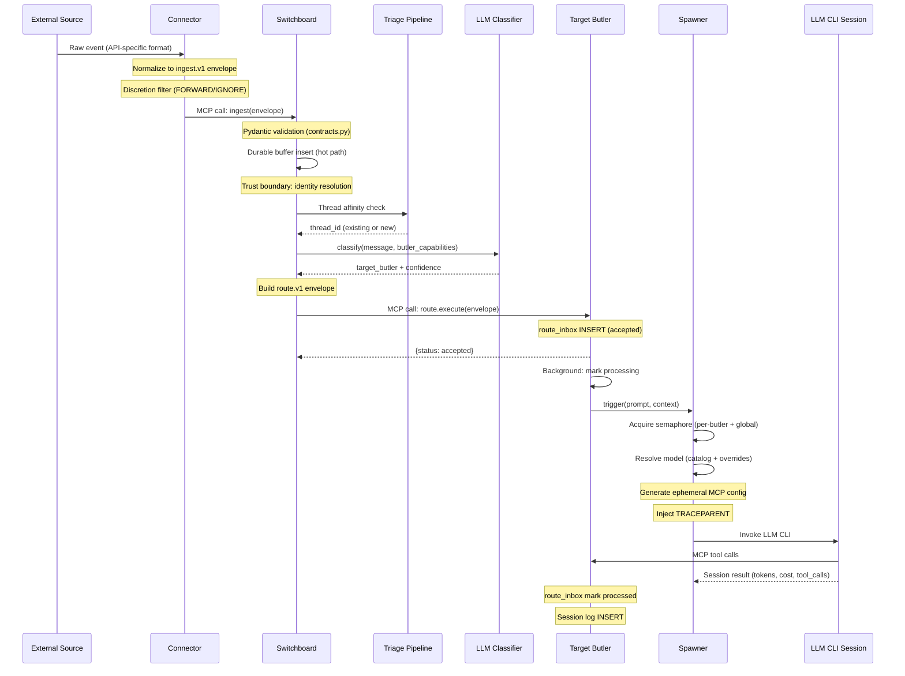
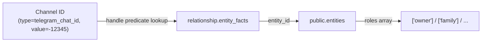
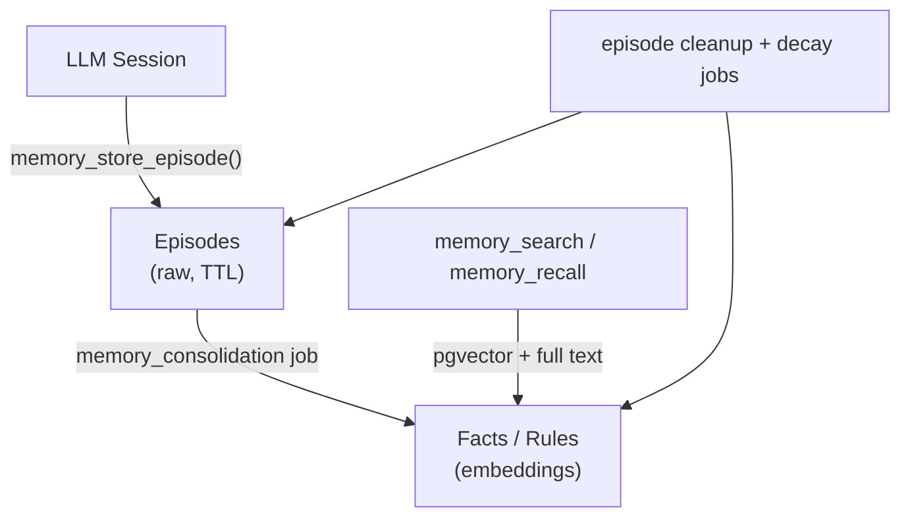
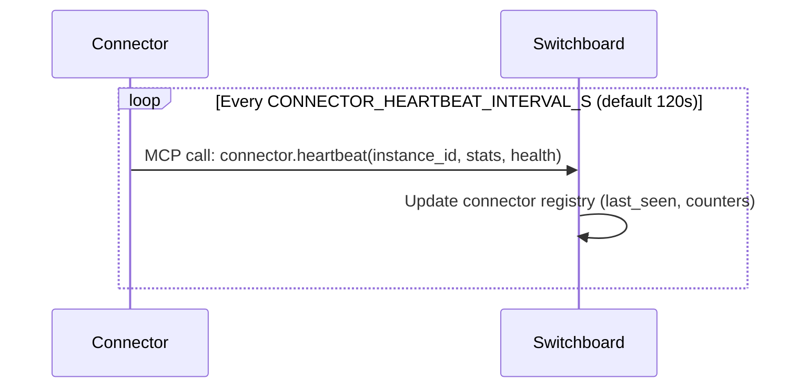

# Data Flow

Primary data paths through the Butlers system, with trust boundaries and
validation points marked.

This page is a snapshot, not a contract. Each flow names its source module or
its authoritative spec; when they disagree with this page, they win.

---

## 1. Ingestion Flow (External Event to Butler Session)

This is the primary path for all externally-originated messages.


```mermaid
sequenceDiagram
    participant Ext as External Source
    participant Con as Connector
    participant SW as Switchboard
    participant Triage as Triage Pipeline
    participant LLM as LLM Classifier
    participant Target as Target Butler
    participant Spawner as Spawner
    participant CLI as LLM CLI Session

    Ext->>Con: Raw event (API-specific format)
    Note over Con: Normalize to ingest.v1 envelope
    Note over Con: Discretion filter (FORWARD/IGNORE)
    Con->>SW: MCP call: ingest(envelope)
    Note over SW: Pydantic validation (contracts.py)

    SW->>SW: Durable buffer insert (hot path)
    Note over SW: Trust boundary: identity resolution

    SW->>Triage: Thread affinity check
    Triage-->>SW: thread_id (existing or new)

    SW->>LLM: classify(message, butler_capabilities)
    LLM-->>SW: target_butler + confidence

    Note over SW: Build route.v1 envelope
    SW->>Target: MCP call: route.execute(envelope)

    Note over Target: route_inbox INSERT (accepted)
    Target-->>SW: {status: accepted}

    Target->>Target: Background: mark processing
    Target->>Spawner: trigger(prompt, context)
    Spawner->>Spawner: Acquire semaphore (per-butler + global)
    Spawner->>Spawner: Resolve model (catalog + overrides)
    Note over Spawner: Generate ephemeral MCP config
    Note over Spawner: Inject TRACEPARENT
    Spawner->>CLI: Invoke LLM CLI
    CLI->>Target: MCP tool calls
    CLI-->>Spawner: Session result (tokens, cost, tool_calls)
    Note over Target: route_inbox mark processed
    Note over Target: Session log INSERT
```

### Validation and trust boundaries

1. **Connector -> Switchboard**: The `ingest.v1` Pydantic model validates
   schema version, source channel, source provider, sender identity, and
   timestamp format. Invalid envelopes are rejected.

2. **Switchboard identity resolution**: Before routing, the Switchboard
   resolves the sender's channel identifier (e.g., telegram_chat_id) through
   `relationship.entity_facts` to a `public.entities` row and injects identity
   context (entity_id, roles). Owner messages get elevated trust.

3. **Switchboard -> Target Butler**: The `route.v1` envelope is validated by
   Pydantic models. The target butler checks `trusted_route_callers` to ensure
   only the Switchboard can submit routes.

4. **LLM session boundary**: The spawned LLM CLI receives a locked-down MCP
   config pointing exclusively at its own butler's MCP server. It cannot reach
   other butlers or infrastructure directly.

---

## 2. Scheduled Task Flow

Butlers execute scheduled tasks independently of external events.

```mermaid
sequenceDiagram
    participant Loop as Scheduler Loop
    participant DB as Schedule DB
    participant Spawner as Spawner
    participant CLI as LLM CLI Session
    participant Butler as Butler MCP

    Loop->>DB: tick(): query due tasks
    DB-->>Loop: Due task list (cron match)

    alt dispatch_mode = "prompt"
        Loop->>Spawner: trigger(prompt=task.prompt)
        Spawner->>CLI: Invoke LLM CLI
        CLI->>Butler: MCP tool calls
        CLI-->>Spawner: Session result
    else dispatch_mode = "job"
        Loop->>Loop: Execute job function directly
        opt Job algorithm requires an LLM (memory consolidation)
            Loop->>Spawner: trigger via live daemon Spawner
            Spawner->>CLI: Invoke catalog-selected LLM CLI
            CLI-->>Spawner: Structured result
        end
    end

    Note over Loop: Sleep tick_interval_seconds
    Note over Loop: Repeat
```

The scheduler loop runs as an asyncio task within each butler daemon. The
default tick interval is 60 seconds. Schedule definitions in `butler.toml` are
synced to the database on startup.

Job-mode tasks (`dispatch_mode = "job"`) execute Python functions directly;
the scheduler does not automatically turn their payload into an LLM prompt.
Most jobs, including `memory_episode_cleanup` and `eligibility_sweep`, are
zero-LLM. `memory_consolidation` is the explicit exception: its deterministic
Python handler claims and groups episodes, then uses the daemon's live Spawner
once per non-empty `(tenant_id, butler)` group so model selection and timeouts
remain governed by the model catalog. A core-owned memory runtime hook resolves
the started module's pool and configured embedding engine at dispatch time;
this keeps private memory schemas such as `chronicler_mem` and the module's
per-model engine cache authoritative instead of falling back to the daemon's
domain pool or the default embedding model.

---

## 3. Response Flow (Outbound Delivery)

When an LLM session needs to communicate with the user, it calls the `notify()`
MCP tool.

```mermaid
sequenceDiagram
    participant CLI as LLM CLI Session
    participant Butler as Butler MCP
    participant Queue as Originating Butler Queue
    participant SW as Switchboard
    participant Module as Output Module
    participant Ext as External API

    CLI->>Butler: notify(channel, intent, message, request_context)
    Butler->>Butler: Resolve notify.v1 envelope and delivery policy

    alt routine implicit-owner send/insight held by Owner Attention Policy [start,end) or DND/sleeping
        Butler->>Queue: INSERT full notify.v1 envelope with deliver_at
        Note over Queue: Policy uses exact configured end; existing scheduler flushes stored envelope with no re-gate
        Queue->>SW: MCP call: notify(...)
    else immediate or existing non-owner delivery path
        Butler->>SW: MCP call: notify(...)
    end

    alt channel = "telegram"
        SW->>Module: Telegram module: send/reply/react
        Module->>Ext: Telegram Bot API
    else channel = "email"
        SW->>Module: Email module: send
        Module->>Ext: SMTP
    end
```

### Notify intents

| Intent | Behavior |
|---|---|
| `send` | Proactive outbound message (scheduled tasks, no request_context needed) |
| `insight` | Proactive insight delivery (same transport mechanics as `send`) |
| `reply` | Contextual response to an ingested message (requires request_context) |
| `react` | Emoji reaction on the source message (Telegram only, requires request_context) |

In-room voice is a candidate explicit-only branch of `notify.v1`; it is not
implemented. Its flow and trust hops are specified in
[RFC 0034](../legends-and-lore/rfcs/0034-messenger-voice-egress.md).

---

## 4. Identity Resolution Flow

Maps a raw channel identifier to a known entity with roles.


```mermaid
graph LR
    A["Channel ID<br/>(type=telegram_chat_id, value=-12345)"] -->|"handle predicate lookup"| B["relationship.entity_facts"]
    B -->|"entity_id"| C["public.entities"]
    C -->|"roles array"| D["['owner'] / ['family'] / ..."]
```

Invoked by Switchboard ingestion (identity preamble), `notify()` recipient
resolution, and approval gates. Source:
`src/butlers/identity.py::resolve_contact_by_channel()`. Schema, predicates and
unknown-sender handling: [Identity Model](../../docs/concepts/identity-model.md).

---

## 5. Memory Flow


```mermaid
graph TD
    A["LLM Session"] -->|"memory_store_episode()"| B["Episodes<br/>(raw, TTL)"]
    B -->|"memory_consolidation job"| C["Facts / Rules<br/>(embeddings)"]
    D["memory_search / memory_recall"] -->|"pgvector + full text"| C
    E["episode cleanup + decay jobs"] --> B
    E --> C
```

Memory is per-butler: each butler that enables the memory module keeps its own
Episodes, Facts and Rules in its schema. Artifact types, retrieval,
consolidation and decay: [Memory module](../../docs/modules/memory.md). Source:
`src/butlers/modules/memory/`.

---

## 6. Connector Heartbeat Flow

Connectors report liveness to the Switchboard for fleet visibility.


```mermaid
sequenceDiagram
    participant Con as Connector
    participant SW as Switchboard

    loop Every CONNECTOR_HEARTBEAT_INTERVAL_S (default 120s)
        Con->>SW: MCP call: connector.heartbeat(instance_id, stats, health)
        SW->>SW: Update connector registry (last_seen, counters)
    end
```

The Switchboard runs an `eligibility_sweep` job every 5 minutes to mark
connectors as stale when their last heartbeat exceeds the TTL.

---

## 7. Crash Healing Flow

When a spawned session hard-crashes, the Spawner fires `dispatch_healing()` on
the wired `self_healing` module, which fingerprints the error
(`src/butlers/core/healing/`) and dispatches a healing session for recurring
patterns. Fleet-wide failure discovery and investigation is the QA staffer's
job: [RFC 0015](../legends-and-lore/rfcs/0015-qa-staffer-discovery-investigation-pipeline.md).

---

## 8. Relationship Interaction Flow (Dunbar Tiers)

The Relationship butler derives Dunbar tiers (5/15/50/150/500/1500) from
`interaction_*` facts scored with exponential decay (30-day half-life),
weighted by direction, interaction type and group size; tiers are never
assigned by hand. Interaction facts come from `interaction_log()`, called by the
fact-extraction skill and by the daily `interaction_sync` job, which scans
`switchboard.message_inbox` (group-aware, skipping chats over 20 participants)
and confirmed `public.calendar_events`.

The scoring formula, weights, hysteresis and sync rules are specified in
[RFC 0013](../legends-and-lore/rfcs/0013-dunbar-group-aware-interaction-scoring.md).
Source: `roster/relationship/tools/dunbar.py`,
`roster/relationship/tools/interactions.py`.

---

## 9. Runtime Config Flow (Dashboard to Spawner)

Operational tuning (core_groups, concurrency, catalog read authority, tool
exposure policy) follows a seed-and-manage pattern. The toml is the seed
source; the DB table is the runtime source of truth; the dashboard is the
mutation interface. Model identity, runtime type, per-session timeouts, and
CLI args are owned by `public.model_catalog` (resolved per spawn), not by
`runtime_config`.

```
butler.toml [butler.runtime_seed]
    |
    | seed_if_empty() on first boot
    v
{schema}.runtime_config (DB table)
    |
    |--- GET/PATCH /api/butlers/{name}/runtime-config (dashboard)
    |
    v
RuntimeConfigAccessor
    |
    +---> _register_core_tools (startup): core_groups                          [COLD, TTL=30s cache]
    +---> Spawner constructor: max_concurrent, max_queued                      [COLD, TTL=30s cache]
    +---> catalog read (call time): catalog_read_sensitivity                   [HOT, TTL=30s cache]
    +---> per-attempt exposure plan: get_tool_exposure_policy()                [HOT, bypasses cache]

public.model_catalog (resolved per spawn via resolve_model)
    |
    +---> Spawner.trigger(): runtime_type, model, extra_args, session_timeout  [HOT]
```

**Write path:** Dashboard PATCH -> DB UPDATE. Cold fields become visible to a
cached reader only after the 30s TTL expires (or a restart). Hot fields are
visible immediately: `catalog_read_sensitivity` is read fresh at call time by
the memory-catalog read path, and `tool_exposure_policy` is read fresh per
attempt via `RuntimeConfigAccessor.get_tool_exposure_policy()`, which never
consults the TTL cache -- required because the dashboard API and the butler
daemon can be separate processes with independent in-memory caches.

**Read path:** Spawner.trigger() -> accessor.get() -> cached or DB query ->
RuntimeConfig dataclass (cold fields). Per-attempt tool exposure planning ->
accessor.get_tool_exposure_policy() -> always a fresh DB query (hot field).

**Seed path:** Daemon start() -> accessor.seed_if_empty(toml_seed) ->
INSERT ... ON CONFLICT DO NOTHING -> read back effective row.

---

## Data Path Summary

| Flow | Entry Point | Exit Point | Protocol | Durable? |
|---|---|---|---|---|
| Ingestion | Connector poll/webhook | route_inbox INSERT | ingest.v1 -> route.v1 (MCP) | Yes (durable buffer + route_inbox) |
| Scheduled | Scheduler tick | Session log INSERT | Internal (asyncio) | Yes (schedule DB) |
| Response | LLM session notify() | External API call | MCP -> module-specific | Conditional: eligible routine owner-default holds are durable in the originating butler queue; other direct paths are fire-and-forget |
| Identity | Channel identifier | Resolved entity | SQL (public schema) | N/A (read-only) |
| Memory | Session episode | Facts / rules | SQL + pgvector | Yes |
| Heartbeat | Connector loop | Registry update | MCP | No (ephemeral liveness) |
