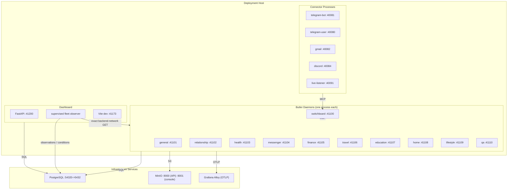

# Deployment Topology

How the Butlers system is deployed: processes, ports, infrastructure, and
environment configuration.

---

## Process Model

The observer edges in this diagram show the approved target contract. The
current deployment still uses daemon-authored heartbeat POSTs until cutover.



Each butler daemon is an independent process serving a FastMCP SSE/HTTP server
on its assigned port. Connectors are separate processes that run alongside the
butler fleet. The observer edge in this diagram is the approved 2026-09-23
target contract; the current runtime still uses daemon-authored heartbeat
POSTs until the control-plane change cuts over.

---

## Port Assignments

### Butler MCP Ports (41100-41110)

| Butler | Type | Port | Status |
|---|---|---|---|
| switchboard | staffer | 41100 | Functional |
| general | butler | 41101 | Functional |
| relationship | butler | 41102 | Functional |
| health | butler | 41103 | Functional |
| messenger | staffer | 41104 | Functional |
| finance | butler | 41105 | Evolving |
| travel | butler | 41106 | Evolving |
| education | butler | 41107 | Evolving |
| home | butler | 41108 | Evolving |
| lifestyle | butler | 41109 | Evolving |
| qa | staffer | 41110 | Evolving |

### Connector Health Ports (40080-40091)

| Connector | Port |
|---|---|
| telegram-user | 40080 |
| telegram-bot | 40081 |
| gmail | 40082 |
| discord | 40084 |
| live-listener | 40091 |

### Infrastructure Ports

| Service | Port | Notes |
|---|---|---|
| Dashboard API | 41200 | FastAPI backend |
| Dashboard Frontend (dev) | 41173 | Vite dev server |
| PostgreSQL | 54320 (host) -> 5432 (container) | pgvector/pg17 |
| MinIO API | 9000 | S3-compatible blob storage |
| MinIO Console | 9001 | Web UI for MinIO |

---

## Docker Compose Topology

The `docker-compose.yml` defines the containerized deployment:

### Services

| Service | Image | Depends On | Profile |
|---|---|---|---|
| `postgres` | pgvector/pgvector:pg17 | -- | default |
| `minio` | minio/minio:latest | -- | default |
| `minio-setup` | minio/mc:latest | minio (healthy) | default |
| `switchboard` | Built from Dockerfile | postgres (healthy), minio-setup | default |
| `general` | Built from Dockerfile | postgres (healthy), minio-setup | default |
| `relationship` | Built from Dockerfile | postgres (healthy), minio-setup | default |
| `health` | Built from Dockerfile | postgres (healthy), minio-setup | default |
| `dashboard-api` | Built from Dockerfile | postgres (healthy) | default |
| `frontend-dev` | node:22-slim | dashboard-api | `dev` profile |

### Volumes

| Volume | Purpose |
|---|---|
| `butlers_postgres_data` | PostgreSQL data (external, persists across compose down) |
| `minio_data` | MinIO blob storage |
| `frontend_node_modules` | Node modules cache for frontend dev |

### Butler container pattern

Each butler container:
- Mounts its roster config directory as `/etc/butler:ro`
- Runs `butlers run --config /etc/butler`
- Receives database credentials and OTel endpoint via environment variables
- Waits for postgres healthcheck and minio-setup completion

---

## Database Topology

Single PostgreSQL instance (pgvector/pg17) with schema-based isolation.

```
butlers (database)
├── public           -- Cross-butler identity, model catalog, secrets
├── switchboard      -- Switchboard-specific tables
├── general          -- General butler tables
├── relationship     -- Relationship butler tables
├── health           -- Health butler tables
├── messenger        -- Messenger butler tables
├── finance          -- Finance butler tables
├── travel           -- Travel butler tables
├── education        -- Education butler tables
├── home             -- Home butler tables
├── lifestyle        -- Lifestyle butler tables
└── qa               -- QA staffer tables
```

Each butler's `search_path` is set to `{butler_schema}, public` so queries
resolve butler-local tables first, then shared identity and coordination
tables in `public`.

Database provisioning (schema creation, Alembic migrations) happens automatically
during butler daemon startup.

---

## Environment Variables

### Database connectivity

| Variable | Default | Used by |
|---|---|---|
| `DATABASE_URL` | -- | All (libpq-style URL; daemon publisher pools, dashboard API pools, and the fleet bridge use its decoded database path as the target when set) |
| `POSTGRES_DB` | caller-configured fallback | Daemon publisher pools, dashboard API pools, and fleet bridge (database target when `DATABASE_URL` is unset) |
| `POSTGRES_HOST` | `localhost` | All |
| `POSTGRES_PORT` | `5432` | All |
| `POSTGRES_USER` | `butlers` | All |
| `POSTGRES_PASSWORD` | `butlers` | All |

### Observability

| Variable | Default | Purpose |
|---|---|---|
| `OTEL_EXPORTER_OTLP_ENDPOINT` | -- (no-op tracer if unset) | OTLP gRPC exporter endpoint |

### Runtime control

| Variable | Default | Purpose |
|---|---|---|
| `BUTLERS_MAX_GLOBAL_SESSIONS` | `3` | Process-wide cap on concurrent LLM sessions |
| `DASHBOARD_URL` | `OAUTH_DASHBOARD_URL`, then `http://localhost:41200` | Public dashboard base for daemon-generated owner links; include any reverse-proxy path prefix. |
| `ANTHROPIC_API_KEY` | -- | Claude API authentication |

### Connector-specific

| Variable | Default | Used by |
|---|---|---|
| `SWITCHBOARD_MCP_URL` | -- | All connectors (Switchboard SSE endpoint) |
| `CONNECTOR_PROVIDER` | -- | All connectors (e.g., "telegram", "gmail") |
| `CONNECTOR_CHANNEL` | -- | All connectors (e.g., "telegram_bot", "email") |
| `CONNECTOR_MAX_INFLIGHT` | `8` | All connectors (concurrent ingest submissions) |
| `CONNECTOR_HEALTH_PORT` | Varies | All connectors |
| `CONNECTOR_HEARTBEAT_INTERVAL_S` | `120` | All connectors |
| `BUTLER_TELEGRAM_TOKEN` | -- | Telegram connector |
| `GMAIL_PUBSUB_ENABLED` | `false` | Gmail connector |
| `LIVE_LISTENER_DEVICES` | -- | Live listener (JSON device spec list) |

### Credential resolution

| Variable | Default | Purpose |
|---|---|---|
| `BUTLER_SHARED_DB_NAME` | `butlers` | Shared credentials database name |
| `BUTLER_SHARED_DB_SCHEMA` | `public` | Shared credentials schema |
| `CONNECTOR_BUTLER_DB_NAME` | `butlers` | Per-connector butler DB for secret overrides |

---

## Development Environment

### Prerequisites

- Python 3.12+
- `uv` package manager
- Node.js 22+ (for frontend)
- Docker and Docker Compose (for infrastructure services)

### Setup

```bash
# Install Python dependencies
uv sync --dev

# Start infrastructure (DB + blob storage)
docker compose up -d postgres minio minio-setup

# Run butlers locally
butlers up

# Start dashboard
butlers dashboard --host 0.0.0.0 --port 41200

# Start frontend dev server
cd frontend && npm install && npm run dev
```

### Quality gates

```bash
make lint       # Ruff linter
make format     # Ruff formatter
make test       # Full test suite
make check      # Lint + test
```

---

## Deployment Modes

### Development (hybrid)

Infrastructure services (PostgreSQL, MinIO) run in Docker containers.
Butler daemons, connectors, and dashboard run as local processes.

```bash
docker compose up -d postgres minio minio-setup
butlers up
```

### Production (fully containerized)

All services run in Docker containers.

```bash
cp .env.example .env
# Edit .env with production secrets
docker compose up -d
```

## Dashboard owner-authentication placement

The dashboard API owns the central owner boundary, bounded WebAuthn/session
router and dedicated `dashboard_auth` persistence. Its pool logs in with
restricted Tier 0 `DASHBOARD_AUTH_DB_USER/PASSWORD`, separately from host
administrative `POSTGRES_*` access; setting a role on an administrative login
is insufficient because that session could reset its role. Trusted host CLI operations
authorize exact browser-bound registration/recovery intents; the API cannot
authorize an intent through a public endpoint. Butler runtime and generic
Secrets surfaces have no authority over this schema. Domain owner/contact
records remain separate from cryptographic HTTP authentication.

Tailscale Serve supplies the canonical HTTPS entry point; the server pins one
origin/RP hostname and trusted proxy path. Same-host dev/prod URL prefixes are
one browser security origin. Separate cookie names/state avoid collisions,
while separate trust requires distinct hostnames. Network membership does not
identify the dashboard owner. See the
[operator runbook](../../docs/identity_and_secrets/dashboard-owner-auth.md) and
[adopted design](../../openspec/changes/specify-host-authorized-dashboard-enrollment/design.md).

## Approved control-plane readiness topology (2026-09-23)

`restore-butler-control-plane-liveness` adds a separately supervised observer
inside the Dashboard/control-plane deployment. It reads the exact daemon
host:port entries from Git roster configuration and calls
`GET /internal/control-plane/identity` over the backend network on each
existing daemon port. The bounded `butler.control.v1` response carries name,
boot UUIDv7, route-contract range, and `accepting_routes`. The observer writes
DB-server-timed observations and durable condition evidence; no daemon-authored
timestamp, arbitrary caller URL, old boot generation, or owner credential can
assert a healthy fleet. Connector heartbeats remain connector-owned MCP calls.

L2 stages the identity route and a separately supervised Dashboard shadow
observer. The observer probes no more than four Git-roster endpoints at once,
reserves a database sequence before I/O, compares the response UUID and epoch
to the committed L1 registration, and conditionally records success or a
bounded failure category. It logs only aggregate legacy-versus-shadow
eligibility mismatches; compare those aggregates over multiple configured TTL
windows before L3 changes route authority. A partial or DB-failed cycle is
incomplete, never an all-clear. Probe cadence and shadow freshness use the
current operator-tuned registry TTL, while only Git roster chooses identity
and endpoint. This is not a live rollout instruction: this
source change requires separately authorized deployment and observation.
Rollback stops the observer and returns to legacy route reads while retaining
`sw_035` policy, provenance, boot ledger, epoch, trigger, and RLS. An old binary
without the identity interface cannot produce new positive receiver evidence.

Docker's `/health` probe remains a process-liveness signal. The canonical
public `GET /ready` retains the k3s change's boolean `ready` response shape.
Its checks cover PostgreSQL, roster, observer freshness, expected fleet,
QA-patrol age, supervised loops, and the cached result of L3's internal
read-only Switchboard route preflight. Q4 alone implements this public route
and its exact owner-auth exception; k3s and Compose consume it. It returns
503 with content-blind boolean check results when any required proof is
missing. The canary tests Switchboard selection and exact-target reachability without
an identity-changing write, target MCP call, or inbox write; it cannot certify target transactional acceptance, which is
represented by actual delivery receipts and conditions.

The Compose launcher and production deploy completion must observe
two distinct complete observer cycles and two distinct qualifying scheduled
QA patrol completions after the deploy window starts, with true sampled
readiness beyond the longest configured daemon TTL. The finite default
deadline is at least two configured patrol cadences plus that TTL and ten
minutes (35 minutes at current defaults); shorter overrides fail validation.
One Docker `healthy` state is insufficient. The existing
`scripts/compose.sh` currently waits for container process health; that is
the implementation seam the approved change must replace.

The separate-host pull monitor already authorized for minimal `/api/health`
does not imply authority to expose semantic readiness externally. A new
functional monitor and exact historic ingestion replay set require their own
owner decision. The delivery-intent worker in
`recover-ingestion-target-deliveries` runs in the Switchboard control plane,
while each target retains its own `route_inbox` processing and crash recovery.
