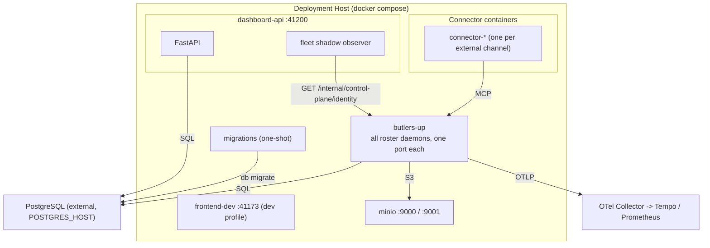

# Deployment Topology

How the Butlers system is deployed: processes, ports, and where the
authoritative configuration lives.

This page is a snapshot, not a contract. Service definitions live in
`docker-compose.yml` and `docs/operations/docker-deployment.md`; ports live in
each `roster/{butler}/butler.toml`. When they disagree with this page, they win;
fix this page. The port map below is the one other docs link to.

---

## Process Model

```mermaid
graph TB
    subgraph Host["Deployment Host (docker compose)"]
        UP["butlers-up<br/>all roster daemons, one port each"]
        subgraph ConnProcs["Connector containers"]
            Conn["connector-* (one per external channel)"]
        end
        subgraph Dashboard["dashboard-api :41200"]
            API["FastAPI"]
            OBS["fleet shadow observer"]
        end
        Vite["frontend-dev :41173 (dev profile)"]
        MIG["migrations (one-shot)"]
        MinIO["minio :9000 / :9001"]
    end

    PG["PostgreSQL (external, POSTGRES_HOST)"]
    OTel["OTel Collector -> Tempo / Prometheus"]

    Conn -- "MCP" --> UP
    OBS -- "GET /internal/control-plane/identity" --> UP
    API -- "SQL" --> PG
    UP -- "SQL" --> PG
    MIG -- "db migrate" --> PG
    UP -- "S3" --> MinIO
    UP -- "OTLP" --> OTel
```

`butlers up` runs every roster butler in one container; each butler still
serves its own FastMCP endpoint on its own port. Connectors run as separate
containers and submit ingress to the Switchboard over MCP. There is no
`postgres` service: the database is external and reached through
`POSTGRES_HOST` / `POSTGRES_PORT`. The one-shot `migrations` service must
complete before any application service starts. The full service list,
profiles, volumes, and dev/prod port offsets are in
[Docker Deployment](../../docs/operations/docker-deployment.md#services).

---

## Port Assignments

This is the single port map; other docs link here. Sources of truth: `port` in
`roster/*/butler.toml`, `CONNECTOR_HEALTH_PORT` in `docker-compose.yml` (or the connector's code
default), and the mode block in `scripts/compose.sh`.

### Butler MCP Ports (41100-41112)

| Butler | Type | Port |
|---|---|---|
| switchboard | staffer | 41100 |
| general | butler | 41101 |
| relationship | butler | 41102 |
| health | butler | 41103 |
| messenger | staffer | 41104 |
| finance | butler | 41105 |
| travel | butler | 41106 |
| education | butler | 41107 |
| home | butler | 41108 |
| lifestyle | butler | 41109 |
| qa | staffer | 41110 |
| chronicler | butler | 41111 |
| concierge | staffer | 41112 |

A new butler takes the next free port after the highest one in use.

### Connector Health Ports (40080-40092)

Container-internal unless noted; each connector serves `/health` and `/metrics` on its port.

| Connector | Port |
|---|---|
| telegram-user | 40080 |
| telegram-bot | 40081 |
| gmail, whatsapp-user | 40082 (separate containers) |
| spotify | 40083 |
| discord-user | 40084 |
| google-calendar | 40085 |
| owntracks | 40086 (host-published) |
| home-assistant | 40087 |
| google-drive | 40088 |
| steam | 40089 |
| google-health | 40090 |
| live-listener | 40091 |
| activitywatch | 40092 (host-published) |

### Host Ports by Mode

`scripts/compose.sh` publishes prod and dev on different host ports (bound to `127.0.0.1`) so both
stacks can run side by side. Inside the containers the ports are always the prod values.

| Service | Prod | Dev |
|---|---|---|
| Switchboard MCP (`butlers-up`) | 41100 | 42100 |
| Dashboard API | 41200 | 42200 |
| Frontend (Vite dev server, `frontend-dev`) | 41173 | 42173 |
| OwnTracks webhook | 40086 | 42086 |

### Infrastructure Ports

| Service | Port | Notes |
|---|---|---|
| PostgreSQL | `POSTGRES_PORT` (default 5432) | External host; not a Compose service |
| MinIO API | 9000 | S3-compatible blob storage, `127.0.0.1` only |
| MinIO Console | 9001 | Web UI for MinIO, `127.0.0.1` only |

---

## Database Topology

One PostgreSQL database with one schema per butler plus the shared `public`
schema for cross-butler identity, model catalog, and secrets. Each butler's
role sees only its own schema and `public`, and its `search_path` is
`{butler_schema}, public`. Schema creation and Alembic migrations run in the
`migrations` service (`db migrate`) before daemons start.

---

## Environment Variables

Every process reads its database target from `DATABASE_URL` or the `POSTGRES_*` variables, and
exports telemetry only when `OTEL_EXPORTER_OTLP_ENDPOINT` is set. Connectors reach the Switchboard
through `SWITCHBOARD_MCP_URL`. Runtime secrets are not environment variables: they resolve DB-first
from `butler_secrets`, with the environment as a last-resort fallback. The full operator reference
is [`docs/identity_and_secrets/environment-variables.md`](../../docs/identity_and_secrets/environment-variables.md).

---

## Configuration

- Local development setup and quality gates:
  [Dev Environment](../../docs/getting_started/dev-environment.md).
- Production deploys (`butlers deploy`):
  [Docker Deployment](../../docs/operations/docker-deployment.md#production-deploys-butlers-deploy).

---

## Dashboard owner-authentication placement

The dashboard API owns the central owner boundary, bounded WebAuthn/session
router and dedicated `dashboard_auth` persistence. Its pool logs in with
restricted Tier 0 `DASHBOARD_AUTH_DB_USER/PASSWORD`, separately from host
administrative `POSTGRES_*` access; setting a role on an administrative login
is insufficient because that session could reset its role. Trusted host CLI operations
authorize exact browser-bound registration/recovery intents; the API cannot
authorize an intent through a public endpoint. Butler runtime and generic
Secrets surfaces have no authority over this schema. Domain owner/contact
records remain separate from cryptographic HTTP authentication.

Tailscale Serve supplies the canonical HTTPS entry point; the server pins one
origin/RP hostname and trusted proxy path. Same-host dev/prod URL prefixes are
one browser security origin. Separate cookie names/state avoid collisions,
while separate trust requires distinct hostnames. Network membership does not
identify the dashboard owner. See the
[operator runbook](../../docs/identity_and_secrets/dashboard-owner-auth.md) and
[adopted design](../../openspec/changes/specify-host-authorized-dashboard-enrollment/design.md).

---

## Control-plane liveness

Each daemon serves `GET /internal/control-plane/identity`
(`src/butlers/core/control_plane_identity.py`), and the dashboard API runs a
supervised shadow observer that probes the Git-roster endpoints and records
observations. Route authority still comes from daemon-authored heartbeats; the
observer runs in shadow until the remaining stages of
`restore-butler-control-plane-liveness` land. The staged rollout, `/ready`
semantics, and deploy gating are specified in its
[design](../../openspec/changes/restore-butler-control-plane-liveness/design.md).
Docker's `/health` probe remains a process-liveness signal only.
