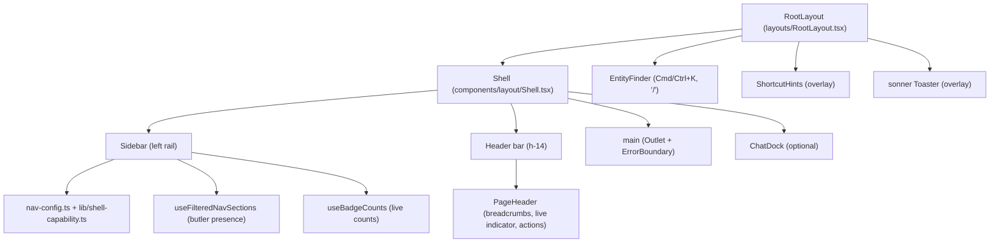
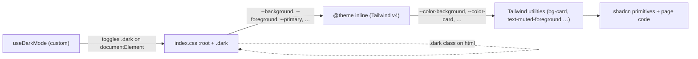

# Frontend Topology

> Snapshot of *where* the dashboard's design language lives in code: the shell, the page
> archetypes, the component domains, and the token plumbing. Doctrine (why) lives in
> [`design-language.md`](../heart-and-soul/design-language.md); required behavior and token
> values live in `openspec/specs/dashboard-design-language/spec.md`. A PR that moves a shell
> file, adds an archetype, or adds a component domain updates this file in the same change.

The dashboard is a single Vite + React SPA bundled into the FastAPI backend (see
[`components.md`](components.md) for the API container). The entry point is
`frontend/src/main.tsx` → `App.tsx` → `router.tsx` → `layouts/RootLayout.tsx`.
Everything below describes the layout from `RootLayout` outward.

---

## Composition: The Shell

| File | Role |
|---|---|
| `components/layout/Shell.tsx` | Only persistent chrome. Desktop `<aside>` expanded (`md:w-60`) by default and collapsible to a 56px icon rail (`md:w-14`, preference in `localStorage`); mobile uses a Radix `Sheet` (`w-64`). `<main>` owns the single responsive gutter (`--page-gutter-x/-y`) plus safe-area insets; page wrappers do not add a second outer padding layer. |
| `components/layout/Sidebar.tsx` | Rail rendering: first-letter or `NavIcon` glyphs, `<ButlerMark>` for butler-linked items, Radix tooltips when collapsed, live badges (`badgeKey`, `badgeVariant`), status dots for `degraded`/`error` butlers, footer worst-status dot. |
| `components/layout/nav-config.ts` | Declarative sections and items. Items carry `butler` (hide when absent), `badgeKey`, and `chord` (`g`-then-key navigation). |
| `lib/route-registry.ts` | Single source for the sidebar, the command menu's Pages group, `g` chords, and the `?` help sheet. |
| `components/layout/PageHeader.tsx` | URL-segment breadcrumb auto-builder (with acronym casing), `hideBreadcrumbs`, live indicator, finder button, dark-mode toggle. |
| `components/layout/EntityFinder.tsx` | The one command menu, opened by Cmd/Ctrl+K, `/`, and the header button. |
| `layouts/RootLayout.tsx` | Mounts the shell, `ErrorBoundary` around `<Outlet />`, scroll memory (reset on PUSH, restore on POP; calendar and chat opt out), and the overlays. |

Pages do not own anything outside their `Outlet` rectangle.

---

## Routing Surface

All routes are flat children of `RootLayout`, declared in `frontend/src/router-config.tsx`
(authority) and assembled in `router.tsx`. There are no nested layouts. For the route map by
domain, see [`docs/frontend/information-architecture.md` §Route Map](../../docs/frontend/information-architecture.md#route-map).

---

## Page Archetypes

The shared `<Page>` primitive (`components/ui/page.tsx`) owns the heading block, skeleton,
error and empty regions, and `space-y-6` rhythm. New pages MUST use it (spec
`dashboard-design-language` §Page Conformance). The archetype union has seven members.

| Archetype | Use | Examples |
|---|---|---|
| `overview` | Top-level multi-region surface | `SpendPage`, `SystemPage` |
| `list` | Filterable table of things: header + filter bar + table + pagination | `SessionsPage`, `AuditLogPage`, `NotificationsPage`, `IssuesPage` |
| `detail` | One record (shell in `components/layout/DetailPage.tsx`; spec `detail-page-archetype`) | `FactDetailPage`, `RuleDetailPage`, `EpisodeDetailPage`, `ConnectorDetailPage` |
| `workspace` | Time-aware canvas with scrubber and aggregations | No current route selects it; `CalendarWorkspacePage` is workspace-like but composes by hand |
| `editor` | Settings and form pages | No current route selects it |
| `editorial` | Narrative briefing (Display headline, Voice, index column) | `DashboardPage`, `ChroniclesPage`, `EntityDetailPage` (editorial mode) |
| `status-board` | Full-bleed board; `header`/`footer` slots, no `<Page>` `<h1>` | `ButlersPage` (header + footer), `ButlerDetailPage` (header only) |

There is no shared `<DataTable>` or form layout: list pages use the shadcn `Table` directly and
editors compose `Input`, `Label`, `Button`, `Dialog`, `Select`.

---

## Component Domains

Components live by domain under `frontend/src/components/`: `ui/` holds shadcn primitives plus
the Dispatch primitives (`Row`, `Pill`, `Eyebrow`, `Mono`, `Voice`, `StateDot`, `ButlerMark`,
`time`, `query-boundary`, `error-state`, `empty-state`, `confirm-dialog`, …); `layout/` holds
the shell; every other folder is one domain or surface (`qa/`, `butler-detail/`, `memory/`,
`health/`, `relationship/`, `chronicles/`, `approvals/`, `ingestion/`, `overview/`, `chat/`,
`decisions/`, `spend/`, `system/`, `topology/`, …). `ls frontend/src/components/` is the current
list.

Button forms follow spec `dashboard-design-language` §Button Forms.

The `qa/` folder hosts the QA dossier: `CaseList` rail, `CaseDossierHeader` + `StateTrack`
(`detect — diagnose — pr — landed`), `ClaimAnchoredBlurb`, `EvidenceLog`, `CounterEvidence`,
`PRPanel` + `DiffPreview`, `PatrolJournal`, and `QaKpiStrip` fed by `/api/qa/summary`.

---

## Design Token Plumbing

- `frontend/src/index.css` declares `:root` (light) and `.dark` values, font, motion, and state
  tokens; `@theme inline` exposes them as `--color-*` / `--radius-*` for Tailwind v4.
- `frontend/components.json` configures shadcn: style `new-york`, base color `neutral`, lucide icons.
- `hooks/useDarkMode.ts` defaults to `'dark'` on a cold load and ignores `prefers-color-scheme`.
  Rationale: design-language.md "Theme commitment".
- Colour roles are lint-enforced (`frontend/eslint.config.js` visual-role guard and
  `frontend/scripts/visual-role-css-guard.mjs`); see §Butler letter-mark below.

---

## Cross-Cutting Patterns

- **Data fetching:** TanStack Query hooks colocated in `frontend/src/hooks/`.
- **Loading / error / empty:** `<Page>` handles page-level state; `QueryBoundary`
  (`components/ui/query-boundary.tsx`, with `SourceDegradedNote` for partial sources),
  `ErrorState`, and `EmptyState` handle region-level state. Per-domain skeletons live in
  `components/skeletons/`.
- **Errors:** `ErrorBoundary` wraps `<Outlet />` for render errors; the `<Page>` `error` prop is
  for async query errors.
- **Toasts and confirmations:** `sonner` is mounted once in `RootLayout`. Confirmations use
  `ConfirmDialog` (`components/ui/confirm-dialog.tsx`); bare `window.confirm` is lint-banned.
- **Modals and drawers:** Radix `Dialog` for modals, Radix `Sheet` for side drawers
  (`SessionDetailDrawer`, `EpisodeDrawer`).

---

## `<Page>` Primitive Contract

The props are defined by `PageProps` in `frontend/src/components/ui/page.tsx`. `<Page>` wraps
the `<main>` outlet content only; it does not replace `Shell.tsx` or `PageHeader.tsx`. Rules the
types cannot express:

- `archetype` is a required discriminant that controls max width, padding, and skeleton shape.
- Render priority: `loading` → skeleton; else `error` → heading block + error card (retry button
  when `onRetry` is set); else `empty` → `EmptyState`; else `children`.
- `title` renders the `<h1>` (`text-3xl font-bold tracking-tight`; the editorial archetype uses the
  44px Display tier, status-board renders none) and sets `document.title` to `${title} | Butlers`.
- Supplying `breadcrumbs` renders a `<Breadcrumbs>` row above the `<h1>` and suppresses the
  `PageHeader` auto-builder.
- `actions` sits at the right of the title row.
- List pages pass `empty={null}` and render empty state inside their table card. Partial
  (per-section) errors are the page's responsibility, not the page-level `error` prop.
- `skeletonSectionCount` applies to `editor` only (default 2); `header` / `footer` apply to
  `status-board` only.

### Per-Archetype Layout Rules

| Archetype | Max width | Heading block | Body rhythm |
|---|---|---|---|
| `overview` | unrestricted | title + description left, actions right (`items-start justify-between gap-4`) | `space-y-6`; authors own spacing inside `children` |
| `list` | unrestricted | as overview | one `<Card>` with filter bar (`flex flex-wrap items-center gap-3` inside `<CardContent>`) + table; pagination outside the card |
| `detail` | `max-w-5xl` | title + metadata strip, actions right, breadcrumbs above | `space-y-6`; `<Tabs>` for multi-section records; one level of `<Card>` per section |
| `workspace` | unrestricted | as overview | controls, primary visualization, aggregations as direct children; `loading` renders one coarse `h-96` block |
| `editor` | `max-w-2xl` | as overview | `space-y-6` between form sections; each section is a `<Card>` or a `<fieldset>`, not mixed |
| `editorial` | 1280px frame | Display headline | see §Editorial archetype layout |
| `status-board` | unrestricted | none; the `header` slot owns identity | slots supply their own padding (`px-7`); `loading` renders `StatusBoardSkeleton` between the slots |

### Loading Skeleton Contract

| Archetype | Skeleton shape |
|---|---|
| `overview` | heading bars + `StatsSkeleton` + two `CardSkeleton` |
| `list` | heading bars + one `Card` containing `TableSkeleton` |
| `detail` | heading bars + `CardSkeleton` + tab-strip bar + content region |
| `workspace` | heading bars + one full-width `h-96` placeholder |
| `editor` | heading bars + `skeletonSectionCount` × `CardSkeleton` |
| `status-board` | `StatusBoardSkeleton` (header bar + 2×4 grid + footer band) |

---

## Type tokens

Font families resolve through `--font-sans` (Inter Tight), `--font-serif` (Source Serif 4), and
`--font-mono` (JetBrains Mono) in `frontend/src/index.css`; `:root` uses `var(--font-sans)` as
the body default. The role scale (Display, Title, Body, Voice, Eyebrow, Mono inline) and the
`.tnum` tabular-numeral rule are spec `dashboard-design-language` §Type System and §Tabular
Numerals.

Fonts are self-hosted WOFF2 assets in `frontend/public/fonts/`, declared with `@font-face` at the
top of `index.css` with `font-display: swap`. No font request leaves the Butlers instance.
Headline Display-tier rendering lives in `components/overview/Headline.tsx`.

---

## Editorial archetype layout

`<Page archetype="editorial">` is used by `DashboardPage` (Overview) and `ChroniclesPage`. The
shared components live in `frontend/src/components/overview/` (`Headline`, `Elaboration`,
`DateEyebrow`, `AttentionList`, `OperationsNowList`, `KpiStrip`, `BriefingStatus`, `Section`, …).
The frame:

- `display: grid`, `grid-template-columns: 1.4fr 1fr`, `gap: 56px`, `max-width: 1280px`; the shell
  supplies the only page gutter.
- Left column: date eyebrow + briefing status pill, Display headline (`max-width: 14ch`), Voice
  paragraph (`max-width: 50ch`), attention list, KPI strip.
- Right column: eyebrow-titled index lists (Butlers, Next). Chronicles composes its own right
  column from `AttentionList`, `KpiStrip`, and `RecentDaysIndex`.

Motion follows spec `dashboard-design-language` §Motion Vocabulary: opacity-only cross-fade on
briefing refresh, transform-only rotation on the status pill icon, nothing else.

### Row anatomies

Hairline-separated `mark / title+detail / meta` grid rows with no card chrome: attention rows
(`AttentionList.tsx`), butler index and operations rows (`OperationsNowList.tsx`), and section
wrappers (`Section.tsx`). Anatomy and empty-state copy: spec §List Primitive.

### KPI strip

`components/overview/KpiStrip.tsx`, reused by `SessionsKpiStrip.tsx` and others. Cell anatomy
(mono eyebrow, mega number, mono delta, hairline dividers): spec §KPI Strip.

### Status pill

`components/overview/BriefingStatus.tsx`: the briefing pill (`composing…`, `llm · cached 5m`,
`templated`); click triggers refresh. States and colors: spec §Process Status Pill.

### Butler letter-mark

The butler hue from `--category-1..12` resolves only onto the butler letter-mark. The canonical
component is `frontend/src/components/ui/ButlerMark.tsx`; see
`openspec/specs/dashboard-design-language/spec.md` § Requirement: Butler Category Hues for the
current butler→token mapping.

`ButlerMark`'s color-role-facing subset of its public surface is intentionally
small:
- `<ButlerMark name="..." tone="fill|neutral" />`: 16px squircle with
  butler initial. `fill` = solid hue background + white initial (active
  state). `neutral` = transparent background + hue initial + hairline
  border (default).
- `KNOWN_BUTLERS`: the canonical roster order that determines permanent
  color slots for known butlers.

For the complete public prop contract, see `ButlerMarkProps` in
`frontend/src/components/ui/ButlerMark.tsx`. Its `size`, `className`,
`showNameOnHover`, and `type` props shape geometry, caller styling, hover
labels, and the staffer circle respectively; they do not expand the identity
color-role surface documented here.

The identity-slot resolver is private to ButlerMark. It is not a public API:
no chart, tag, badge, or other caller may resolve `--category-N` (or its
`--color-category-N` alias) directly. The private identity surface is
enforced by the visual-role guard in `frontend/eslint.config.js` for
TypeScript/TSX and `frontend/scripts/visual-role-css-guard.mjs` for source
stylesheets; both gates run through `frontend`'s `npm run lint`.

Non-identity callers choose a typed semantic role instead:

- **Local categories:** `categoricalHueVar` / `categoricalColor` from
  `frontend/src/lib/visual-token-roles.ts`, which resolve the
  `--categorical-1..12` ramp.
- **Chart series:** `chartSeriesColor` / `chartColor` from
  `frontend/src/lib/chart-colors.ts`, which resolve `--chart-1..5` (the
  role-explicit `chartSeriesColor` name is preferred for new multi-series
  code).
- **Operational state:** `StateDot` / `stateColorVar`, which resolve the
  state-token registry rather than a categorical or identity hue.
- **Owner-selected label colors:** `ownerCustomColor`, the explicit custom
  color boundary for a supplied owner value.
- **Filled label styles:** `labelFillColors` normalizes supported owner hex
  (`#RGB`, `#RGBA`, `#RRGGBB`, `#RRGGBBAA`) to an opaque fill and chooses a
  contrast-safe foreground; unsupported input falls back to the typed local
  categorical ramp and its theme-aware fill foreground.

### See also

- Doctrine: [`design-language.md`](../heart-and-soul/design-language.md) §Editorial archetype,
  §Type system, §Voice and Copy.
- Briefing wire contract: `openspec/specs/dashboard-overview/spec.md`.
