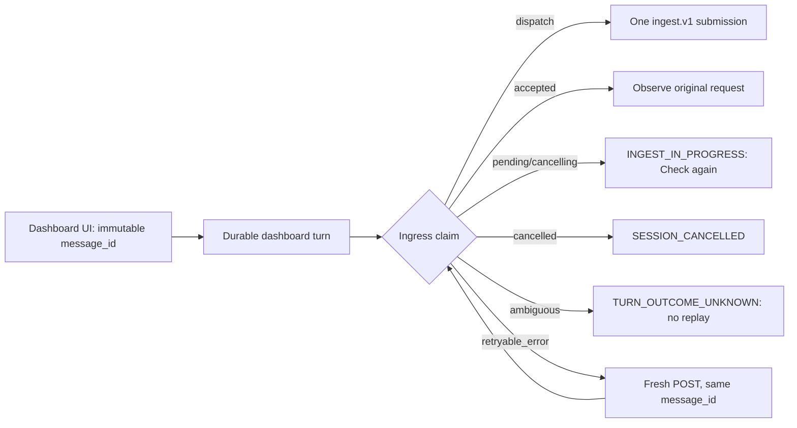

> **ARCHIVED** — This implementation/design plan is historical. Archived on 2026-09-06.
> **Reason:** Durable dashboard-turn / immutable message_id retry contract is now codified in the conversations spec.
> **Successor:** `openspec/specs/dashboard-conversations/spec.md`.
>
> The doctrine on archival lives in `openspec/specs/docs-information-architecture/spec.md`.

# Chat Send Retry Semantics

**Status:** Current durable-turn contract · amended 2026-07-29

**Related:** [Dashboard chat widget design](2026-07-03-dashboard-chat-widget-design.md), [Dashboard conversations specification](../../openspec/specs/dashboard-conversations/spec.md), [Ingestion envelope protocol](../api_and_protocols/ingestion-envelope.md)

## Current decision

Every dashboard UI user message receives one immutable client-generated UUID
(`message_id`). The API persists the user message and opens a durable dashboard
turn keyed by that ID before it exposes SSE or crosses the Switchboard ingress
boundary. The ID is reused for retry and Stop, and becomes
`event.external_event_id` in the ingest envelope.

The authoritative outcome matrix is:

| Durable outcome | Client behavior | May issue `ingest.v1`? |
| --- | --- | --- |
| `dispatch` | Submit the current POST's envelope. | Yes, exactly once for the claim owner. |
| `accepted` | Observe/poll the original request and its eventual reply. | No. |
| `pending` or `cancelling` | Render `INGEST_IN_PROGRESS` with **Check again** / history refresh. | No. |
| `cancelled` | Render `SESSION_CANCELLED` as a confirmed terminal Stop. | No. |
| `ambiguous` | Render `TURN_OUTCOME_UNKNOWN` honestly and suppress automatic replay. | No. |
| `retryable_error` | Offer Retry, which makes a fresh POST with the same immutable ID. | Yes, after the durable retryable result. |
| deterministic rejection | Surface the rejection; reuse of the ID does not create a new logical message. | Only if a later server-side state change explicitly permits it. |

The canonical Stop API is `POST /api/butlers/{name}/conversation-turns/{message_id}/cancel`.
It addresses the durable turn even before a new conversation has delivered its
ID over SSE. The older conversation-scoped cancel endpoint is compatibility-only.
A 200 Stop response is truthful rather than optimistic: it reports either
`cancelled`, `already_finished`, or an unconfirmed outcome with an explanation.

## What Retry means

Retry remains a fresh HTTP/SSE attempt, not byte-for-byte transport replay. It
reuses the same logical message and durable turn, but the request can have a
fresh `observed_at`, page context, and conversation-context preamble. The
durable claim prevents that freshness from creating a second ingress or runtime
for an active turn.

This contract intentionally does not promise reconstruction of an old SSE
position, response tokens, or exact envelope bytes. It promises that a
dashboard retry cannot silently race a still-owned, cancelled, or unprovable
turn into a second external ingress.

## Recovery boundary

Normal `route_inbox` recovery re-dispatches a stale claimed row only after
fencing its opaque processing lease. A dashboard-sourced row linked to a
durable turn is different: reclamation cannot prove the prior runtime died, so
recovery marks that turn ambiguous and does not replay it. Exact durably
registered predecessor sessions remain addressable by Stop.

This is deliberately narrower than broad terminal-action recovery. It does not
change ordinary non-dashboard recovery or claim that every irreversible
downstream effect can be reconstructed.

## Historical v1 boundary

Before the durable turn control plane, the dashboard reused a client message ID
for local message persistence and Switchboard deduplication, but a generic
Retry could submit a fresh ingress while the predecessor's outcome was not
durably known. The 2026-07-17 version of this document recorded that limited
at-least-once behavior. It is retained here only as historical context; the
outcome matrix above supersedes it.

## Implementation evidence

| Concern | Current interface or source location |
| --- | --- |
| Durable turn creation, ingress claims, cancellation, and recovery reconciliation | [`dashboard_turns.py`](../../src/butlers/core/dashboard_turns.py) |
| API pre-SSE turn opening, outcome-to-SSE mapping, and canonical Stop | [`conversations.py`](../../src/butlers/api/routers/conversations.py) |
| Immutable UI message identity and retry callbacks | [`ChatPanel.tsx`](../../frontend/src/components/chat/ChatPanel.tsx) and [`FloatingChatWidget.tsx`](../../frontend/src/components/chat/FloatingChatWidget.tsx) |
| No-replay UI classification for ambiguous and in-progress outcomes | [`send-error-utils.ts`](../../frontend/src/components/chat/send-error-utils.ts) and [`send-error.tsx`](../../frontend/src/components/chat/send-error.tsx) |
| Lease fencing before anchor/runtime handoff and dashboard-specific recovery | [`route_inbox.py`](../../src/butlers/core/route_inbox.py), [`_routing.py`](../../src/butlers/core_tools/_routing.py), and [`switchboard_wiring.py`](../../src/butlers/switchboard_wiring.py) |
| Regression coverage | [`test_route_inbox.py`](../../tests/core/test_route_inbox.py), [`test_route_execute_conversation_anchor.py`](../../tests/daemon/test_route_execute_conversation_anchor.py), [`ChatPanel.test.tsx`](../../frontend/src/components/chat/ChatPanel.test.tsx), and [`FloatingChatWidget.test.tsx`](../../frontend/src/components/chat/FloatingChatWidget.test.tsx) |
