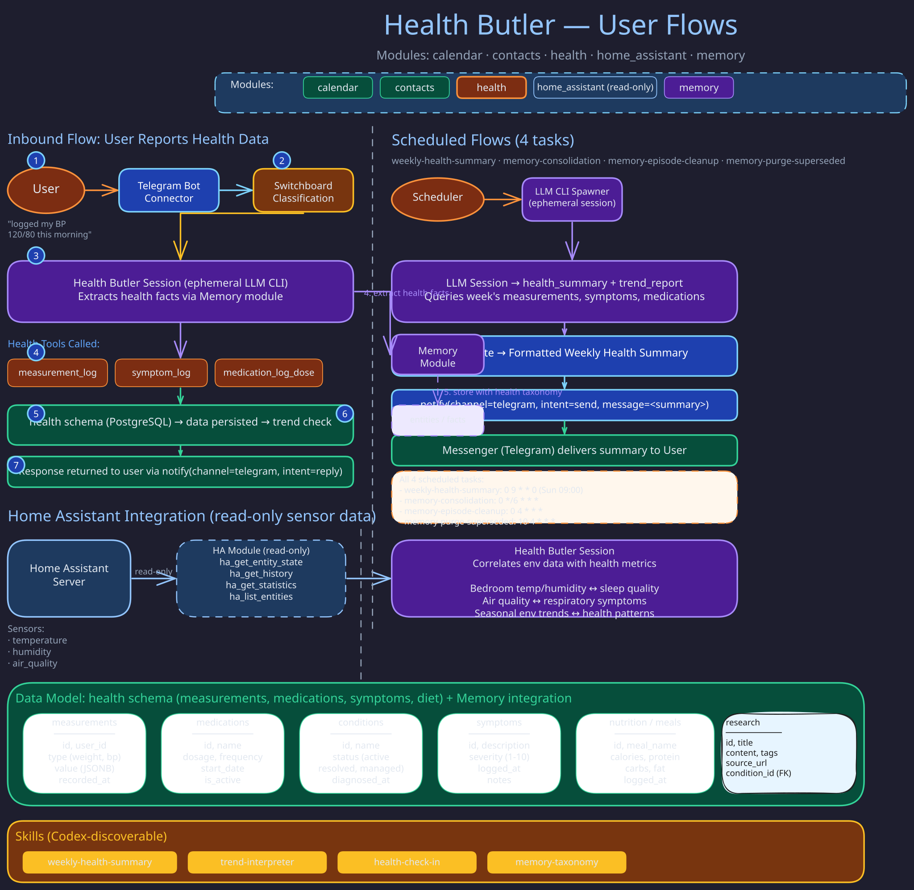

# Health Butler

Tracks wellbeing over time: measurements, medications and adherence, conditions, symptoms,
meals, and saved research. It has read-only Home Assistant access to correlate environment with
health, and reports an instrument outage as unmeasurable rather than as a missed measurement.

- **Identity and scope:** [`roster/health/MANIFESTO.md`](../../roster/health/MANIFESTO.md)
- **Required behavior:** [`butler-health` spec](../../openspec/specs/butler-health/spec.md)
- **Schedules, modules, and port:** [`roster/health/butler.toml`](../../roster/health/butler.toml)

## Related Pages

- [Home Butler](home.md) -- owns Home Assistant control; Health only reads sensors
- [Expected Signals](../concepts/expected-signals.md) -- the honest-absence contract behind measurement-gap nudges
- [Switchboard Butler](switchboard.md) -- routes health-related messages here
