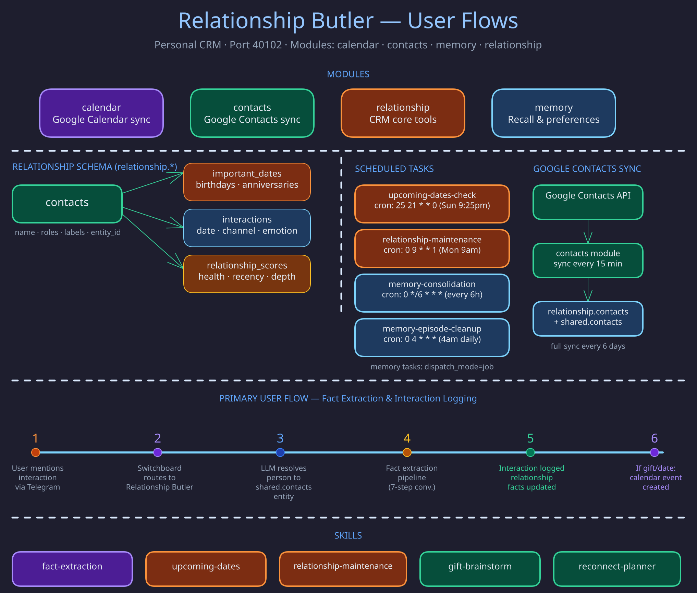

# Relationship Butler

A personal CRM: contacts, relationships, important dates, interactions, gifts, loans, and
reminders, so the owner never forgets what matters about the people in their life. Data is
entity-first: every contact links to a shared entity, and facts attach to the entity.

- **Identity and scope:** [`roster/relationship/MANIFESTO.md`](../../roster/relationship/MANIFESTO.md)
- **Required behavior:** [`butler-relationship` spec](../../openspec/specs/butler-relationship/spec.md)
- **Schedules, modules, and port:** [`roster/relationship/butler.toml`](../../roster/relationship/butler.toml)
- **Entity model:** [Identity Model](../concepts/identity-model.md)

## Stale-contact source authority

Elapsed time alone does not prove a contact has gone quiet. A contact can be surfaced as overdue
(in insight scans, the weekly maintenance message, the reconnect planner, the Contacts overdue
panel, or the attention rail) only when exactly one server-attested producer was expected to
record the next interaction, and the heartbeat for that exact producer endpoint is healthy. A
healthy sibling endpoint never substitutes; stale, missing, unhealthy, or mixed provenance makes
the contact `unmeasurable` and pauses every nudge. Caller-settable `extra_metadata.source` is not
producer authority. `unmeasurable` describes the instrument, not the owner's behavior, so an
empty overdue list is not an all-clear.

The channel-to-producer mapping lives in the `butler-relationship` spec and
[RFC 0029](../../about/legends-and-lore/rfcs/0029-expected-signals-and-honest-absence.md). For
triage, check the contact's expected-signal state and exact producer, then that same connector
endpoint's heartbeat.

## Effective time on structural facts

`relationship.entity_facts` rows can say *when* a relationship held, separately from when the
assertion was made (`created_at`), observed (`observed_at`, `last_seen`), how certain it is
(`conf`), and whether the assertion version is current (`validity`). None of those ever defaults
or derives an effective bound. The contract is the
[`relationship-fact-effective-time`](../../openspec/changes/relationship-fact-effective-time/design.md)
change; the wire rules live in `roster/relationship/tools/fact_temporal.py`.

- **Packet.** `effective_period_id` names one occurrence of a triple (NULL is the default
  occurrence every legacy row uses). The interval is half-open `[effective_from, effective_to)`
  with a precision per bound: `instant`, `day`, `month`, `year` or `unbounded`. A NULL bound with
  NULL precision is **unknown**; a NULL bound with `unbounded` is an explicit open end. Unknown
  never means "for all time". Coarse bounds normalize to UTC unit starts, and an upper bound to
  the first instant after its unit (`2024-05`/`month` stores `2024-06-01T00:00:00Z`).
- **Writer modes.** With no temporal argument (omitted and `null` are identical) a write is
  *ordinary*: it targets the default occurrence and copies whatever packet that row already has
  into any provenance replacement. Any non-null bound, precision or period id is an *explicit*
  packet; a different packet for an occupied occurrence is refused, never silently corrected.
  `corrects_fact_id` is a compare-and-swap correction of one exact active version; a stale
  target fails without writing. Parked owner approvals carry all six temporal keys canonically
  and freeze the resolved mode and base version in `fact_approval_context`.
- **Readers stay assertion-current.** Existing queries select `validity = 'active'` only; an
  active row whose interval closed in the past is still returned. As-of reads belong to a
  separate change.
- **Transition stage, no live cutover.** Migration `rel_035` adds the columns, checks and the
  occurrence index but keeps `uq_ef_spo_active`, the deployed writer's conflict target. While
  that index exists every temporal argument fails `temporal_cutover_pending` before approval
  parking or any write, so only unknown default rows can exist. Dropping it is a later cutover
  migration that is not in the chain; it needs proof that no old writer is live and that every
  production mutator in `tests/contracts/test_entity_facts_mutator_inventory.py` preserves
  occurrences or refuses first. Until then, rollback is: drain the transition writer, restore
  the old one, optionally downgrade `rel_035` (facts and rel_034 evidence, coverage and approval
  context survive). The downgrade refuses once the legacy index is gone or any temporal value
  exists; after cutover, recovery rolls forward. The proof and enforcement that cutover must
  require (signed receipt, lifecycle fence, gated rel036) are drafted in the
  [effective-time cutover packet](../operations/relationship-effective-time-cutover.md).
- **Mutator fences.** Entity merge locks and plans every affected fact first, repoints rows with
  their packets and evidence intact, and refuses `temporal_occurrence_collision` before any write
  rather than collapse an occurrence that carries effective time. Legacy `contact_merge`,
  hash-addressed contact routes, SPO retraction and `prefers-channel` refuse
  (`temporal_mutator_unsupported` / `temporal_occurrence_ambiguous`) whenever they would have to
  choose between occurrences or drop a packet. `contact_merge` does every Relationship write in
  one transaction that locks both entity rows and every affected fact, re-runs its fence under
  those locks, and commits whole or writes nothing; the memory entity merge runs only after that
  commit. A contact value edit re-locks its hash-selected row before retracting it and refuses
  `contact_fact_changed` (409) if the row was retracted or re-valued meanwhile. Entity forget
  retracts every occurrence as-is and removes their graph edges; Google/Steam hard deletes keep
  their all-version cascade.

## Implementation Notes

- `relationship.facts` is a multi-valued log store: `activity` and `interaction_*` carry many
  active rows per `(entity_id, predicate)`. Contradiction detection in
  `run_fact_retraction_curation` (`roster/relationship/jobs/relationship_jobs.py`) is therefore
  gated to the `_CONTRADICTION_FUNCTIONAL_PREDICATES` allowlist, so a new log predicate can never
  flood approvals. Cardinality cannot be read from `entity_predicate_registry`, which covers only
  the `entity_facts` store.
- `run_interaction_sync_job` reads `switchboard.message_inbox` directly, so `scripts/init-db.sql`
  grants `butler_relationship_rw` read-only access to schema `switchboard` (plus matching default
  privileges).
- `POST /api/relationship/contacts/sync` dispatches to the `contacts_sync_now` MCP tool with
  `{"provider": "google", "mode": "incremental|full"}`. `mode` is strict, and credential failures
  surface as `400` errors pointing at `/api/oauth/google/start`.
- `relationship.facts` and `relationship.predicate_registry` belong to the memory module; domain
  triple-store work uses `relationship.entity_facts` and `relationship.entity_predicate_registry`.
  Interaction facts use `subject='entity:{entity_id}'` (`interaction_log` / `interaction_list`
  still resolve legacy contact UUIDs).
- Active-surface queries share one filter excluding `metadata.archived = true`, `archived_at`,
  `tombstone = true`, `deleted_at` and `merged_into`.
- Dunbar decay counts connector LLM-extraction facts as mentions unless
  `extra_metadata.source == "interaction_sync"`; `email`, `interview` and `calendar_event`
  interactions weigh `0.2`.

## Related Pages

- [Switchboard Butler](switchboard.md) -- routes people-related messages here
- [General Butler](general.md) -- handles freeform data that is not contact-specific
