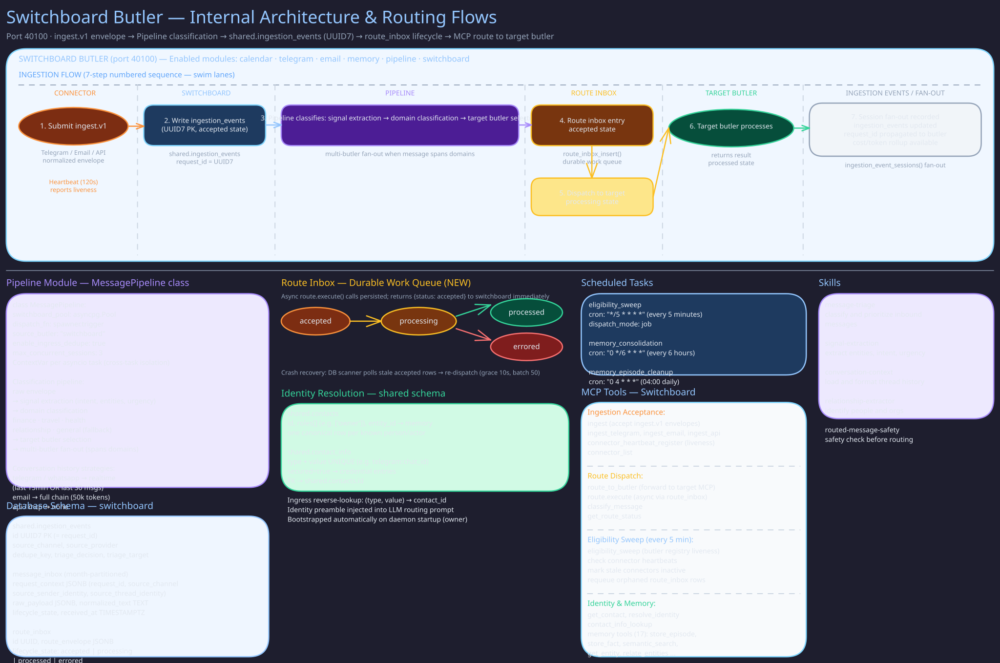

# Switchboard Butler

The single ingress and routing control plane. It assigns request context, resolves sender
identity, classifies and decomposes each message, dispatches segments to specialist butlers, and
relays every butler's `notify()` to Messenger. It owns no domain logic.

- **Identity and scope:** [`roster/switchboard/MANIFESTO.md`](../../roster/switchboard/MANIFESTO.md)
- **Required behavior:** [`butler-switchboard` spec](../../openspec/specs/butler-switchboard/spec.md)
- **Schedules, modules, and port:** [`roster/switchboard/butler.toml`](../../roster/switchboard/butler.toml)

## Related Pages

- [Switchboard Routing](../concepts/switchboard-routing.md) -- how a message is routed, end to end
- [Messenger Butler](messenger.md) -- the delivery plane `notify()` is relayed to
- [General Butler](general.md) -- fallback routing target
