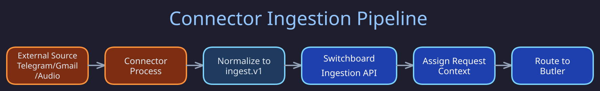
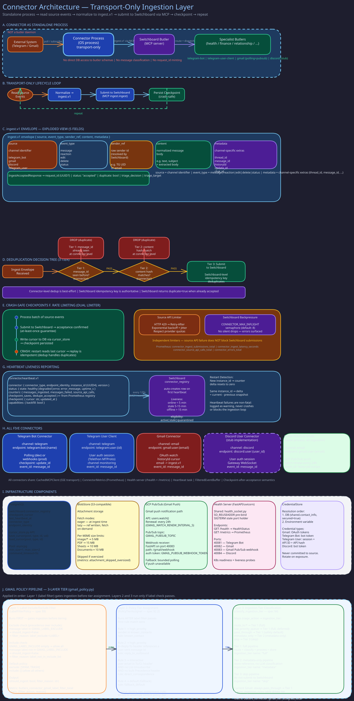

# Connector Architecture Overview

> **Purpose:** Explain what connectors are, their responsibilities, transport model, and how they submit events to the Switchboard.
> **Audience:** Developers building or operating connectors.
> **Prerequisites:** Familiarity with the [Switchboard butler role](../concepts/switchboard-routing.md).

## Overview





Connectors are transport adapters that bridge external messaging systems (Telegram, Gmail, audio devices, etc.) into the Butlers ecosystem. They read events from source APIs, normalize them into a canonical envelope format, and submit them to the Switchboard's ingestion API. Connectors are deliberately thin -- they own the transport layer and nothing else.

## What Connectors Are

A connector is an independent process (or co-located daemon) that:

1. Reads source events or messages from an external system.
2. Normalizes source payloads into the `ingest.v1` envelope format.
3. Submits envelopes to the Switchboard via MCP tool call (`ingest`).
4. Persists a resume cursor so it can restart safely after crashes.
5. Sends periodic heartbeats to report liveness and operational statistics.

Connectors run independently from the Switchboard daemon lifecycle. The preferred deployment model is one process per connector type, though in-process connectors are allowed as long as they use the same canonical ingest path.

## Connector Responsibilities

### Connectors MUST

- Read source events/messages from an external system (Telegram, email, webhook, audio, etc.).
- Normalize source payloads into `ingest.v1` envelopes.
- Submit to the canonical Switchboard ingest API via MCP tool call.
- Persist connector-local resume state (cursor/offset/high-water mark) in the database via the `cursor_store` module.
- Enforce source-side rate limiting (provider quotas, 429 handling, jittered backoff).
- Enforce ingest-side backpressure (bounded in-flight requests, retry policy).
- Send periodic heartbeats to the Switchboard (every 2 minutes by default).
- Implement crash-safe, restart-safe behavior with at-least-once delivery.

### Connectors MUST NOT

- Classify messages (that is a Switchboard responsibility).
- Route directly to specialist butlers.
- Mint canonical `request_id` values (Switchboard assigns these at ingest acceptance).
- Bypass Switchboard ingestion with direct target-butler calls.

## Transport Model

Connectors submit envelopes via **MCP tool call** (`ingest`) to the Switchboard MCP server. Transport is SSE-based MCP (`fastmcp.Client`), not HTTP POST. The MCP server endpoint is configured via the `SWITCHBOARD_MCP_URL` environment variable.

The Switchboard responds with `202 Accepted` semantics: ingest is accepted for async processing, and the response includes a canonical request reference. Duplicate submissions for the same dedupe identity return the same canonical request reference and are treated as success, not error.

### Submission Flow

```
External Source --> Connector --> [normalize to ingest.v1] --> MCP tool call (ingest) --> Switchboard
                                                                                            |
                                                                         request_id assigned <--
                                                                         classification + routing -->
```

## Data Source Modes

Connectors support two source models:

- **Push/webhook connectors:** The source pushes events to the connector (e.g., Telegram webhooks, Gmail Pub/Sub), which forwards them to the Switchboard.
- **Pull/poll connectors:** The connector periodically fetches new events from the source API (e.g., Telegram `getUpdates`, Gmail history polling), then forwards each to the Switchboard.

Each newly observed source message/event is ingested as one canonical ingress record.

## Endpoint Identity Auto-Resolution

Connectors auto-resolve their endpoint identity at startup from the source API. No environment variable is needed:

| Connector | Resolution method | Example identity |
|---|---|---|
| Telegram bot | `getMe()` | `telegram:bot:@mybot` |
| Telegram user client | `get_me()` | `telegram:user:@username` |
| Gmail | `google_accounts.email` | `gmail:user:alice@gmail.com` |
| Live listener | Device config | `live-listener:connector` |

## Idempotency and Deduplication

Connectors must always send stable source identity fields (`channel`, `endpoint_identity`, `external_event_id`). The Switchboard owns the deduplication decision at the ingest boundary. Connectors must treat duplicate acceptance as success.

Canonical dedupe key guidance per provider:

- **Telegram:** `update_id` + receiving bot identity
- **Email:** RFC `Message-ID` + receiving mailbox identity
- **API/MCP:** caller idempotency key or deterministic payload hash + source identity + bounded time window

## Checkpoint Persistence

All connectors persist their resume cursor in the database via the `cursor_store` module (`butlers.connectors.cursor_store`). The canonical storage location is the `switchboard.connector_registry` table, keyed by `(connector_type, endpoint_identity)`.

Startup flow:

1. Create an asyncpg pool via `create_cursor_pool_from_env()`.
2. Call `load_cursor(pool, connector_type, endpoint_identity)`.
3. If a cursor exists, resume from that position.
4. If `None` (first run), initialize from the source API and write the baseline via `save_cursor()`.

No file-based cursor storage is used. All checkpoint state lives in the database.

## Self-Registration via Heartbeat

Connectors self-register on their first heartbeat -- no manual pre-configuration is required. The Switchboard creates a `connector_registry` row and begins tracking liveness. See [Heartbeat Protocol](heartbeat.md) for details.

## Environment Variables (Common)

| Variable | Required | Description |
|---|---|---|
| `SWITCHBOARD_MCP_URL` | Yes | SSE endpoint URL for Switchboard MCP server |
| `CONNECTOR_PROVIDER` | Yes | Provider name (`telegram`, `gmail`, etc.) |
| `CONNECTOR_CHANNEL` | Yes | Canonical channel (`telegram`, `email`, `voice`, etc.) |
| `CONNECTOR_POLL_INTERVAL_S` | For poll connectors | Poll interval in seconds |
| `CONNECTOR_MAX_INFLIGHT` | No (default: 8) | Ingest concurrency cap |
| `CONNECTOR_HEARTBEAT_INTERVAL_S` | No (default: 120) | Heartbeat interval in seconds |
| `CONNECTOR_HEARTBEAT_ENABLED` | No (default: true) | Disable for dev/testing |

Provider-specific credentials must come from environment or secret manager, never committed config.

## Authentication

Connector authentication uses bearer tokens issued by the Switchboard. Token scope must match the connector's source identity (`channel`, `provider`, `endpoint_identity`). See [API Authentication](../identity_and_secrets/cli-runtime-auth.md) for token lifecycle details.

## Available Connectors

- [Telegram Bot](telegram-bot.md) -- Bot API polling/webhook connector
- [Telegram User Client](telegram-user-client.md) -- MTProto user-client live stream
- [Gmail](gmail.md) -- Gmail API history polling and Pub/Sub push
- [Live Listener](live-listener.md) -- Ambient audio capture, VAD, and transcription
- [Heartbeat Protocol](heartbeat.md) -- Liveness reporting (all connectors)
- [Attachment Handling](attachment-handling.md) -- Gmail attachment fetch policy
- [Gmail Ingestion Policy](gmail-ingestion-policy.md) -- Tiered email processing
- [Metrics](metrics.md) -- Connector statistics and dashboard visibility

## Verification

To confirm connectors are operating within their defined responsibilities:

```bash
# 1. Active connectors appear in the registry with liveness state
psql -h localhost -U butlers -d butlers -c \
  "SELECT connector_type, endpoint_identity, state, last_heartbeat_at
   FROM switchboard.connector_registry ORDER BY connector_type;"
# Expected: each running connector (gmail, telegram_bot, etc.) shows state='online'
#           with last_heartbeat_at within the last 2 minutes

# 2. Cursor state is DB-backed (not file-based)
psql -h localhost -U butlers -d butlers -c \
  "SELECT connector_type, endpoint_identity, cursor_value, updated_at
   FROM switchboard.connector_registry ORDER BY updated_at DESC LIMIT 5;"
# Expected: cursor_value is a non-null checkpoint (history ID, update_id, etc.)
#           for each active connector; no file under /tmp or /var/lib/connectors

# 3. Connectors never route directly to domain butlers (only to Switchboard)
# Check ingestion_events source: all events should come through the ingest tool
psql -h localhost -U butlers -d butlers -c \
  "SELECT source_provider, source_endpoint_identity, COUNT(*) as events
   FROM switchboard.ingestion_events
   WHERE received_at > NOW() - INTERVAL '1 hour'
   GROUP BY source_provider, source_endpoint_identity;"
# Expected: only known connector identities appear; no rows with source_provider='internal'
#           from domain butlers bypassing the Switchboard

# 4. Connector rate limiting is enforced (no 429 errors spike in metrics)
curl -s "http://localhost:9090/api/v1/query?query=connector_errors_total{error_type='rate_limit'}" \
  | python3 -m json.tool | grep value
# Expected: zero or low count; spikes indicate rate limit misconfiguration

# 5. Backpressure counter stays near zero under normal load
curl -s "http://localhost:9090/api/v1/query?query=connector_ingest_submissions_total{status='error'}" \
  | python3 -m json.tool | grep value
# Expected: error count is near zero; rising errors indicate Switchboard backpressure
```

## Implementation Notes

- WhatsApp `pair_required` is a waiting state, not a failure. `BridgeSubprocessManager`
  (`src/butlers/connectors/bridge_manager.py`) treats it as startup-ready unconditionally, and
  `WhatsAppUserClientConnector._sse_event_loop` checks `is_awaiting_pairing` before its generic
  degraded-stop branch, so a bridge mid-QR-scan is never torn down. Only terminal reasons
  (pairing timeout, invalidated session, unreachable) break the loop.
  `_maybe_resolve_pending_endpoint_identity()` is re-run on each healthy pass so the
  `"whatsapp:pending"` placeholder resolves once the bridge reports `connected`.
- Discretion's small-group bypass (`group_size_bypass_max`) must gate on an allow-list
  `chat_type in {"group", "supergroup"}` as well as `participant_count`: DMs report
  `participant_count=2` and broadcast channels resolve counts too, so a count-only or
  `!= "private"` check bypasses discretion for them.
- `whatsapp-bridge` dispatches whatsmeow events serially on one goroutine: never make a blocking
  network call inside a handler (use the `internal/events.GroupInfoCache` pattern: serve the cached
  value, refresh in the background). There is no Go CI job; run
  `go build && go vet && go test -race && gofmt -l .` locally.
- Spotify: prefer the resolved `context_name` in `normalized_text` and `payload.raw.context_name`;
  raw URI suffixes are a fallback, or entity extraction stores Spotify IDs as names.
- WhatsApp `Client outdated (405)` loops mean the pinned `go.mau.fi/whatsmeow` is stale: update
  `whatsapp-bridge/go.mod` and confirm a live connect. It is not a re-pair condition.
- An optional connector whose credentials arrive at runtime through the dashboard must park, not
  crashloop: keep a sentinel endpoint identity plus a degraded heartbeat
  (`google_health:degraded`, `steam:no_accounts`, `spotify:unconfigured`, the Google managers' idle
  mode). Keep `_endpoint_identity` empty while parked; only metrics, policy and heartbeat labels use
  the sentinel. Only "never connected" is non-fatal, via its own exception subclass
  (`SpotifyCredentialsUnconfiguredError`); every post-configuration fault stays loud. Env-var
  connectors (telegram, discord, whatsapp, activitywatch) that fail `Config.from_env()` are a
  deployment misconfiguration and should crash.
- `switchboard.connector_registry` has two producers on one `(connector_type, endpoint_identity)`
  key: the `connector.heartbeat` tool (one row per process) and `cursor_store.save_cursor` (one row
  per checkpoint). Since sw_031 the role is persisted in `operational_role` (`runtime_instance`,
  `checkpoint`, `unknown`) with `parent_endpoint_identity`; the vocabulary is
  `butlers.connectors.registry_roles`. Only `runtime_instance` rows carry liveness authority;
  heartbeat promotion is one-way; `save_cursor` stamps `checkpoint` on INSERT only, never in its
  `ON CONFLICT` branch. Never derive the role from the identity string, surface `unknown` as
  `unclassified`, and make every new writer declare a role and every new consumer filter by it.

## Related Pages

- [Connector Interface Contract](../api_and_protocols/ingestion-envelope.md) -- Full normative spec including `ingest.v1` envelope schema
- [Switchboard Butler Role](../concepts/switchboard-routing.md) -- Ingestion authority
- [API Authentication](../identity_and_secrets/cli-runtime-auth.md) -- Token lifecycle
