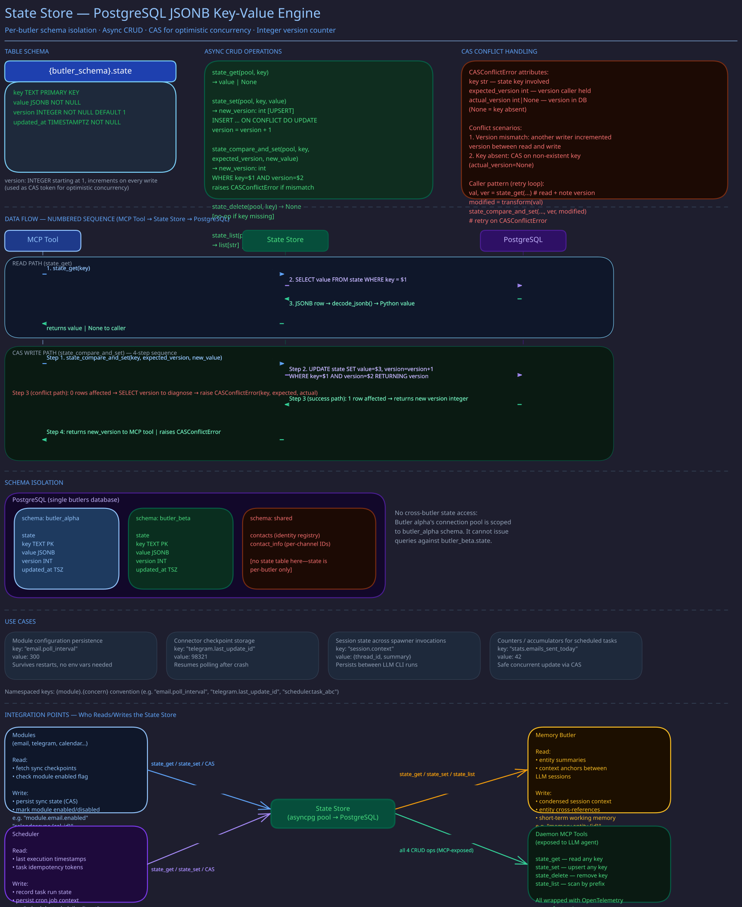

# State Store

> **Purpose:** Document the KV JSONB state store that butlers use to persist data between sessions.
> **Audience:** Module developers, butler authors.
> **Prerequisites:** [Schema Topology](schema-topology.md).

## Overview



Every butler has a `state` table in its schema that provides a key-value store backed by PostgreSQL JSONB. This is the primary mechanism for butlers to remember things between ephemeral LLM CLI sessions. The state store is intentionally simple: string keys mapping to arbitrary JSON-serializable values, with built-in versioning for safe concurrent writes.

## Table and API

The `state` table is created in `alembic/versions/core/core_001_foundation.py`: a `TEXT` primary
key, a `JSONB` value, `updated_at`, and a `version` counter. The async API is in
`src/butlers/core/state.py`; each function takes an asyncpg pool. What each write gives you:

- **`state_set`** is an atomic `INSERT ... ON CONFLICT DO UPDATE` upsert that bumps `version` and
  returns it. Concurrent writers get last-writer-wins.
- **`state_compare_and_set`** writes only when the stored `version` equals the caller's expected
  version, otherwise it raises `CASConflictError` carrying both versions. Use it when two sessions
  may read, modify, and write back the same key.
- **`state_claim_if_changed`** writes only when the stored value differs and returns whether this
  caller won. Use it for check-then-act dedup and claim patterns, where a bare `state_set` would let
  two racing callers both proceed.
- **`state_get`** returns `None` for a missing key, and `state_delete` on a missing key is a no-op.
  `state_list` filters by key prefix and returns keys only unless `keys_only=False`.

## Key Naming Conventions

State keys follow a namespaced convention using `::` separators:

- `contacts::sync::google` -- Google contacts sync state
- `contacts::sync::telegram` -- Telegram contacts sync state
- `scheduler::last_tick` -- Last scheduler tick timestamp
- `module::<name>::<key>` -- Module-specific state

## JSONB Decoding

The `decode_jsonb()` helper handles a subtle asyncpg behavior: JSONB columns are returned as Python strings (text representation) when no custom codec is registered. The function applies `json.loads()` and detects double-encoded values (a JSON string containing JSON text) by applying a second decode pass when needed.

## Concurrency Model

The state store is designed for concurrent access from multiple asyncio tasks within a butler daemon:

- **Simple writes** (`state_set`): Last-writer-wins semantics. Safe when only one writer per key is expected.
- **Coordinated writes** (`state_compare_and_set`): Optimistic locking via version numbers. Use this when multiple writers may contend on the same key.
- **Claims** (`state_claim_if_changed`): exactly one of several racing callers sees `True`.

Since each butler has its own schema and pool, there is no cross-butler contention on the state table.

## Exposed as MCP Tools

The state store is exposed to LLM CLI instances through core MCP tools (`src/butlers/core_tools/_state.py`), allowing the AI runtime to persist and retrieve data across sessions.

## Verification

To confirm the state store described here matches the running system:

```bash
# 1. State table exists in each butler's schema
psql -h localhost -U butlers -d butlers -c \
  "SELECT key, updated_at, version FROM general.state ORDER BY updated_at DESC LIMIT 5;"
# Expected: rows with namespaced keys (e.g., "contacts::sync::google", "scheduler::last_tick")

# 2. Version increments on each write
# Record the current version for a key, then write to it via the MCP state_set tool,
# then re-query:
psql -h localhost -U butlers -d butlers -c \
  "SELECT key, version FROM general.state WHERE key = 'scheduler::last_tick';"
# Expected: version number increases by 1 on each write

# 3. state_list MCP tool returns keys accessible to the LLM
# Trigger a butler session that calls state_list() and check its output.
# Expected: returns key strings (with keys_only=True), matching what's in the DB above

# 4. CAS conflict detection: state_compare_and_set rejects stale version
# In Python with a running pool, call state_compare_and_set with the wrong version:
#   from butlers.core.state import state_compare_and_set, CASConflictError
#   try:
#       await state_compare_and_set(pool, "scheduler::last_tick", expected_version=0, new_value={})
#   except CASConflictError as e:
#       print(f"Rejected: expected {e.expected_version}, actual {e.actual_version}")
# Expected: CASConflictError raised with correct version values

# 5. State is scoped per-butler (general's state is not visible to health)
psql -h localhost -U butlers -d butlers -c \
  "SELECT key FROM health.state ORDER BY key LIMIT 5;"
# Expected: different keys from general.state, no cross-butler leakage
```

## Related Pages

- [Schema Topology](schema-topology.md) -- Where the state table lives
- [Migration Patterns](migration-patterns.md) -- How the state table is created
