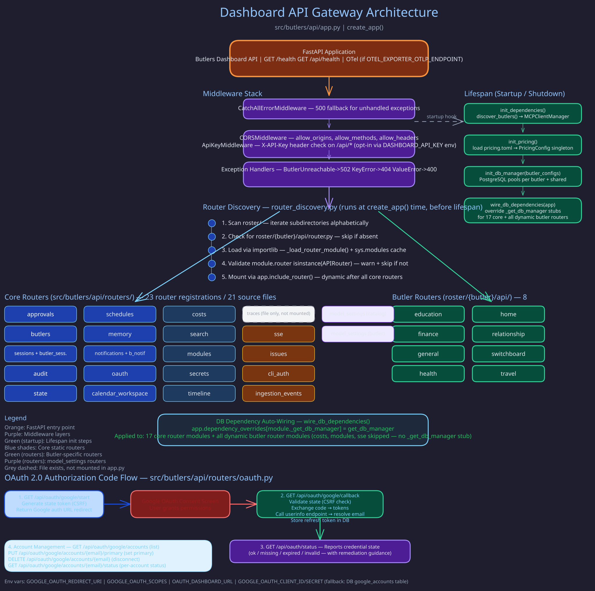

# Frontend Documentation

> **Purpose:** Index of the frontend design pages for the Butlers dashboard.
> **Audience:** Frontend developers, designers, anyone working on or integrating with the dashboard UI.
> **Prerequisites:** [Dashboard API](../api_and_protocols/dashboard-api.md).

## Overview



The Butlers dashboard is a React single-page application that serves as the operational single-pane-of-glass for the entire butler infrastructure. It provides monitoring, management, and configuration capabilities across all butlers, connectors, modules, and system health.

## Pages

### [Purpose and Single Pane of Glass](purpose-and-single-pane.md)

Defines the dashboard's role and why it exists. The dashboard is the operator's primary interface for monitoring butler health, reviewing session activity, managing schedules, approving sensitive actions, and configuring the system. It consolidates information that would otherwise require CLI access, database queries, or log parsing.

### [Information Architecture](information-architecture.md)

Covers the navigation rationale: sidebar grouping and tab organization. Documents the sidebar navigation hierarchy, how butler detail pages are structured with 10+ tabs, and how the Switchboard's specialized views (registry, routing log, triage, backfill) integrate into the navigation.

### [Data Access and Refresh](data-access-and-refresh.md)

Documents the API access patterns, polling/refresh behavior, and write-operation surfaces. Covers TanStack Query patterns for data fetching, auto-refresh tiers (real-time SSE for status, periodic polling for lists, on-demand for heavy queries), and how the frontend handles optimistic updates.

## Source of Truth

- **Required behavior** per page and endpoint: the `openspec/specs/dashboard-*` specs.
- **Routes:** `frontend/src/router-config.tsx`; topology in
  [about/lay-and-land/frontend.md](../../about/lay-and-land/frontend.md).
- **Endpoint shapes:** each router's `response_model` (mounted in `src/butlers/api/app.py`,
  butler routers under `roster/{butler}/api/router.py`) and the generated OpenAPI schema.
- **Cross-cutting API rules:**
  [Response Conventions](../api_and_protocols/response-conventions.md).
- The pages in this directory explain rationale and patterns; they do not enumerate features or
  endpoints.

## Update Rule

When frontend behavior changes, update the owning `openspec/specs/dashboard-*` spec in the same
change. Update a page here only when navigation rationale or data-access patterns change.

## Tech Stack

The dashboard is built with:

- **React** with TypeScript
- **Vite** for development and build
- **shadcn/ui** component library
- **OKLCH** design system for color management
- **TanStack Query** for server state management
- **Recharts** for data visualization (health charts, cost tracking)

## Development

The frontend dev server runs on port `41173` and proxies API requests to the dashboard backend on port `41200`:

```bash
# Standalone
cd frontend && npm install && npm run dev

# Via Docker Compose
docker compose --profile dev up frontend-dev
```

## Related Pages

- [Dashboard API](../api_and_protocols/dashboard-api.md) -- Backend REST API documentation
- [Environment Config](../operations/environment-config.md) -- Frontend environment variables
- [Docker Deployment](../operations/docker-deployment.md) -- Frontend container setup
