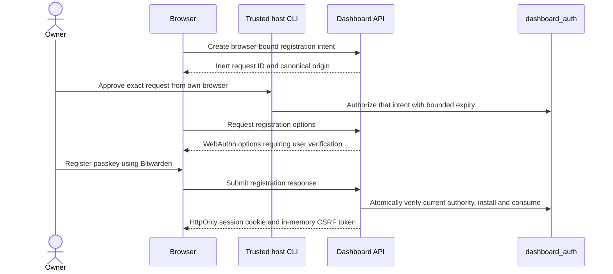

# Dashboard owner authentication

The dashboard belongs to one owner. Initial passkey registration requires
approval from the trusted host; routine sign-in uses that passkey without a
host command. Bitwarden stores the passkey when selected in the browser chooser.
Butlers verifies WebAuthn and never reads the vault, requests a master password,
or treats an account email as identity proof.

This page is the operator procedure for the
[adopted owner-authentication contract](../../openspec/changes/specify-host-authorized-dashboard-enrollment/design.md).
Implementation interfaces: `src/butlers/api/owner_auth/config.py` owns public
configuration and cookie naming; `src/butlers/api/owner_auth/http.py` owns HTTP
admission and ceremony boundaries. Update this page in the same change whenever
those interfaces or the host CLI contract change.

A successful build or review is not evidence that a deployed instance has been
enrolled. Run live procedures only for an explicitly authorized instance and
operation, after implementation verification and deployment preflight.

## How trust is established

The request ID locates one pending intent. It is not a bearer credential, and
knowing it does not permit registration from another browser. Approve only the
ID displayed in the browser being enrolled. A request supplied by someone else
must not be mistaken for your own intent.

## Canonical HTTPS and deployment identity

Use the configured Tailscale Serve HTTPS origin. The RP ID is its exact hostname,
not a URL path or parent domain. Browser authentication has no HTTP fallback,
including localhost. The supported origin uses port 443; alternate Serve ports
are not silently accepted. Missing or mismatched browser configuration makes
browser authentication unavailable.

The dashboard shell and API must use the same origin. Existing dev/prod path
prefixes can share an origin, but paths are not a browser trust boundary.
Deployment-specific cookie names and separate database state avoid accidental
collisions; mutually untrusted deployments require separate hostnames. Do not
infer trusted origin from client-supplied forwarded headers.

Configure `DASHBOARD_AUTH_ORIGIN`, `DASHBOARD_AUTH_RP_ID`,
`DASHBOARD_AUTH_DEPLOYMENT` and `DASHBOARD_AUTH_TRUSTED_PROXY_PEERS` as described
in the [environment reference](environment-variables.md#dashboard-api-variables).
The API must see the raw peer: Uvicorn proxy-header rewriting is disabled. A
trusted proxy supplies exact `X-Forwarded-Proto: https` and the canonical
`X-Forwarded-Host`; unknown peers cannot supply effective HTTPS authority.
A host-to-container connection may appear as a bridge address, not loopback;
verify the exact peer in the authorized deployment rather than assuming it.

[Tailscale's proxy implementation](https://github.com/tailscale/tailscale/blob/main/ipn/ipnlocal/serve.go)
sets these forwarded headers and strips its mount prefix. Verify the deployed
version and complete proxy path before cutover. Disable raw access logging and
header/body/query capture for authentication; verify absence using synthetic
sentinels before any real ceremony. These public source facts do not certify a
particular live proxy configuration.

## Runtime ordering before authority is exposed

Keep dashboard exposure closed while preparing the cutover. Install the patched
Spawner/runtime-adapter environment filters in every runtime and probe image,
terminate legacy runtime children, and verify that no old child or writer still
holds administrative `POSTGRES_*` or `DATABASE_URL` authority before introducing
the auth schema or accepting owner enrollment. A source patch or new parent
process does not revoke credentials inherited by an older child. If any legacy
child/writer cannot be accounted for, keep exposure closed and defer enrollment.

Retain these runtime filters during rollback for as long as the auth schema
exists. Rolling back API/frontend code requires the safeguard below: retain a configured
key or remove exposure. An older runtime image must not inherit host database
credentials again. These are deployment prerequisites,
not commands authorized by specification adoption or synthetic tests.

## Provision the restricted authentication connection

The authentication pool uses `DASHBOARD_AUTH_DB_USER` and
`DASHBOARD_AUTH_DB_PASSWORD`, with the existing PostgreSQL host, port and database.
These are Tier 0 infrastructure credentials. Missing credentials fail closed;
the pool must not fall back to the administrative `POSTGRES_USER/PASSWORD`.
Host CLI operations continue to use that separate trusted administrative path.

Prepare the following through the existing authorized database/secret-provisioning
workflow before live cutover:

1. Provision the `dashboard_auth_api` capability role before migration. Fresh
   databases receive it through `scripts/init-db.sql`; an existing deployment
   needs the same narrow role provision through its authorized administrative
   workflow, not an unreviewed re-run of the entire bootstrap. Then apply the
   additive auth migration to create the private schema. The normal migration
   principal remains `NOCREATEROLE`; never widen it to work around this preflight.
2. Provision a dedicated `LOGIN`, `NOINHERIT`, `NOSUPERUSER`, `NOCREATEDB`,
   `NOCREATEROLE` principal with membership only in the required auth API role.
   It must not own the database/schema or hold schema CREATE, direct table or
   column privileges, replication, bypass-RLS, or a host/schema-owner role.
3. Supply its password through deployment secrets only to the dashboard API.
   Never put password values in SQL files, shell history, process arguments,
   diagnostic output, the frontend or runtime-child configuration.
4. Verify with the actual restricted connection that permitted API functions
   work, direct table/host-function access fails, and `RESET ROLE` cannot regain
   administrative authority. A connection logged in as an administrator and
   subsequently restricted with `SET ROLE` does not satisfy this isolation.

The connection preflight permits only the login itself and `dashboard_auth_api`
in its complete reachable role ancestry. This also excludes privileged built-in
roles such as `pg_execute_server_program`, without relying on a privilege-name
denylist. It additionally checks column grants that do not appear as whole-table
privileges:

| Capability | Authentication runtime connection |
| --- | --- |
| Schema USAGE through `dashboard_auth_api` | Allowed |
| Execute `dashboard_auth.api(text,jsonb)` and `dashboard_auth.cleanup()` | Allowed |
| Execute `dashboard_auth.host(text,jsonb)` | Denied |
| Direct table/column read or mutation | Denied |
| Schema CREATE/ownership or database ownership | Denied |
| Superuser, role/database creation, replication or bypass-RLS authority | Denied |

No role/password provisioning follows automatically from adoption, tests or
merge. Record only the operation category and pass/fail outcome in the live
receipt, not connection credentials or authentication records.

## Initialize deployment configuration

After the separately authorized additive migration creates the empty auth
singleton, run `butlers auth reconcile-mode --confirm-revoke` once from the
trusted host with the intended deployment configuration, including keyless mode.
This binds the initialized row to the canonical origin and mode; it grants no
browser enrollment authority. API startup never creates a missing singleton or
repairs an inconsistent one. Proceed to browser enrollment only after this
host step succeeds and the content-blind status is available.

## Register the first passkey

1. Open the canonical dashboard and select **Register passkey**. The page shows
   the intended operation, full request ID and canonical origin. Private data
   stays unavailable.
2. Compare that exact request with your browser, then run the displayed
   `butlers auth authorize-registration --request <request-id>` command on the
   trusted host using its existing administrative database access.
3. Return to the browser, check authorization, and select **Register passkey**.
   Choose Bitwarden in the native passkey chooser.
4. Wait for verified server completion. Opening a chooser is not success;
   Butlers cannot independently certify which vault saved the credential.

The intent and ceremony expire after five minutes. Cancellation or expiry
requires a fresh browser request and host authorization. If response delivery
fails after a possible commit, try ordinary passkey sign-in rather than replaying
the old registration response.

## Daily use

Select **Sign in with passkey**. Returning and synced browsers use the same
flow without a host command, username or vault-password form. Browser sessions
expire absolutely, without sliding extension, within twelve hours.

Logout revokes the current session. Revoking all sessions leaves the passkey
usable for a new sign-in. Reload obtains a fresh in-memory synchronizer CSRF
token through the authenticated endpoint; unsafe cookie-backed actions require
both that token and the exact Origin. Authentication does not bypass domain
owner checks, approvals, idempotency, privacy or other route restrictions.

When a session expires, private queries and streams stop and the shell asks for
sign-in again. An interrupted mutation is not automatically repeated after
login. Retry it deliberately after inspecting its current state.

## Recover a lost credential

Recovery is deliberately stronger than logout: **host approval immediately
retires the old passkey and revokes every browser session**, before replacement.

1. Select **Recover access** to create a recovery intent in the intended browser.
2. Compare its full request ID and origin. On the trusted host run
   `butlers auth authorize-recovery --request <request-id> --confirm-revoke`.
3. Register a replacement in the browser and wait for durable completion.
4. If cancelled or expired, the old credential does not reactivate. Create a new
   recovery intent and explicitly authorize it again on the host.

For emergency session revocation without replacing the passkey, use
`butlers auth revoke-sessions --confirm-revoke` on the trusted host.

If unauthenticated visitors occupy pending ceremony capacity, use
`butlers auth clear-pending --confirm-revoke`. This invalidates pending contexts,
intents and ceremonies without listing visitors, replacing the active passkey,
or revoking already established sessions. Existing per-minute limits still
apply; wait for their cooldown before retrying. Pending registrations need a
fresh browser intent and fresh host approval.

## Configured-key automation and mode changes

A configured `DASHBOARD_API_KEY` retains non-browser `X-API-Key` authentication
and the HTTPS key-to-session browser flow. Never put the key in a URL, frontend
build variable, persistent browser storage, log or command transcript.

Configured-key and passkey modes are exclusive. Adding, changing or removing
the configured key retires previous passkey/session authority through explicit
host reconciliation; removing the key requires fresh host enrollment.
Before restarting after a key change, run
`butlers auth reconcile-mode --confirm-revoke` with the intended deployment
configuration. Repeating unchanged configuration is a no-op. A running worker
with a retired key generation fails unavailable immediately; restart with the
matching configuration restores its ability to authenticate.

Changing origin/RP requires deliberate host
`butlers auth rebind-origin --confirm-revoke`. Keyless mode then needs
host-authorized replacement registration; configured-key mode keeps its
exclusive header path and permits a fresh key-backed session at the new origin. An existing credential cannot be moved to a new
RP by editing a stored hostname. Never delete auth rows to reopen enrollment.

## Failure, restore and rollback

| Condition | Operator response |
| --- | --- |
| Browser chooser cancelled | Retry from a fresh ceremony; no success is assumed. |
| Registration response lost | Check the browser's own session or use fresh passkey login. |
| Auth store missing, corrupt or unavailable | Repair on the trusted host; no HTTP initialization or permissive fallback. |
| Recovery interrupted | Create and approve a new recovery intent; old authority remains revoked. |
| Browser origin differs from stored identity | Plan explicit rebind and replacement; do not add a request-derived alias. |

Remove exposure before restoring older auth state. A restored database cannot
detect its own rollback and may contain previously valid sessions or challenges;
explicit host epoch invalidation is required before re-exposure. A health response
alone does not prove safe restoration.

Before running a legacy image, revoke sessions and ceremonies, then either
configure a nonempty API key or remove all browser/network exposure. A reachable
legacy image with an empty key is not a safe rollback. Preserve auth history and
invalidate old authority again before forward cutover.

## Verification and evidence

Use synthetic credentials and isolated PostgreSQL/browser fixtures for development.
Actual canonical Serve and Bitwarden acceptance is a separately authorized live
operation. It must prove cookie acceptance/return, HttpOnly absence from JS,
CSRF reload and mutation, actual registration/login, cancellation and recovery.

Retained receipts contain only image/source identity, timestamp, operation
category and outcome. Exclude request/credential IDs, owner handles, cookies,
CSRF values, key digests, vault screenshots, raw HTTP bodies and command arguments.
The API keeps public verification material and digest-only browser credentials
in dedicated authentication state; generic Secrets and butler runtime roles do
not access it. The owner entity/contact remains a separate domain record.

### Global migration bookkeeping

The auth schema is database-global even when individual butler schemas track
separate core migration heads. Repeated `core_240` applications validate and
reuse its existing identity and authority; missing/corrupt state is never
reinitialized. A never-host-initialized, empty store permits only a no-op
revision downgrade that retains the global schema and marker. Initialized or
historical state refuses that downgrade. This bookkeeping exception neither
removes authentication data nor authorizes an old image or live rollback.
