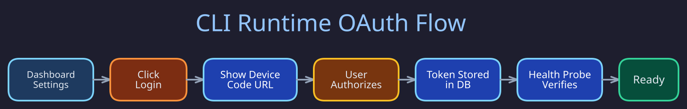

# OAuth Flows

> **Purpose:** Document the Google OAuth device-code flow, credential storage split, and multi-account support.
> **Audience:** Operators bootstrapping Google integrations, developers extending OAuth.
> **Prerequisites:** [Credential Store](../data_and_storage/credential-store.md), [Owner Identity](owner-identity.md).

## Overview



Butlers integrates with Google services (Calendar, Contacts, Gmail) via OAuth 2.0. The OAuth flow is bootstrapped through the dashboard UI and credentials are stored in a split model: app credentials in `butler_secrets`, refresh tokens in `public.entity_info` on companion entities. Multi-account Google support is fully implemented.

## Credential Storage Split

Google OAuth credentials are stored in two locations:

### App Credentials (in `butler_secrets`)

| Key | Category | Sensitive | Description |
|-----|----------|-----------|-------------|
| `GOOGLE_OAUTH_CLIENT_ID` | `google` | No | OAuth client ID |
| `GOOGLE_OAUTH_CLIENT_SECRET` | `google` | Yes | OAuth client secret |
| `GOOGLE_OAUTH_SCOPES` | `google` | No | Granted OAuth scopes |

These are shared across all Google accounts and stored via the `CredentialStore`.

### Refresh Tokens (in `public.entity_info`)

Each Google account has a **companion entity** in `public.entities` with `roles = ['google_account']`. The refresh token is stored as an `entity_info` row:

```
public.entity_info:
  entity_id = <companion_entity_uuid>
  type = "google_oauth_refresh"
  value = "1//0abc..."
  secured = true
  is_primary = true
```

This per-entity storage enables multi-account Google support -- each account has its own companion entity and its own refresh token.

## Google Account Registry

The `public.google_accounts` table tracks connected Google accounts:

| Column | Type | Description |
|--------|------|-------------|
| `id` | UUID | Account primary key |
| `entity_id` | UUID (FK) | Companion entity in `public.entities` |
| `email` | TEXT | Google email address |
| `display_name` | TEXT | Google profile display name |
| `is_primary` | BOOLEAN | Whether this is the active primary account |
| `granted_scopes` | TEXT[] | OAuth scopes granted at last connect |
| `status` | TEXT | `active`, `revoked`, or `expired` |
| `connected_at` | TIMESTAMPTZ | When the account was first connected |

A partial unique index enforces at most one primary account at the database level.

### Account Lifecycle

- **`create_google_account()`** -- Registers a new account after OAuth callback. Creates a companion entity, inserts the account row, and optionally stores the refresh token. First account is automatically primary.
- **`set_primary_account()`** -- Atomically swaps the primary flag using a single transaction.
- **`disconnect_account()`** -- Full disconnect flow: fetch refresh token, attempt Google revocation, delete entity_info, mark status as `revoked`. If disconnected account was primary, auto-promotes the oldest remaining active account.
- **`list_google_accounts()`** / **`get_google_account()`** -- Query by email, UUID, or get the primary.

### Account Limit

A soft limit of 10 active accounts (configurable via `GOOGLE_MAX_ACCOUNTS` env var) prevents unbounded growth.

## OAuth Bootstrap Flow

The dashboard provides a web-based OAuth bootstrap from `/settings/owner`:

1. User opens Settings → Owner Config and navigates to `GET /api/oauth/google/start` in the dashboard.
2. The dashboard initiates the OAuth authorization code flow with Google.
3. User authorizes in the browser and Google redirects back with an authorization code.
4. The callback endpoint exchanges the code for tokens.
5. App credentials (client_id, client_secret) are stored in `butler_secrets` via the shared credential store.
6. The refresh token is stored in `public.entity_info` on the companion entity.
7. A `public.google_accounts` row is created (or updated) with the granted scopes.

### Scope Grants

Different modules require different OAuth scopes:

- **Calendar** -- `https://www.googleapis.com/auth/calendar`
- **Contacts** -- `https://www.googleapis.com/auth/contacts.readonly`
- **Gmail** -- `https://www.googleapis.com/auth/gmail.readonly` (or `.modify`)

The `granted_scopes` array on the Google account record tracks which scopes were authorized. Modules validate scope availability at startup (e.g., the contacts module checks for a contacts scope).

## Loading Credentials

At module startup, credentials are loaded via `load_google_credentials()` or `resolve_google_credentials()`:

```python
from butlers.google_credentials import resolve_google_credentials

creds = await resolve_google_credentials(
    store, pool=shared_pool, caller="calendar", account="work@gmail.com"
)
# creds.client_id, creds.client_secret, creds.refresh_token
```

Resolution:
1. App credentials from `butler_secrets` via `CredentialStore.load()`.
2. Refresh token from `public.entity_info` via the companion entity lookup.
3. Account selector: `None` = primary account, `str` = email, `UUID` = account ID.

`MissingGoogleCredentialsError` is raised if credentials are incomplete, with a safe-to-log message naming missing fields (never values).

## Credential Safety

- `GoogleCredentials.__repr__()` redacts `client_secret` and `refresh_token`.
- `GoogleCredentials.__str__()` is aliased to `__repr__()` to prevent Pydantic's default from exposing values.
- Log messages never include secret material.

## Verification

To confirm the Google OAuth credential split, account registry, and token loading are operating as described:

```bash
# 1. Verify the google_accounts table exists and has the expected shape
psql -h localhost -U butlers -d butlers -c \
  "SELECT column_name, data_type FROM information_schema.columns
   WHERE table_schema = 'public' AND table_name = 'google_accounts'
   ORDER BY ordinal_position;"
# Expected: id, entity_id, email, display_name, is_primary, granted_scopes, status, connected_at

# 2. Confirm at most one primary account is enforced at the DB level
psql -h localhost -U butlers -d butlers -c \
  "SELECT indexname, indexdef FROM pg_indexes
   WHERE schemaname = 'public' AND tablename = 'google_accounts'
   AND indexdef ILIKE '%is_primary%';"
# Expected: a partial unique index on is_primary WHERE is_primary = true

# 3. Verify app credentials are stored in butler_secrets with the google category
psql -h localhost -U butlers -d butlers -c \
  "SELECT key, category, is_sensitive FROM public.butler_secrets
   WHERE category = 'google'
   ORDER BY key;"
# Expected: GOOGLE_OAUTH_CLIENT_ID (not sensitive) and GOOGLE_OAUTH_CLIENT_SECRET (sensitive)

# 4. Confirm refresh tokens are stored in entity_info, not butler_secrets
psql -h localhost -U butlers -d butlers -c \
  "SELECT e.canonical_name, ei.type, ei.secured
   FROM public.entity_info ei
   JOIN public.entities e ON e.id = ei.entity_id
   WHERE ei.type = 'google_oauth_refresh';"
# Expected: one row per connected Google account with secured = true

# 5. Verify the companion entity has roles = ['google_account']
psql -h localhost -U butlers -d butlers -c \
  "SELECT e.id, e.canonical_name, e.roles
   FROM public.entities e
   WHERE 'google_account' = ANY(e.roles);"
# Expected: one entity per connected Google account with the google_account role

# 6. Confirm credentials load without exposing secrets in repr/str
python3 -c "
from butlers.google_credentials import GoogleCredentials
c = GoogleCredentials(client_id='id', client_secret='s3cr3t', refresh_token='tok3n')
print(repr(c))
"
# Expected: repr shows '[REDACTED]' for client_secret and refresh_token -- no raw secret values
```

## Implementation Notes

- One `public.google_accounts` row backs the Drive, Calendar, Gmail and Health connectors, whose
  account-sync loops each filter on `status='active'` plus a qualifying scope in `granted_scopes`.
  Narrowing scopes or flipping `status` in one flow silently drops the others at their next sync.
- Re-auth therefore requests incremental authorisation (`include_granted_scopes=true` on both
  authorize builders in `oauth.py`): the callback persists `token_data["scope"]` verbatim, so a
  non-incremental request would narrow the shared grant.
- Only a genuine `invalid_grant` may mark the shared account `revoked`; transient or scope-local
  failures stay connector-local (the per-account `auth_error` flag).
- Google OAuth scopes are the fixed `_DEFAULT_SCOPES` set in `src/butlers/api/routers/oauth.py`
  (Gmail, Calendar and the People scopes); there is no `GOOGLE_OAUTH_SCOPES` override. User-facing
  OAuth guidance points at the dashboard flow and DB persistence, never at env-var fallbacks.
- The Google Health API (`health.googleapis.com/v4`) rejects any access token carrying non-health
  scopes (`403 DISALLOWED_OAUTH_SCOPES`), so callers mint a health-only token by passing the
  `googlehealth` `.readonly` scopes in the refresh exchange (`google_health.py`,
  `secrets_v2.py::_mint_health_access_token`). A v4 `403` means "scope not granted" only for a
  down-scoped token.
- Google may report a broader scope variant than requested (`googlehealth.sleep` for
  `.readonly`): match granted scopes by family (`google_health_scope_family` /
  `googleHealthScopeFamily`), never by exact URL. Granted scopes live per account in
  `public.google_accounts.granted_scopes`.
- Account reauthorisation links must pass an explicit `scope_set` to keep optional scopes; the
  default (`base+gmail+calendar+contacts+drive`) omits Health and overwrites `granted_scopes`.
- `entity_info` `google_oauth_refresh` values are plaintext (`secured=true` is a display marker);
  app credentials are `GOOGLE_OAUTH_CLIENT_ID` / `GOOGLE_OAUTH_CLIENT_SECRET` in `butler_secrets`.

## Related Pages

- [Credential Store](../data_and_storage/credential-store.md) -- `butler_secrets` table
- [Owner Identity](owner-identity.md) -- Entity-based credential storage
- [Contacts Module](../modules/contacts.md) -- Google Contacts provider sync
