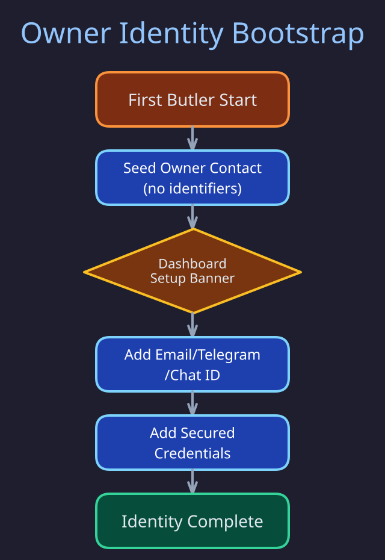

# Owner Identity

> **Purpose:** Explain how the owner entity is bootstrapped, how identity fields are configured, and how secured credentials are managed.
> **Audience:** Users setting up Butlers for the first time, developers extending identity resolution.
> **Prerequisites:** [Schema Topology](../data_and_storage/schema-topology.md), [Identity Model](../concepts/identity-model.md).

## Overview



Every daemon startup idempotently ensures exactly one **owner entity** exists in `public.entities`
with `roles = ['owner']` (`src/butlers/owner_bootstrap.py` `_ensure_owner_entity`). It starts with
no channel identifiers: the owner configures their identity through the dashboard so butlers can
recognize them across channels and so contact sync does not create a duplicate of them.

## Bootstrap Flow

1. If no entity carries the `owner` role, insert one (`canonical_name = 'Owner'`,
   `entity_type = 'person'`); otherwise reuse it.
2. On the Relationship daemon only, mirror the owner's `telegram_chat_id` `entity_info` row into a
   canonical `telegram:<chat_id>` `has-handle` fact in `relationship.entity_facts`, because
   identity resolution and the approval gate read facts, not `entity_info`.

Both steps are non-fatal no-ops when the tables do not exist yet.

## Configuring Identity

Open the owner entity's detail page in the dashboard and use the setup banner's dialog to add:

### Standard Identity Fields

- **Email** -- Your primary email address. Used for email identity resolution and contact sync deduplication.
- **Telegram handle** -- Your `@username`. Used for Telegram contact matching.
- **Telegram chat ID** -- Numeric ID for direct message delivery. Send `/start` to `@userinfobot` on Telegram to find yours.

### Secured Credentials

For butlers that act on your behalf (sending emails, connecting to Telegram as your user account):

- **Email password** -- App password for SMTP/IMAP access. Stored as `secured=true` in `public.entity_info`.
- **Telegram API ID** -- From [my.telegram.org](https://my.telegram.org). Required for user-client (MTProto) connections.
- **Telegram API hash** -- From [my.telegram.org](https://my.telegram.org). Paired with the API ID.
- **Telegram user session** -- MTProto session string for the Telegram user-client connector.

Secured entries are stored in PostgreSQL with `secured=true` and masked in the dashboard API. List responses exclude raw values; a "Reveal" button provides on-demand access.

## Setup Banner

The owner entity's detail page shows a setup banner while the owner lacks a real name, email, or
Telegram handle (`GET /api/relationship/owner/setup-status`). Non-secret channel handles are written
as `relationship.entity_facts` triples so the owner becomes resolvable; only secured credentials go
to `public.entity_info`.

## Identity Resolution

Owner recognition uses the shared resolution path in
[Identity Model](../concepts/identity-model.md): a message whose channel handle resolves to the owner
entity gets the `[Source: Owner (entity_id: ...), via <channel>]` preamble, and contact sync matches
the owner's email and handle instead of creating a duplicate person.

### Credential Resolution

Module startup code resolves credentials from the owner entity's `entity_info`:

```python
from butlers.credential_store import resolve_owner_entity_info

api_id = await resolve_owner_entity_info(pool, "telegram_api_id")
api_hash = await resolve_owner_entity_info(pool, "telegram_api_hash")
session = await resolve_owner_entity_info(pool, "telegram_user_session")
```

The function queries `public.entities` for the owner, then fetches the matching `entity_info` row, preferring primary entries.

## Security Model

Since Butlers is a user-federated platform (each user owns their instance), the security model is straightforward:

- Credentials are stored in PostgreSQL in the `public.entity_info` table.
- The user controls the database directly.
- API-level masking prevents accidental exposure in dashboard responses.
- No encryption at rest (the user owns the infrastructure).

## Entity Structure

```
public.entities
├── id: UUID
├── canonical_name: "Owner"
├── entity_type: "person"
└── roles: ["owner"]

public.entity_info (for the owner entity)
├── (entity_id, "email") -> "user@example.com"
├── (entity_id, "telegram") -> "@username"
├── (entity_id, "telegram_chat_id") -> "123456789"
├── (entity_id, "telegram_api_id") -> "12345" (secured)
├── (entity_id, "telegram_api_hash") -> "abc..." (secured)
├── (entity_id, "google_oauth_refresh") -> "1//..." (secured)
└── ...
```

## Verification

To confirm the owner entity bootstrap, identity fields, and credential resolution are operating as described:

```bash
# 1. Verify exactly one owner entity exists in public.entities
psql -h localhost -U butlers -d butlers -c \
  "SELECT id, canonical_name, entity_type, roles
   FROM public.entities
   WHERE 'owner' = ANY(roles);"
# Expected: exactly one row with roles including 'owner' and entity_type = 'person'

# 2. Verify the owner's channel handles are resolvable facts
psql -h localhost -U butlers -d butlers -c \
  "SELECT ef.predicate, ef.object
   FROM relationship.entity_facts ef
   JOIN public.entities e ON e.id = ef.subject
   WHERE 'owner' = ANY(e.roles) AND ef.validity = 'active'
     AND ef.predicate IN ('has-email', 'has-handle')
   ORDER BY ef.predicate;"
# Expected: at least a has-email row and a has-handle row of the form telegram:<chat_id>

# 3. Confirm secured credentials are stored in entity_info with secured=true
psql -h localhost -U butlers -d butlers -c \
  "SELECT ei.type, ei.secured
   FROM public.entity_info ei
   JOIN public.entities e ON e.id = ei.entity_id
   WHERE 'owner' = ANY(e.roles)
   ORDER BY ei.type;"
# Expected: telegram_api_id, telegram_api_hash, telegram_user_session all have secured = true

# 4. Confirm the setup banner is satisfied
curl -s http://localhost:41200/api/relationship/owner/setup-status
# Expected: has_name, has_email and has_telegram all true
```

## Related Pages

- [Identity Model](../concepts/identity-model.md) -- Entity anchor, channel facts, resolution
- [Credential Store](../data_and_storage/credential-store.md) -- DB-first secret resolution
- [OAuth Flows](oauth-flows.md) -- Google OAuth credential storage
