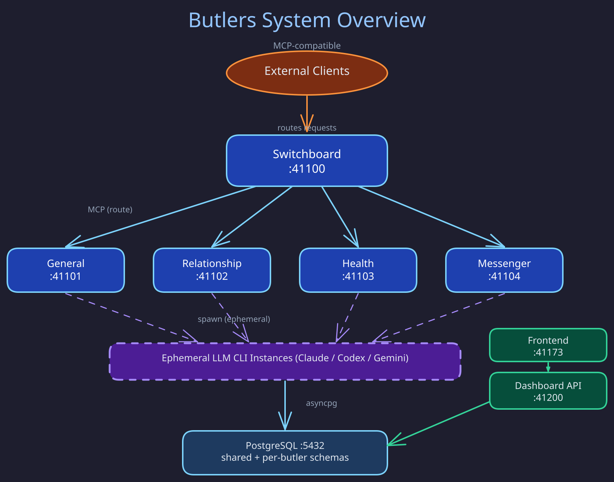

# Butlers Documentation

> Your guide to Butlers — your personal AI agent system — from first run to production operation.

## Butlers in One Page

Butlers is a personal AI agent system that takes recurring mental labour off one person's plate.
Every instance belongs to exactly one owner, who holds the database, the credentials, and the
model keys; there is no hosted service and no multi-tenancy. It is not a chatbot, a monolithic
agent, or a framework for other products: butlers act on schedules and incoming events, each within
one life domain. [Vision](../about/heart-and-soul/vision.md) is the binding statement of goals,
non-goals, and non-negotiable rules.

- **Butler daemon.** Each butler is a long-running MCP server with deterministic core
  infrastructure — state store, scheduler, LLM CLI spawner, session log. Intelligence lives only in
  the ephemeral LLM session it spawns per trigger, wired exclusively to that butler's tools. Domain
  butlers serve the owner; staffers (such as the Switchboard) serve the system.
- **Modules** add MCP tools, migrations, and lifecycle hooks inside a daemon and never touch core.
- **Connectors** are separate processes that normalise external events (Telegram, Gmail, ...) and
  submit them to the Switchboard; they never classify or route.
- **Switchboard** is the single ingress: it classifies each request and dispatches to domain
  butlers over MCP. Butlers never call each other directly.
- **Dashboard** is a FastAPI API plus a web frontend behind owner authentication.
- **PostgreSQL** is one database with one schema per butler; cross-butler data (identity,
  credentials) lives in `public`, and each butler's role sees only its schema plus `public`.

## Reading Path

New here? Follow this sequence:

| # | Section | What you'll learn |
|---|---------|-------------------|
| 1 | [Overview](overview/index.md) | What Butlers is and why it exists |
| 2 | [Getting Started](getting_started/index.md) | Prerequisites, setup, first launch |
| 3 | [Concepts](concepts/index.md) | Core mental model — butlers, modules, connectors, routing |
| 4 | [Architecture](architecture/index.md) | System design, daemon internals, database topology |
| 5 | [Runtime](runtime/index.md) | How the system behaves when running |
| 6 | [Butlers](butlers/index.md) | Per-butler role profiles |
| 7 | [Modules](modules/index.md) | Pluggable capability units |
| 8 | [Connectors](connectors/index.md) | External transport adapters |

Then explore by topic as needed:

## Topic Index

### System Fundamentals
- [Overview](overview/index.md) — what Butlers is, project goals, system shape
- [Concepts](concepts/index.md) — butler lifecycle, modules vs connectors, switchboard routing, MCP model, identity model
- [Architecture](architecture/index.md) — system topology, daemon design, routing, database schema, observability

### Runtime Behavior
- [Runtime](runtime/index.md) — spawner, scheduler, sessions, model routing, tool call capture

### Components
- [Butlers](butlers/index.md) — the roster: one role profile per butler
- [Modules](modules/index.md) — capability units a butler opts into via `butler.toml`
- [Connectors](connectors/index.md) — per-transport ingestion adapters

### Interfaces
- [Frontend](frontend/index.md) — dashboard UI, information architecture, API contracts
- [API and Protocols](api_and_protocols/index.md) — MCP tools, ingestion envelope, dashboard API, inter-butler communication

### Infrastructure
- [Data and Storage](data_and_storage/index.md) — schema topology, migrations, state store, blob storage, credential store
- [Identity and Secrets](identity_and_secrets/index.md) — owner identity, OAuth, CLI auth, environment variables
- [Operations](operations/index.md) — Docker deployment, environment config, Grafana monitoring, troubleshooting

### Quality and Planning
- [Testing](testing/index.md) — strategy, markers, E2E suite, benchmarks
- [Roadmap](roadmap/index.md) — project plan, OpenSpec overview

### Reference
- [Diagrams](diagrams/) — source files for all documentation diagrams
- [Working plans](plans/README.md) — retained design dependencies and approval packets
- [Redesigns](redesigns/README.md) — binding briefs and dated audit evidence
- [Archive and successors](archive/README.md) — retained research and successor map for retired plans
