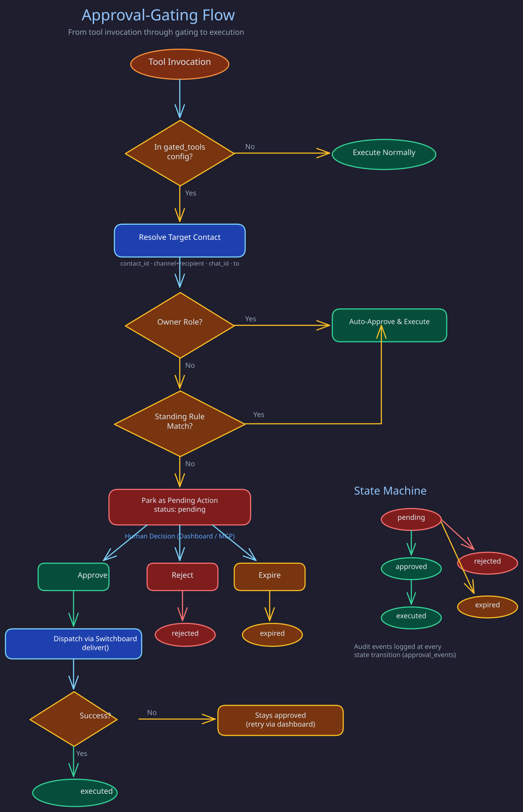

# Approvals Module

> **Purpose:** Human-in-the-loop approval mechanism that intercepts high-impact tool invocations, parks them for review, and supports standing rules for auto-approval.
> **Audience:** Contributors and module developers.
> **Prerequisites:** [Module System](module-system.md).

## Overview



The Approvals module is an execution-control module that butlers load locally. It intercepts configured high-impact tool invocations before execution, parks unapproved invocations as durable pending actions, and supports manual approve/reject/expire workflows plus standing approval rules for auto-approval of repeatable safe patterns.

This is how the system ensures that butlers cannot send emails to strangers, post messages to non-owner contacts, or execute other sensitive operations without explicit human authorization.

Source: `src/butlers/modules/approvals/` -- `module.py` (tools), `gate.py` (interception), `executor.py` (execution), `rules.py` (matching), `events.py` (audit), `redaction.py`, `retention.py`, `sensitivity.py`.

## Configuration

Enable in `butler.toml`:

```toml
[modules.approvals]
enabled = true
default_expiry_hours = 48
default_risk_tier = "medium"    # low | medium | high | critical

[modules.approvals.gated_tools]
email_send_message = {}
email_reply_to_thread = { expiry_hours = 24, risk_tier = "high" }
telegram_send_message = {}
telegram_reply_to_message = {}
```

Only tools listed in `gated_tools` are intercepted. Tools are gated strictly by config -- there are no implicit defaults based on tool name patterns.

## Two-Layer Gating

The approval gate operates at two independent layers, both enforcing gating:

**Layer 1 -- MCP tool wrapping** (`gate.py`): Intercepts gated tool calls at the MCP boundary. Primary gate for direct LLM tool invocations.

**Layer 2 -- `route.execute` inline gate** (`daemon.py`): The Messenger butler's `route.execute` handler calls channel module methods directly, bypassing MCP tool wrappers. An inline gate re-enforces role-based gating at this layer.

### Role-Based Auto-Approval

1. **Owner-targeted**: Actions targeting the owner contact are auto-approved immediately (owners are pre-trusted).
2. **Known non-owner**: Standing rules are checked. Match -> auto-approve and execute. No match -> park as `pending`.
3. **Unresolvable target**: Parked as `pending` (conservative default).

## Tools Provided

Tools are registered in `ApprovalsModule.register_tools` (`src/butlers/modules/approvals/module.py`);
read it for the current names and signatures. The families:

- **Queue** -- list, show, count, approve, reject and expire pending actions, and query executed
  actions for audit. Approval executes immediately only when an owning executor is available;
  otherwise `dispatch_approved_action` later runs the approved action through the owning daemon's
  original tool handler.
- **Standing rules** -- create (directly or from a pending action with suggested constraints),
  list, show and revoke the rules described below.
- **Autonomy suggestions** -- list, confirm or dismiss suggested promotions and demotions of a
  tool's approval posture.

## Standing Rules

Standing rules auto-approve matching invocations. A rule matches when all of these hold:

- Tool name matches.
- Rule is active and not expired.
- `use_count < max_uses` when bounded.
- Argument constraints match (typed: `exact`, `pattern`, `any`; legacy: `"*"` wildcard).

Matching precedence is deterministic: constraint specificity (descending) -> bounded scope before unbounded -> newer rule before older -> lexical rule ID tiebreaker.

### Constraint Suggestions

`suggest_rule_constraints` and `create_rule_from_action` use sensitivity classification:

1. Module-declared tool metadata (`ToolMeta.arg_sensitivities`) -- checked first.
2. Heuristic sensitive argument names (`to`, `recipient`, `email`, `url`, `amount`, etc.).
3. Default: non-sensitive.

Sensitive args get `{"type": "exact", "value": ...}`; non-sensitive args get `{"type": "any"}`.

## Action Lifecycle

Valid status transitions:

```
pending -> approved | rejected | expired
approved -> executed | abandoned
rejected, expired, executed, abandoned -> (terminal)
```

All actual execution — auto-approved actions and manually approved actions dispatched by their owning butler — uses the shared `execute_approved_action()` path. It holds a database row lock from its approved/null eligibility check through handler invocation and the successful terminal write, so an Abandon request cannot win after a side effect starts. A successful action becomes `executed` only after its result and immutable audit event are persisted. If a handler is unavailable or fails, the action remains `approved` with no execution result so the operator can retry, reject, or dashboard-abandon it; an already-executed replay returns the stored result without re-running the tool.

`abandoned` is a terminal, dashboard-only recovery outcome for an action that was
previously approved but intentionally left unexecuted. It requires a non-blank
reason and appends an immutable `action_abandoned` event in the same transaction.
There is no MCP, Telegram callback, automatic, bulk, or scheduled abandonment
path.

## Risk Tiers

Tools and actions are classified into risk tiers: `low`, `medium`, `high`, `critical`. Higher tiers (`high`, `critical`) require narrower constraints (at least one `exact` or `pattern`) and bounded scope (`expires_at` or `max_uses`) for standing rules.

## Database Tables

The module owns tables in the hosting butler's schema (Alembic branch: `approvals`):

- `pending_actions` -- durable queue and audit log for gated invocations. Ordinary terminal actions are retained for 90 days; rejected or abandoned ordered `memory_entity_merge` / legacy `entity_merge` actions remain as durable owner decisions so curation cannot reopen the same pair.
- `approval_rules` -- standing rules for auto-approval. Its optional `created_from` action ID is historical provenance, so a retained rule does not block deletion of its terminal source action after that action's 90-day window.
- `approval_events` -- append-only immutable audit log. Its `action_id` and `rule_id` are historical provenance, so deleting a terminal action after its 90-day window or an inactive rule after its 180-day window neither mutates nor deletes the event; events retain their separate 365-day audit window. New non-null action and rule references are still validated when an event is written.

## Dependencies

None. The approvals module is a leaf module. Other modules interact with it indirectly through the daemon's gate-wiring mechanism.

## Implementation Notes

- Dormant RFC 0023 recovery uses the explicit
  [approval delivery authority transport](../runtime/approval-delivery-authority.md).
  Protected peer admission and the owning source's durable presentation proof
  are separate prerequisites. Ordinary TCP or caller correlation cannot enable
  recovery, and constructing the opt-in transport does not activate rollout.

- Owner-entity mutations park for approval unless `src` is in `_OWNER_AUTO_APPLY_SOURCES`
  (`roster/relationship/tools/relationship_assert_fact.py`): owner self-registration plus
  `_TRUSTED_INTERNAL_SOURCES` (structured derivation such as `interaction_sync`). Prose-extraction
  jobs are deliberately untrusted (RFC 0017). The dashboard API rejects any auto-apply `src`
  (`roster/relationship/api/models.py::_reject_trusted_internal_src`), and the MCP wrapper hardcodes
  `src="relationship"`.
- Butlers that cannot read `relationship.entity_facts` recognise the owner through
  `public.resolve_owner_triple` (SECURITY DEFINER), called by
  `identity.resolve_owner_channel_via_definer()` when normal resolution returns None.
- Every channel gate delegates to `identity.resolve_channel_contact_with_owner_corroboration()`,
  which tests ambiguity across all live matching entities before filtering to the owner. The bypass
  goes only to exactly one active identifier on one live, non-merged, non-deleted owner entity;
  every other case, including lookup errors, fails closed.
- Decision paths (the `approve_action`, `reject_action` and `expire_stale_actions` MCP tools, backed
  by `ApprovalsModule._approve_action`, `ApprovalsModule._reject_action` and
  `ApprovalsModule._expire_stale_actions` in `src/butlers/modules/approvals/module.py`) use
  compare-and-set
  writes (`... WHERE status='pending'`). Expiry is a decision boundary: approve and defer paths
  expire a still-pending action whose `expires_at` has passed instead of acting on it.
- `execute_approved_action` is idempotent per `action_id`: a per-action lock serialises it, an
  `executed` action replays its stored `execution_result`, and the terminal write happens only
  from `approved`.
- `ButlerDaemon._apply_approval_gates()` (`src/butlers/daemon.py`) falls back to registered MCP
  tool handlers when an approved action's
  `tool_name` is not a gated original, so module-queued actions for non-gated tools can execute.
- A producer calling `park_pending_action()` outside the MCP gate persists a declared owner, a
  registered tool name and exact kwargs, and the owning daemon validates that handler signature at
  startup. If no safe command can be replayed (secret-bearing requests), reject before parking with
  a redacted audit signal; never repair historic rows by guessing.
- `approval_events` rows are insert-only: trigger `trg_approval_events_immutable` rejects `UPDATE`
  and `DELETE`.
- Standing-rule precedence is deterministic (`constraint_specificity_desc`, `bounded_scope_desc`,
  `created_at_desc`, `rule_id_asc`). `high` and `critical` tiers require a constrained rule (at least
  one arg constraint plus `expires_at` or `max_uses`); rules created from an action at those tiers
  default to `max_uses=1`.

The dashboard action, flat-list, history and dossier responses expose additive
`origin: "prepared" | null` from the stored pending action. Only the exact stored
`prepared` value earns the neutral Prepared label in the rail and dossier;
absent, malformed and unrecognized values remain Origin unknown. This label is
independent of status, expiry, permissions and delivery evidence. Intended
non-send without delivery evidence is not a failed push, while independently
recorded failure or uncertain delivery remains visible even for a prepared action.

- A notification review link is a dossier locator, not an approval capability. The dashboard's
  qualified `GET /api/approvals/{id}?review_source=messenger` repeats a bounded lookup over
  every configured approvals source. A missing pool, failed read, duplicate UUID, or wrong source
  withholds the dossier; ordinary unqualified lookup and decision permissions stay unchanged.
  Configuration is retained before provisioning, so a failed pool cannot disappear from this check.

## Related Pages

- [Module System](module-system.md)
- [Calendar Module](calendar.md) -- uses approval integration for overlap overrides
- [Email Module](email.md) -- tools gated by approvals
- [Telegram Module](telegram.md) -- tools gated by approvals
