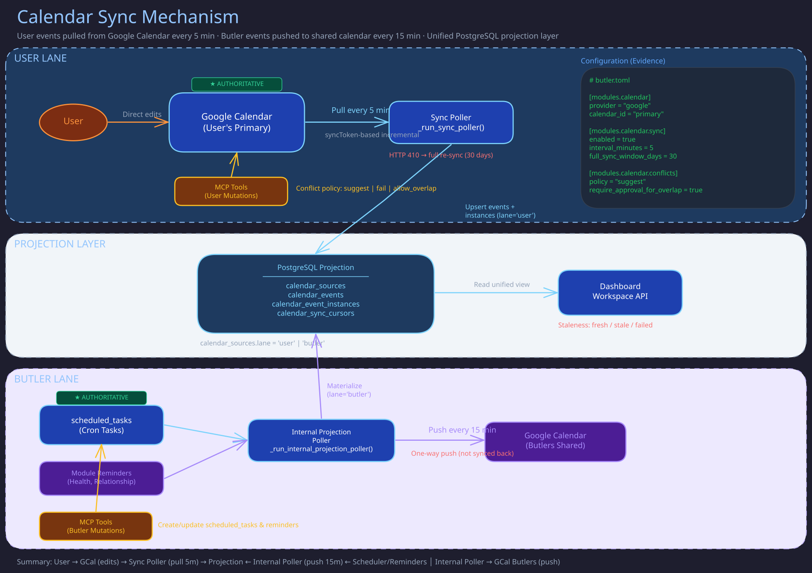

# Calendar Module

> **Purpose:** Provider-agnostic calendar integration with event CRUD, conflict detection, sync, and a workspace projection model for the dashboard.
> **Audience:** Contributors and module developers.
> **Prerequisites:** [Module System](module-system.md).

## Overview



The Calendar module gives butlers the ability to read and write calendar events through a provider-agnostic interface. Google Calendar is the v1 provider, with the architecture designed for future iCloud/CalDAV support.

Key capabilities:

- **Event CRUD** -- create, read, update, delete events with timezone-aware scheduling.
- **Conflict detection** -- pre-write overlap checking with configurable policies (suggest alternatives, fail, or allow with approval gate).
- **Butler-managed events** -- dedicated subcalendar for butler-generated schedules and reminders, tagged with `BUTLER:` prefix.
- **Polling-based sync** -- periodic sync from the provider with local projection for fast dashboard queries.
- **Attendee management** -- RSVP tracking, add/remove attendees.
- **Approval integration** -- overlap overrides and high-impact actions (e.g., cancelling events with external attendees) route through the approvals module.

Source: `src/butlers/modules/calendar.py`.

## Configuration

Enable in `butler.toml`:

```toml
[modules.calendar]
provider = "google"
account = "user@gmail.com"        # optional: specific Google account
calendar_id = "primary"            # optional: auto-discovered if omitted
timezone = "America/New_York"

[modules.calendar.conflicts]
policy = "suggest"                 # "suggest", "fail", or "allow_overlap"
suggestion_count = 3

[modules.calendar.sync]
enabled = true
interval_minutes = 5
window_days = 30
```

### Credentials

Google Calendar uses OAuth2 refresh-token exchange. Credentials are resolved via the shared credential store:

- `GOOGLE_OAUTH_CLIENT_ID` and `GOOGLE_OAUTH_CLIENT_SECRET` from `butler_secrets`.
- Refresh token from `public.entity_info` on the owner entity (or the specific Google account entry in `public.google_accounts`).

When `calendar_id` is not explicitly configured, the module auto-discovers or creates a shared "Butlers" subcalendar.

## Tools Provided

Tools are registered in `CalendarModule.register_tools` (`src/butlers/modules/calendar.py`); read
it for the current names and signatures. The families:

- **Event CRUD** (`calendar_*_event`, `calendar_*_event_instance`, attendee add/remove) -- read and
  write provider events; every create/update runs through the conflict engine below. Instance
  tools edit or delete one occurrence of a recurring event.
- **Butler-managed events** (`calendar_*_butler_event`) -- schedules and reminders the butler owns,
  including enable/disable.
- **Reminders** (`reminder_*`) -- reminders stored as native calendar events attributed to the
  calling butler.
- **Planning** -- `calendar_find_free_slots` (read-only availability finder) and
  `calendar_propose_event` (stages a pending proposal for review without writing to the provider).
- **Calendar and sync management** -- list calendars, set the primary calendar, check sync
  status, and force a sync cycle.

## Conflict Detection

Every create/update operation runs through the conflict engine before writing:

- **`suggest`** (default): Returns up to N alternative time slots when overlap is detected.
- **`fail`**: Rejects the operation with an error listing conflicting events.
- **`allow_overlap`**: Proceeds with the write. When the approvals module is co-loaded, an overlap approval may be enqueued for high-impact operations.

## Workspace Projection

The module maintains a local projection of calendar data for the dashboard at `/butlers/calendar`. The projection store normalizes both external provider events and internal butler schedules/reminders into unified records. A background projector refreshes this data periodically (default: every 15 minutes) and on sync completion.

Projection sources:

- **Provider events** -- synced from Google Calendar.
- **Scheduled tasks** -- butler cron schedules projected as calendar entries.
- **Butler reminders** -- reminder-type events from the butler's domain.

Projection authorship is normalized before write-through: blank or sentinel
`source_butler` values fall back to the module's canonical butler name (and
then `DEFAULT_BUTLER_NAME`), while blank `source_session_id` values are stored
as `NULL`.

Projection status is tracked as `fresh`, `stale`, or `failed`.

## Rate Limiting

Google Calendar API calls include retry logic for `429 Too Many Requests` and `503 Service Unavailable` with exponential backoff (max 3 retries, base 1s).

## Database Tables

The module does not own dedicated Alembic migrations (`migration_revisions()` returns `None`). Sync state is persisted to the butler's existing state store (KV JSONB) under keys prefixed with `calendar::sync::`.

## Dependencies

None. The calendar module is a leaf module. When the approvals module is co-loaded, the daemon wires an approval enqueuer callback via `set_approval_enqueuer()`.

## Implementation Notes

- `CalendarConfig` requires `provider`; `calendar_id` is optional and resolved at startup.
- Core `scheduled_tasks` carries calendar-linkage columns (`timezone`, `start_at`, `end_at`,
  `until_at`, `display_title`, `calendar_event_id`) with bounds checks and a partial unique index on
  `calendar_event_id`.
- `CalendarModule._sync_calendar` materializes unified projection rows: provider deltas upsert into
  `calendar_events` + `calendar_event_instances`, and internal scheduler/reminder sources refresh
  into the same tables with deterministic `origin_ref` linkage. Checkpoints live in
  `calendar_sync_cursors` (`provider_sync`, `projection`); each refresh records status in
  `calendar_action_log`. Projection writes hard-gate on `to_regclass(...) IS TRUE`, so pre-migration
  databases no-op.
- `calendar_sync_status` / `calendar_force_sync` report `projection_freshness` (`last_refreshed_at`,
  `staleness_ms`, per-source `fresh|stale|failed`). Dashboard `calendar_force_sync(queue=true)`
  commands are durable `calendar_action_log` rows: the worker starts even with polling disabled,
  leases one `running` command at a time, coalesces one pending successor, and restart recovery
  requeues interrupted work without losing full-recovery intent.
- Reminders are native-only (`calendar_events` with `source_kind='internal_reminders'`); the retired
  `reminders` table is migration history, never a fallback or fixture. The Butlers provider-calendar
  mirror stores its provider id in `calendar_events.metadata.provider_event_id`; series deletion
  removes the provider copy before the authoritative local row.
- Workspace: `/butlers/calendar` (`CalendarWorkspacePage.tsx`) reads `GET /api/calendar/workspace`
  and `/workspace/meta` via `use-calendar-workspace.ts`. Tests cover URL-backed `view=user|butler`,
  butler-lane grouping, and both create/edit payload shapes. The `dashboard-*`
  OpenSpec specs must list the mutation endpoints (`/api/calendar/workspace/user-events`, `/butler-events`), the v1
  recurrence scope (`series` only for provider recurring updates/deletes), and `projection_freshness`
  / `request_id`.
- `_normalize_recurrence()` rejects any rule containing `\n` or `\r` (iCalendar injection) and
  checks `FREQ` / `DTSTART` / `DTEND` case-insensitively. `CalendarEventCreate` and
  `CalendarEventUpdate` normalise `recurrence_rule` before any provider call.
- Recurring writes with naive datetime boundaries require an explicit `timezone`, and
  `calendar_update_event` accepts only `recurrence_scope="series"` for recurrence.
- Conflict preflight always runs on `calendar_create_event` and on `calendar_update_event` only when
  the start/end window changes. Legacy policy values normalise (`allow` to `allow_overlap`, `reject`
  to `fail`).
- With `allow_overlap` and `conflicts.require_approval_for_overlap = true`, an overlapping write
  returns `status="approval_required"` and queues a `pending_actions` row carrying the executable
  tool name and args; a replay with `approval_action_id` bypasses re-queue only when that action is
  `approved` for the same tool. With approvals unavailable it returns `approval_unavailable` and
  never writes.
- Malformed provider payloads raise `ValueError`; `CalendarAuthError` is reserved for auth and
  transport failures. `_GoogleProvider` validates credentials before creating its owned
  `httpx.AsyncClient`, so a credential error cannot leak a client.
- Read tools (`calendar_list_events`, `calendar_get_event`) go through the active
  `CalendarProvider`, and a per-call `calendar_id` override never mutates the configured default.
- Projection tables (`calendar_sources`, `calendar_events`, `calendar_event_instances`,
  `calendar_sync_cursors`, `calendar_action_log`) are core tables in every migrated schema, keyed
  for idempotency by `UNIQUE (source_id, origin_ref)`, `UNIQUE (event_id, origin_instance_ref)` and
  `UNIQUE (idempotency_key)`, with GiST range indexes for window queries.
- Workspace mutations (`POST /api/calendar/workspace/user-events` and `/butler-events`, envelope
  `{butler_name, action, request_id?, payload}`) proxy to MCP tools and return projection freshness
  (from the tool, else `calendar_sync_status`). A repeat `request_id` replays the stored
  `calendar_action_log` result instead of re-executing; approval-queued replays of butler-event
  delete/toggle set `_approval_bypass=True`.
- `POST /api/calendar/workspace/sync` keeps the raw `query_calendar_sources` fan-out, picks one
  canonical owner per calendar (enabled, `core` capability, freshest) and sends it a single
  `calendar_force_sync(queue=true)`, answering `202`. The module persists and serialises the command
  in `calendar_action_log` with `running` recovery, so a browser timeout never cancels provider
  work.

## Related Pages

- [Module System](module-system.md)
- [Approvals Module](approvals.md)
