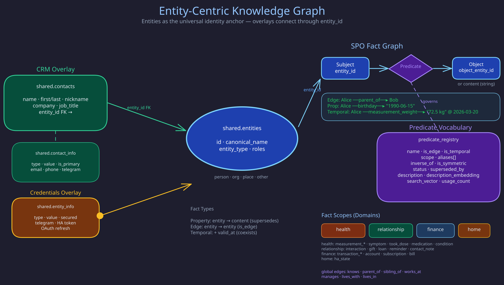

# Knowledge Base

> **Purpose:** Documents the entity-centric data model, SPO fact graph, predicate vocabulary, and domain overlays that form the butler system's knowledge layer.
> **Audience:** Contributors and module developers.
> **Prerequisites:** [Module System](module-system.md), [Memory Module](memory.md).

## Overview



The Butlers knowledge graph uses **entities as the universal identity anchor**. Every piece of knowledge -- facts, relationships, credentials, contact details -- attaches to an entity via `entity_id`. This page describes the entity data model, the predicate vocabulary system, and how domain-specific "overlays" layer onto the shared entity graph.

The knowledge base is not a standalone module. It is the data model that the Memory module reads and writes, and that other modules (Contacts, Health, Finance, Relationship) attach to via foreign keys.

## Core: public.entities

The `public.entities` table is the single source of identity across all butlers. Every person, organization, place, or device in the system is an entity.

The table is created in `alembic/versions/core/core_002_identity.py` and evolved by later `core_*`
migrations; [Identity Model](../concepts/identity-model.md) is the authoritative description. The
invariants: `roles` (e.g. `['owner']`) is the source of truth for identity roles; `aliases` feed
resolution; entities share one namespace across all butlers (there is no tenant column); and
lifecycle state (`merged_into`, `deleted_at`, `unidentified`) lives in `metadata`, not in columns.

**Entity resolution** uses a 4-tier waterfall: role match -> exact (canonical or alias) -> prefix/substring -> fuzzy (edit distance <= 2). Context boosting from graph neighborhood and domain hints refines scoring.

**Lifecycle**: Entities are never hard-deleted. Merging sets `metadata.merged_into`; soft-delete sets `metadata.deleted_at`. A partial unique index allows name reuse after tombstoning.

## The SPO Fact Graph

Knowledge is stored as **Subject/Predicate/Object** facts in per-butler `facts` tables. The entity is always the subject; the object can be another entity (edge-fact) or a content string (property-fact).

### Three Fact Types

| Type | entity_id | object_entity_id | valid_at | Behavior |
|------|-----------|-------------------|----------|----------|
| **Property** | Set | NULL | NULL | Latest supersedes previous |
| **Edge** | Set | Set | NULL | Links two entities; supersedes by full key |
| **Temporal** | Set | Optional | Set | Coexists with others at different timestamps |

**Uniqueness keys:**

- Property: `(entity_id, scope, predicate)` among live (`active` or `fading`) facts with
  `valid_at IS NULL`
- Edge: `(entity_id, object_entity_id, scope, predicate)` among live facts with `valid_at IS NULL`
- Temporal: Idempotency key (SHA-256 of canonical tuple) prevents duplicates; no supersession

### Fact Scoping

Facts are namespaced by `scope` to isolate domains:

| Scope | Butler | Example predicates |
|-------|--------|-------------------|
| `health` | Health | `measurement_weight`, `symptom`, `took_dose`, `medication`, `condition` |
| `relationship` | Relationship | `interaction`, `gift`, `loan`, `reminder`, `contact_note` |
| `finance` | Finance | `transaction_debit`, `transaction_credit`, `account`, `subscription` |
| `home` | Home | `ha_state` |
| `global` | Any | `knows`, `parent_of`, `birthday`, `preference` |

## Predicate Vocabulary

The `predicate_registry` table governs which predicates are valid, what constraints they carry, and how they are discovered.

### Registry Schema

The table is created in `src/butlers/modules/memory/migrations/001_memory_schema.py` and seeded by
`002_seed_predicates.py`. The columns that carry behaviour: `is_edge` and `is_temporal` drive
write-time enforcement (below); `aliases` resolve synonyms deterministically; `inverse_of` and
`is_symmetric` drive inverse materialization; `status` is the lifecycle below; and the embedding,
full-text vector and `usage_count` feed predicate search and ranking.

### Predicate Lifecycle

```
proposed -> active -> deprecated (superseded_by -> replacement)
```

Auto-registered predicates start as `proposed` with inferred flags. Migration-seeded predicates are `active` with rich descriptions. The seeded domain vocabulary (names, scopes, temporal/edge flags and `example_json` payloads) is defined in `src/butlers/modules/memory/migrations/002_seed_predicates.py`; query the live set with `memory_predicate_list`. Deprecated predicates still accept writes but return warnings.

### Write-Time Enforcement

When a predicate exists in the registry:

- `is_edge = true` -> `object_entity_id` required (else ValueError).
- `is_temporal = true` -> `valid_at` required (else ValueError).

Unregistered predicates are stored freely, then auto-registered as `proposed`.

### Predicate Search

The `memory_predicate_search` MCP tool uses three-signal hybrid retrieval fused via Reciprocal Rank Fusion (RRF):

1. **Trigram** (pg_trgm): Fuzzy name matching -- catches typos.
2. **Full-text** (tsvector): Stemmed description search.
3. **Semantic** (vector cosine): Conceptual matching -- "dad" finds `parent_of`.

### Inverse Predicates

Edge predicates can declare bidirectional pairs. Inverse facts are **materialized at write time** -- when `parent_of(Alice, Bob)` is stored and `parent_of` has `inverse_of = 'child_of'`, a mirrored fact `child_of(Bob, Alice)` is auto-created in the same transaction. This doubles edge-fact storage but means queries work naturally without special read-path logic.

### Domain/Range Type Validation

When a predicate specifies `expected_subject_type` or `expected_object_type`, `store_fact()` checks actual entity types. Mismatches produce **warnings, not errors** -- the fact is still stored. This follows Wikidata's philosophy: constraints are guidance, not enforcement gates.

## Overlays: Sub-Data Models

Overlays are domain-specific data models that attach to entities via foreign keys.

### Channel Identifiers

Contact details are not a separate table: channel handles (email, phone, Telegram and similar)
are `relationship.entity_facts` triples keyed by entity. See
[Identity Model](../concepts/identity-model.md).

### Credentials Overlay

`public.entity_info` stores credentials and identifiers per entity, with `secured = true` for
masked values and `is_primary` for preferred identifiers.

### Health/Finance Overlays

Health and finance data attaches to the owner entity. All measurements, conditions, transactions, and subscriptions are facts scoped to their domain.

## Schema Isolation

| Schema | Visibility | Purpose |
|--------|-----------|---------|
| `public` | All butlers (read); selective write | Entities, entity_info |
| Per-butler | Butler-specific | Facts, episodes, rules, domain tables |

Inter-butler communication is MCP-only through the Switchboard. The public schema provides identity resolution without violating butler isolation.

## Key Design Principles

1. **Entity-first**: All knowledge attaches to entities, not contacts or bare strings.
2. **Overlays, not monoliths**: Channel handles, credentials and facts are separate models linked by entity id.
3. **Predicate governance**: Registry enforces `is_edge`/`is_temporal`, aliases prevent proliferation, inverses enable bidirectional traversal.
4. **Temporal safety**: Temporal predicates require `valid_at` to prevent supersession from destroying historical data.
5. **Soft lifecycle**: Entities and predicates are tombstoned/deprecated, never deleted.
6. **Scope isolation**: Facts are namespaced by domain; predicates are scoped for search relevance.

## Related Pages

- [Memory Module](memory.md) -- the module that reads/writes this data model
- [Contacts Module](contacts.md)
- [Module System](module-system.md)
