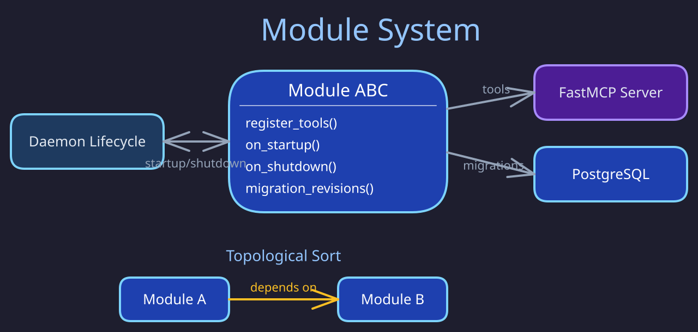

# Module System

> **Purpose:** Describes the abstract module contract, registry, dependency resolution, and lifecycle hooks that all butler modules implement.
> **Audience:** Contributors and module developers.
> **Prerequisites:** Familiarity with the [Butlers architecture overview](../architecture/index.md).

## Overview

Every butler is a long-running MCP server with a fixed core (state store, scheduler, LLM spawner, session log) and a set of opt-in **modules**. Modules are the only mechanism for adding domain-specific MCP tools to a butler. They never touch core infrastructure directly.

This page is the single definition of the module contract. The code is authoritative for names and
signatures; this page states only the invariants the code cannot say for itself.

Source of truth:

- `src/butlers/modules/base.py` -- the `Module` ABC, `ToolMeta`, and the `ToolGroupMixin` /
  `group_enabled()` tool-group filter
- `src/butlers/modules/registry.py` -- `ModuleRegistry`, `default_registry()`, `_topological_sort()`
- `src/butlers/lifecycle.py` -- the startup sequence that drives the hooks (numbered steps)

## The Contract

Every module subclasses `Module` (`src/butlers/modules/base.py`) and implements all of its abstract
members: the `name`, `config_schema` and `dependencies` properties, plus `register_tools`,
`migration_revisions`, `on_startup` and `on_shutdown`. Read the signatures and docstrings there.
The invariants:

- **Modules only add tools.** A module never modifies core infrastructure (state store, scheduler,
  spawner, session log); everything it contributes reaches the butler through `register_tools`.
- **`name` is the stable key** for the `[modules.<name>]` section in `butler.toml`, for
  dependency declarations, and for runtime enable/disable state.
- **Config is validated, not trusted.** The daemon validates the raw `[modules.<name>]` table
  against `config_schema` and passes the validated object to the hooks. Configs that mix in
  `ToolGroupMixin` gain an optional `groups` list; `register_tools` should gate each tool family
  with `group_enabled(config, "<group>")` so a butler can load only part of a module.
- **Identity comes from `butler_name`.** `register_tools` receives the canonical butler name from
  the daemon; modules must use it and never derive identity from `db.schema` or similar.
- **`on_startup` owns connections and background work; `on_shutdown` must release them.**
  Secrets resolve DB-first through the optional `credential_store` argument.
- **Tool sensitivity is declared, not guessed, when it matters.** `tool_metadata()` (optional,
  default `{}`) maps tool names to `ToolMeta` argument sensitivities. Without a declaration the
  approvals subsystem falls back to name-based heuristics (see [Approvals](approvals.md)).
- Other optional hooks (`wire_audit_pool`, `extra_status_fields`) default to no-ops; see their
  docstrings in `base.py`.

## Module Registry

`default_registry()` discovers every concrete `Module` subclass under the `butlers.modules`
package, plus butler-specific modules in `roster/<butler>/modules/__init__.py`. Registration is
idempotent.

The daemon loads modules with `load_all()`: **every** registered module is instantiated, whether or
not `butler.toml` mentions it (absent modules get an empty config). Which modules are active is
runtime enable/disable state, not static config. `load_from_config()` loads only the listed
modules and is stricter: an unknown name or a dependency outside the enabled set raises
`ValueError`.

## Dependency Order

`_topological_sort()` orders modules so that every module's `dependencies` come before it
(Kahn's algorithm, alphabetical within a tier, so the order is deterministic). A cycle raises
`ValueError`. This single order governs module migrations, `on_startup`, and `register_tools`;
`on_shutdown` runs in reverse.

## Migrations

A module that owns tables returns an Alembic branch label from `migration_revisions()` (or `None`
if it has no tables). The label names a migration chain, resolved by `src/butlers/migrations.py`
(`_CHAIN_ROOT_FAMILIES`) to `src/butlers/modules/<label>/migrations/`. Module migrations run into
the butler's own schema unless the module config declares a private schema (for example memory's
`memory_schema`). See [Migration patterns](../data_and_storage/migration-patterns.md).

## Startup Order

The authoritative step list is the module docstring of `src/butlers/daemon.py` and the numbered
comments in `src/butlers/lifecycle.py`. For modules, the order that matters is:

1. **Load and order** -- `load_all()` instantiates every module in dependency order.
2. **Validate config** -- each module's config is validated against `config_schema`.
3. **Migrate** -- core, butler-specific, then module migration chains.
4. **Start** -- `on_startup(config, db, credential_store, blob_store)` in dependency order.
5. **Register tools** -- only after the FastMCP server exists and core tools are registered,
   `register_tools(mcp, config, db, butler_name)` runs in dependency order; approval gates are
   applied afterwards.

So `on_startup` runs **before** `register_tools`: a tool body may assume the module has started.
Module-specific steps are non-fatal per module: a module that fails config validation, credentials,
migration, `on_startup` or registration is recorded as failed and skipped in later phases, and the
butler starts with the remaining modules. If startup aborts, modules already started get
`on_shutdown()`.

## Writing a New Module

Place the module in `src/butlers/modules/` (single file or package) and auto-discovery finds it;
butler-specific modules go in `roster/<butler>/modules/__init__.py`. Copy the shape of a small
existing module (for example `src/butlers/modules/metrics/`) rather than a template, and follow the
`adding-connectors-and-modules` subskill of the `butlers-development` skill.

## Implementation Notes

- `ButlerDaemon` filters `load_all()` through `ButlerDaemon._select_startup_modules`
  (`src/butlers/daemon.py`): a module with required
  `config_schema` fields and no `[modules.<name>]` section is skipped (info log), keeping
  intentionally omitted modules out of migrations, startup and tool registration.
- Module configs pass through `ButlerDaemon._validate_module_configs`, which rejects extra and
  missing fields.
- Egress audit: every outbound call emits one `dashboard_audit_log` operation at its call site
  (`llm_api_call` from the spawner, `telegram_send`, `google_calendar_write`, `gmail_send`) via
  `write_audit_entry` or `emit_dashboard_audit`; `GET /api/system/egress` reads them. Modules get
  the pool through `Module.wire_audit_pool(pool)`, a post-startup no-op by default.

## Related Pages

- [Memory Module](memory.md)
- [Approvals Module](approvals.md)
- [Calendar Module](calendar.md)
- [Contacts Module](contacts.md)
