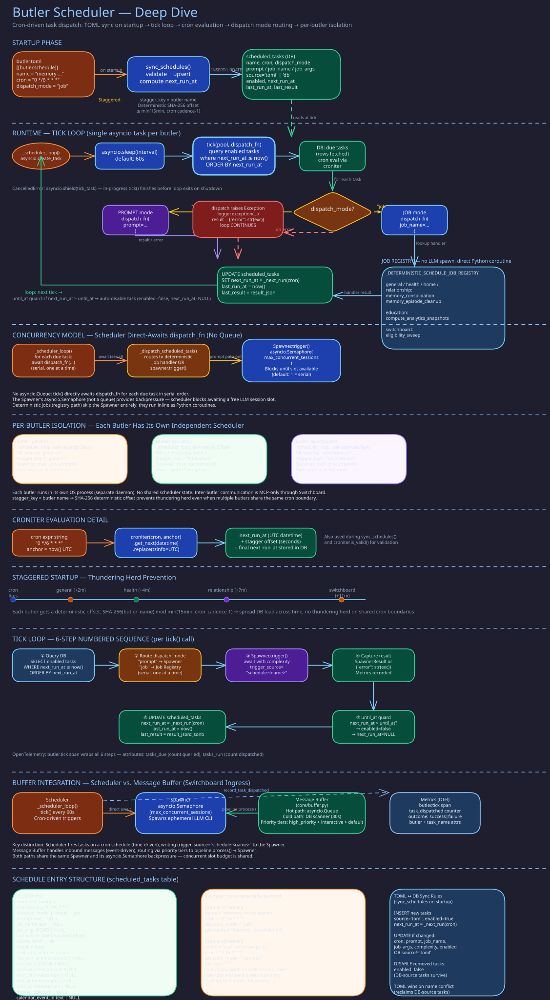

# Scheduler Execution

> **Purpose:** Describe the cron-driven task scheduler: tick loop, TOML-to-DB sync, staggering, dispatch modes, and task lifecycle.
> **Audience:** Developers configuring scheduled tasks, operators troubleshooting missed schedules, architects understanding the dispatch model.
> **Prerequisites:** [Trigger Flow](../concepts/trigger-flow.md), [LLM CLI Spawner](spawner.md).

## Overview



The scheduler (`src/butlers/core/scheduler.py`) is a cron-driven task dispatch system. At daemon startup, it syncs schedule definitions from `butler.toml` into the `scheduled_tasks` database table. During operation, the daemon periodically calls `tick()`, which evaluates cron expressions and dispatches due tasks to the spawner. The scheduler supports two dispatch modes, deterministic staggering, complexity-aware model selection, and automatic task expiry.

## TOML-to-DB Sync

On startup, `sync_schedules()` reconciles `[[butler.schedule]]` entries from the butler's TOML config with the `scheduled_tasks` table:

- **New tasks** are inserted with `source='toml'` and `enabled=true`.
- **Changed tasks** (cron expression, prompt, dispatch mode, job name, job args, or complexity changed) are updated in place. Tasks previously created at runtime (`source='db'`) that share a name with a TOML schedule are reclaimed to `source='toml'`.
- **Removed tasks** (present in DB with `source='toml'` but absent from the current TOML) are disabled by setting `enabled=false`.

Each synced task gets a computed `next_run_at` based on its cron expression and optional stagger offset.

## Dispatch Modes

Scheduled tasks support two dispatch modes, configured via `dispatch_mode`:

### Prompt Mode (default)

The task's `prompt` string is sent to the spawner, which spawns an LLM session. This is for tasks that require reasoning --- summarizing calendars, drafting emails, analyzing data. The scheduler emits a warning if neither the prompt text nor any referenced skill's `SKILL.md` contains the string `notify` (case-insensitive), catching tasks whose results would be silently discarded.

### Job Mode

The task's `job_name` maps to a registered Python function that runs directly without spawning an LLM. This is for deterministic maintenance work: memory consolidation, analytics computation, eligibility sweeps.

## The Tick Loop

The daemon calls `tick()` at a regular interval. Each tick:

1. **Query due tasks** --- `SELECT` from `scheduled_tasks` where `enabled = true AND next_run_at <= now()`, ordered by `next_run_at`.

2. **Dispatch each task** --- For prompt-mode tasks, calls `dispatch_fn(prompt=..., trigger_source="schedule:<task-name>", complexity=...)`. For job-mode tasks, calls `dispatch_fn(job_name=..., job_args=..., trigger_source="schedule:<task-name>")`.

3. **Update state** --- After dispatch (success or failure), advances `next_run_at` to the next cron occurrence, sets `last_run_at` to now, and stores the dispatch result in `last_result` (JSONB).

4. **Handle expiry** --- If a task has an `until_at` timestamp and the next computed run would exceed it, the task is auto-disabled (`enabled=false`, `next_run_at=NULL`).

5. **Record metrics** --- Each dispatch increments a `task_dispatched` counter with `butler`, `task_name`, and `outcome` (success/failure) attributes. The tick span records `tasks_due` and `tasks_run` as OTel attributes.

Dispatch failures are logged but do not prevent subsequent tasks from running. The error is stored in `last_result` for operator visibility.

## Task Continuity (opt-in)

A prompt-mode task can set `continuity = true` (per-task, default `false`) to have the scheduler inject what its previous run concluded into its next dispatched prompt. The task's own session calls the `carry_forward(task_name, content)` core tool to record that conclusion; the record lives in the shared `public.task_continuity` ledger, keyed by `(butler_name, task_name)` for the single "live" row and `(butler_name, task_name, session_id)` so calling it twice in one session updates the same row rather than duplicating it.

At the next opted-in dispatch, `tick()` reads that live row and appends a `## Task Continuity — <task_name>` block naming the previous session, its age, and its content --- or, if the task has run under continuity but never called `carry_forward`, an honest "the last run recorded no carry-forward" block, never silence. This is a general primitive for the pattern the chronicler's day-close cache implements bespoke (`src/butlers/chronicler/day_close_writer.py`); migrating that hook onto this layer is a deliberate non-goal until a regression test proves equivalence.

## Staggering

When multiple butler instances share the same cron schedule, simultaneous dispatch would create a thundering herd. The scheduler applies deterministic staggering:

- A `stagger_key` (typically the butler name) is hashed with SHA-256.
- The hash is mapped to an offset in seconds, bounded by `min(max_stagger_seconds, cron_interval - 1)`.
- The offset is added to the computed `next_run_at`.

The default `max_stagger_seconds` is 900 (15 minutes). The offset never exceeds the cron interval minus one second, ensuring a task does not stagger past its next scheduled occurrence.

## Complexity Tiers

Each scheduled task can set a `complexity` tier (the `Complexity` enum in
`src/butlers/core/model_routing.py`; see [Model Routing](model-routing.md#complexity-tiers)). A
missing value defaults to `Complexity.WORKHORSE`. A stored retired tier (`medium`, `high`, ...) is
remapped to its canonical successor rather than collapsed, and any other unrecognized value
degrades to `WORKHORSE` with a warning (`_parse_complexity_from_db_row`).

## Scheduled Task Rows

`scheduled_tasks` is created in `alembic/versions/core/core_001_foundation.py` and extended by
later core migrations (deadlines, token budgets, calendar linkage, delegation wake, continuity).
Invariants worth knowing: `name` is unique per butler schema, `source` is `toml` or `db` and decides
whether `sync_schedules()` owns the row, and an expired task is left with `enabled=false` and
`next_run_at=NULL`.

## Verification

To confirm the scheduler behavior described here matches the running system:

```bash
# 1. Scheduled tasks are synced from TOML on startup
psql -h localhost -U butlers -d butlers -c \
  "SELECT name, cron, dispatch_mode, source, enabled, next_run_at, last_run_at
   FROM general.scheduled_tasks ORDER BY next_run_at;"
# Expected: tasks with source="toml" matching entries in roster/general/butler.toml

# 2. Task last_run_at advances after each tick
# Wait for the next tick interval (check butler.toml for tick interval, typically 60s).
# Then re-run the query above and confirm last_run_at changed for due tasks.

# 3. trigger_source follows "schedule:<task-name>" convention
psql -h localhost -U butlers -d butlers -c \
  "SELECT trigger_source, COUNT(*) FROM general.sessions
   WHERE trigger_source LIKE 'schedule:%'
   GROUP BY trigger_source ORDER BY count DESC LIMIT 10;"
# Expected: rows for each scheduled task that has fired

# 4. Stagger offsets differ between butlers on the same cron
# Compare next_run_at for the same cron expression across two butlers:
psql -h localhost -U butlers -d butlers -c \
  "SELECT 'general' AS butler, name, cron, next_run_at FROM general.scheduled_tasks WHERE source='toml'
   UNION ALL
   SELECT 'health' AS butler, name, cron, next_run_at FROM health.scheduled_tasks WHERE source='toml'
   ORDER BY cron, butler;"
# Expected: matching cron tasks show different next_run_at values (stagger applied)

# 5. Auto-disabled tasks have enabled=false and next_run_at=NULL
psql -h localhost -U butlers -d butlers -c \
  "SELECT name, enabled, next_run_at, until_at FROM general.scheduled_tasks
   WHERE until_at IS NOT NULL;"
# Expected: tasks past their until_at show enabled=false, next_run_at=NULL
```

## Implementation Notes

- `sw_038` supplies `public.qa_local_schedule_policy()` for QA's separately
  wired scheduler consumer. It accepts no arguments, requires effective
  `SET ROLE butler_qa_rw`, and returns only `policy_state` and
  `policy_provenance` for `qa`. The role-less audit pool is not an authorized
  caller. SQLSTATE `42501` is denied, `P0002` is missing policy, and `22023`
  is malformed policy; transport/function absence is unavailable. Consumers
  must suppress new admission on these outcomes, never reuse cached `active`.
  The migration retains the function and ACL on downgrade because migration
  state cannot prove that all readers were retired. Remove it only after a
  separately reviewed replacement; policy rows and owner holds are unchanged.
- QA's consumer is `read_qa_schedule_policy()` in `src/butlers/core/scheduler.py`. For
  `butler_name == "qa"`, `tick()` ignores `eligibility_pool`, the receiver-cutover flag and the
  legacy route resolver. It reads the projection through its primary `pool`, which the daemon wires
  to QA's own `SET ROLE butler_qa_rw` pool, once before the deadline/cron passes and again
  immediately before every deadline dispatch and every cron claim. Nothing is cached. Results map to
  the closed `QaSchedulePolicy` enum: `allow` for `active` with any valid provenance (so TTL-derived
  `active/legacy_ttl` keeps patrolling); `administrative_hold` for `paused|quarantined`;
  `owner_review_hold` for `review_required/operator`; `legacy_ambiguous` for
  `review_required/legacy_ambiguous`; and `missing`, `malformed`, `denied` or `unavailable` for a
  missing row, a bad shape or pair, a role refusal, or any other failure (including a missing pool).
  Any value other than `allow` stops new admission. Logs carry only the category, never row, SQL or
  exception text. A refused cron task is left unclaimed, so it runs exactly once after the hold
  lifts and does not trigger catch-up. Work that was already launched keeps running.
  `asyncio.CancelledError` propagates and does not authorize anything. Other butlers keep the
  `src/butlers/core/scheduler.py::_butler_dispatch_gated()` path.

- `job_args` JSONB can round-trip through asyncpg as a JSON string: serialize dicts explicitly on
  write and normalize back to dicts before diffing, validation merges, list responses or dispatch.
- Scheduler context must match across the background loop, the `tick` tool and
  `schedule_trigger`: resolve it through `ButlerDaemon._build_scheduler_runtime_context()` and
  prepare prompt-mode tasks with the same captured `run_at` and effective timezone passed to
  completion. Otherwise Chronicler's early-morning day-close derives the prior UTC date.

## Related Pages

- [Trigger Flow](../concepts/trigger-flow.md) --- the broader trigger model that the scheduler participates in
- [LLM CLI Spawner](spawner.md) --- how dispatched prompts become LLM sessions
- [Model Routing](model-routing.md) --- how complexity tiers map to models
- [Butler Lifecycle](../concepts/butler-lifecycle.md) --- when sync_schedules runs during startup
