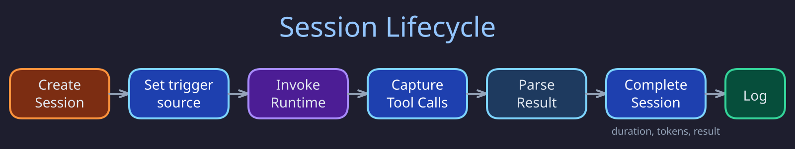

# Session Lifecycle

> **Purpose:** Describe how sessions are created, completed, and queried --- the append-only session log that records every LLM invocation.
> **Audience:** Developers working on session management, dashboard developers building session views, operators analyzing butler activity.
> **Prerequisites:** [Trigger Flow](../concepts/trigger-flow.md), [LLM CLI Spawner](spawner.md).

## Overview



A session represents one ephemeral LLM CLI invocation. The session log (`src/butlers/core/sessions.py`) is an append-only record: sessions are created when a trigger fires and completed when the runtime instance returns. After creation, the only permitted mutation is `session_complete()`, which fills in result fields and sets `completed_at`. This strict contract ensures that the session table is a reliable audit trail of all LLM activity.

## Session Creation

`session_create()` inserts the row and returns its UUID; the spawner calls it before invoking the
runtime adapter. Columns come from `core_001_foundation` plus later core migrations under
`alembic/versions/core/`; the function signature in `src/butlers/core/sessions.py` is the
authoritative field list. Invariants:

- **`trigger_source`** must be one of `TRIGGER_SOURCES` in `sessions.py`, or
  `schedule:<task-name>` / `deadline:<task-name>`.
- **`request_id`** is required: the ingestion UUIDv7 for connector traffic, freshly generated
  otherwise.
- **`purpose_lane`** is a closed `standard` / `private_content` value taken from trusted routing or
  connector context, never inferred from prompt text.
- **`resolution_source`** is `catalog` for live dispatch; `direct_runtime` appears only in pool-free
  harnesses (see [Model Routing](model-routing.md#resolution-flow-in-the-spawner)).
- **`effective_prompt` / `prompt_digest` / `prompt_provenance`** form the effective-system-prompt
  receipt. It is immutable creation evidence, separate from the caller's `prompt`. It is returned
  only by the authenticated `GET /api/sessions/{id}/prompt` door after digest and byte-count
  verification; list, aggregate, ordinary detail, audit, metric, and telemetry surfaces do not
  copy it. Legacy rows may lack a receipt and are reported as unavailable rather than
  reconstructed from current files.

## Session Completion

`session_complete()` is the only mutation allowed after creation. It fills the result, merged tool
calls, duration, success/error, cost, and token counts, and sets `completed_at`. NUL characters are
stripped from text fields first, because PostgreSQL text columns reject them. An unknown
`session_id` raises `ValueError`.

## Healing Fingerprint

After a session fails and the self-healing module computes an error fingerprint, `session_set_healing_fingerprint()` writes a 64-character hex SHA-256 fingerprint to the session row. This is a best-effort update that enables deduplication of healing attempts for identical failure patterns.

## Active Sessions

`sessions_active()` returns all sessions where `completed_at IS NULL`. This is the primary mechanism for the dashboard to detect running sessions and display real-time activity.

## Session Queries

Read helpers (`sessions_list`, `sessions_get`, `sessions_summary`, `sessions_daily`,
`top_sessions`, `schedule_costs`) live in `src/butlers/core/sessions.py`. One contract there is not
obvious from the signature: `schedule_costs()` joins `scheduled_tasks` to sessions through the
`trigger_source` convention and adds `projected_monthly_runs`, the cron expression's own cadence
over an average Gregorian month, with the basis stated once as `forecast_basis`. The projection is
a pure function of the cron string. A cadence that cannot be established yields `0.0`, meaning
"unknown" rather than "never runs". Keep it separate from the measured totals in the same row.

## Friction Ledger

`session_complete()` derives a typed friction row into `sessions_friction` for every session that was not clean, keyed on `(session_id, kind, ordinal)` for idempotence. Derivation is deterministic (`_classify_friction_kind()` in `sessions.py`, mirroring the same guardrail/timeout signatures as `by_error_marker`) — no LLM judgment. A clean session (`success=True`, no leftover `error`) writes zero rows. Kinds:

- `degenerate_tool_loop` / `guardrail_termination` --- spawner guardrail terminations (repeated identical tool calls, or a tool-call/token budget cap).
- `classification_timeout` --- a switchboard classification dispatch (mini model, ≤60s) that timed out.
- `recovered_error` --- the session ultimately succeeded but carries a leftover `error` string from a mid-session failure.
- `dead_end` --- any other unclassified failure.

A friction-write failure is logged and swallowed; it never blocks the append-only session-close contract.

## JSONB Handling

JSONB columns (`tool_calls`, `cost`) are stored as JSON strings in PostgreSQL. The `_decode_row()` helper deserializes these when reading session records, ensuring callers always receive Python dicts/lists rather than raw JSON strings.

## Verification

To confirm the session lifecycle described here matches the running system:

```bash
# 1. Session row is created with expected creation fields
psql -h localhost -U butlers -d butlers -c \
  "SELECT id, trigger_source, model, complexity, resolution_source, started_at, completed_at
   FROM general.sessions ORDER BY started_at DESC LIMIT 3;"
# Expected: completed sessions show completed_at set; running sessions have completed_at NULL

# 2. Active sessions (running but not completed)
psql -h localhost -U butlers -d butlers -c \
  "SELECT id, trigger_source, started_at FROM general.sessions WHERE completed_at IS NULL;"
# Expected: empty when no sessions are running; rows appear during active LLM invocations

# 3. Session completion fields are populated
psql -h localhost -U butlers -d butlers -c \
  "SELECT id, success, input_tokens, output_tokens, duration_ms,
          (result IS NOT NULL) AS has_result, (tool_calls IS NOT NULL) AS has_tool_calls
   FROM general.sessions ORDER BY started_at DESC LIMIT 3;"
# Expected: success=true, token counts populated, result and tool_calls non-null

# 4. Trigger source conventions are followed
psql -h localhost -U butlers -d butlers -c \
  "SELECT DISTINCT trigger_source FROM general.sessions;"
# Expected: values from TRIGGER_SOURCES in sessions.py, or schedule:<name> / deadline:<name>

# 5. Sessions API endpoint returns the same data
curl -s http://localhost:41200/api/butlers/general/sessions | python3 -m json.tool | head -50
# Expected: matches the SQL query results above
```

## Implementation Notes

- Dashboard chat Stop is message-scoped: the immutable dashboard user-message id travels through
  ingress, route inbox, recovery and `Spawner`, and cancellation renders only after the durable
  control row confirms it. Route-inbox workers hold fenced processing leases; a worker that loses
  its lease cancels its runtime but leaves the session unresolved for recovery to mark `ambiguous`
  (no replay or retry, but Stop intent is recorded and every known session is cancelled).

## Related Pages

- [LLM CLI Spawner](spawner.md) --- the component that creates and completes sessions
- [Tool Call Capture](tool-call-capture.md) --- how tool call records are collected for the `tool_calls` field
- [Model Routing](model-routing.md) --- how the `model`, `complexity`, and `resolution_source` fields are populated
- [Scheduler Execution](scheduler-execution.md) --- how `schedule:<name>` trigger sources originate
