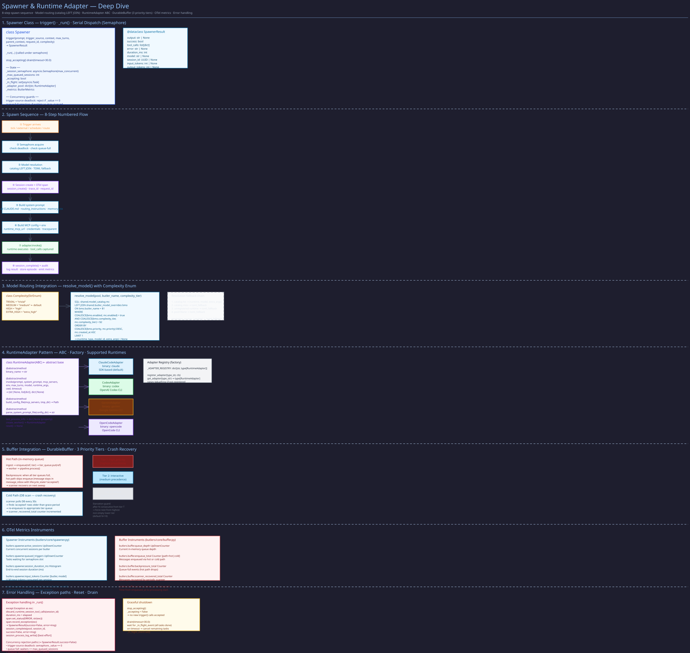

# Spawner

> **Purpose:** Document the LLM CLI spawner that invokes ephemeral runtime instances for butler sessions.
> **Audience:** Developers working on session dispatch, runtime adapters, or concurrency tuning.
> **Prerequisites:** [Trigger Flow](../concepts/trigger-flow.md), [MCP Model](../concepts/mcp-model.md).

## Overview



The Spawner (`src/butlers/core/spawner.py`) is the core component that invokes ephemeral AI runtime instances for a butler. Each butler has exactly one Spawner instance. When triggered, the Spawner acquires concurrency slots, resolves the model from the catalog, generates a locked-down MCP config, invokes the runtime via an adapter, captures tool calls, logs the session, and returns the result.

## Construction and Entry Point

`Spawner` and its entry point `Spawner.trigger()` live in `src/butlers/core/spawner.py`; the
signature and docstring there are authoritative. The semantics that matter to callers:

- **`trigger_source`** selects prompt layers, MCP wiring, and the derived dispatch intent. Every
  source except `healing` and `qa` gets MCP tools, so it requires a tool-capable runtime.
- **`complexity`** defaults to `Complexity.WORKHORSE` and is the tier resolution starts from (see
  [Model Routing](model-routing.md#complexity-tiers)).
- **`attachments`** with an `image/*` media type make the intent require vision, so a catalog with
  no vision-proven model fails the dispatch instead of handing the image to a text-only model.
- **`max_token_budget` / `max_tool_calls`** raise guardrail terminations that the failover
  classifier always suppresses.
- **`env_override`, `timeout_override`, `cwd`, `bypass_butler_semaphore`** exist for the
  self-healing and QA dispatchers, which own their own sandbox, watchdog, and concurrency cap.
- **`conversation_id`** lets a `route` turn resume the conversation's provider-native session when
  the adapter supports it. **`dashboard_turn_id`** requires the durable Stop-protocol claim to
  succeed before `runtime.invoke`.
- **`credential_store`** (constructor): for Codex it must carry an explicitly selected system-global
  `cli-auth/codex` authority. A missing or unavailable selection refuses new Codex subprocesses
  rather than treating a local runtime file or fallback pool as authority.

`trigger()` returns a `SpawnerResult`. On a pre-invocation resolution failure it carries the
prompt-free `resolution_receipt` so callers keep the no-winner explanation.

## Execution Pipeline

### 1. Concurrency Acquisition

Two semaphores must be acquired in order:

1. **Per-butler semaphore** --- sized from `runtime_config.max_concurrent` (seeded from `[butler.runtime_seed]`; a cold field, so changes need a restart). Default is 1 (serial dispatch). Can be bypassed with `bypass_butler_semaphore=True` for internal dispatch.
2. **Global semaphore** --- Process-wide `asyncio.Semaphore` defaulting to 3, configurable via `BUTLERS_MAX_GLOBAL_SESSIONS`. Limits total concurrent sessions across all butlers in the process.

Metrics track queue depth at both levels (`butlers.spawner.queued_triggers` and `butlers.spawner.global_queue_depth`).

### 2. Model Resolution and Same-Tier Failover Setup

The spawner resolves the model dynamically via the catalog using `resolve_model_with_effective_tier()`:

1. Query `public.model_catalog` with optional `public.butler_model_overrides` for the butler's name and the requested complexity tier.
2. If the catalog returns a result: use that model's `runtime_type`, `model_id`, and `extra_args`. Pin the **effective tier** for the logical session — all same-tier failover candidates must match this tier.
3. If a populated catalog returns no fitting candidate: fail before runtime invocation and retain the prompt-free resolution receipt on the failed result.
4. If the catalog is empty or unavailable on a live daemon: fail before invocation because catalog-keyed permission, quota, ceiling, breaker, and provenance gates cannot run. Explicit pool-free direct-adapter harnesses may use `DEFAULT_RUNTIME_TYPE` with no model only after adapter capability fit.

The resolution source (`"catalog"`; `"direct_runtime"` only in pool-free harnesses) is recorded on the session row. An unregistered catalog runtime fails closed instead of combining that entry's model ID with another runtime.

Spend-rule and private-content overrides remain subordinate to the original dispatch intent. Before
prewarm or session creation, the final catalog entry must have been fit-eligible in the original
resolution receipt for the same effective tier. An override cannot erase an `excluded_hard_fit`
vision, tool-use, context, deadline, or budget finding.

**Quota-skip loop:** After initial resolution, the spawner enters a quota-skip loop before invoking the adapter:

- Call `check_token_quota()` for the current candidate.
- If quota is exhausted: write a `quota_skip` row to `public.model_dispatch_attempts`, then call the shared failover-admission path to find the next model in the same effective tier that satisfied the original intent and has a registered runtime.
- Candidates that failed original intent fit are recorded as non-invoked `suppressed` attempts. Candidates naming unregistered runtimes are recorded as non-invoked `runtime_failure` attempts. The bounded search continues past both.
- If no next candidate exists: emit `butlers.spawner.failover_exhausted_total` metric and return failure.
- Repeat until a candidate with remaining quota is found.

All quota-skip rows share the same `logical_session_id` as later attempt rows (minted before the loop, non-null even for internal triggers without a `request_id`).

### 3. Session Creation

A session row is inserted into the `sessions` table with the prompt, trigger source, model, request ID, complexity tier, and resolution source. The returned session UUID is used for all subsequent correlation.

### 4. MCP Config Generation

The spawner generates a config declaring a single MCP server --- this butler's FastMCP instance. The URL includes a `runtime_session_id` query parameter for tool call correlation. Only declared credentials are included in the environment; undeclared env vars do not leak.

### 5. System Prompt Composition

The system prompt is composed in `spawner_context._compose_system_prompt()` from these layers, in stable order for token-cache efficiency (each appended as a suffix, separated by one blank line, only when non-empty):

1. **Base system prompt** --- read from the butler's `CLAUDE.md`
2. **General timezone instruction** --- from shared owner settings
3. **Situational context preamble** --- from the context bus (`butlers.context_bus`)
4. **Blind-spot preamble** --- declared expected-signal absence. Absent whenever every signal the butler has declared a dependency on (`butlers.core.blind_spot_declarations.declared_signal_patterns`) is PRESENT, so this layer is a byte-identical no-op in the common case. Gated by the per-butler `runtime_config.blind_spot_preamble_enabled` kill switch (default on). Unlike every other layer here, its underlying fetch (`fetch_blind_spot_preamble` / `evaluate_declared_signals`) is deliberately **fail-closed**: a query error surfaces as a typed "source health could not be evaluated" block rather than silently omitting the layer.
5. **Owner routing instructions** --- fetched from the `routing_instructions` table, sorted by priority (switchboard only)
6. **Memory context** --- retrieved from the memory module based on the prompt content

### 6. Runtime Invocation and Same-Tier Failover Loop

The appropriate `RuntimeAdapter` is selected based on the resolved `runtime_type`. The adapter spawns the LLM CLI as a subprocess with the MCP config, system prompt, user prompt, environment, and model parameters. Trace context is propagated via the `TRACEPARENT` environment variable.

**Same-tier failover loop:** When an adapter raises an exception, the spawner enters the failover decision path before propagating the error:

1. **Collect evidence:** Consume any tool calls captured in the runtime session buffer (via `consume_runtime_session_tool_calls()`). These represent MCP side effects that have already occurred.

2. **Consult the classifier:** Call `classify_failover_eligibility(FailoverContext(exception=..., tool_calls=..., process_info=...))`. The classifier returns a `FailoverDecision(eligible, reason)`.

3. **Suppressed path** (`eligible=False`): Emit `butlers.spawner.failover_suppressed_total` metric. Write a `suppressed` row to `public.model_dispatch_attempts`. Re-raise the original exception — the session fails.

4. **Eligible path** (`eligible=True`):
   - Write a `runtime_failure` row to `public.model_dispatch_attempts` for the current candidate.
   - Append the current `catalog_entry_id` to `_attempted_ids`.
   - Call the same shared failover-admission path used by quota failover.
   - Record and skip candidates that failed original intent fit or name an unregistered runtime.
   - If a next candidate exists: emit `butlers.spawner.failover_attempts_total`, swap `model`/`runtime_type`/`catalog_entry_id`, re-create the adapter, and loop back to **Runtime Invocation**.
   - If no candidate remains: emit `butlers.spawner.failover_exhausted_total`, re-raise the last exception.

5. **On success after failover:** Write a `success` row to `public.model_dispatch_attempts` for the winning candidate. Update the session row's `model` field to reflect the fallback model that actually ran.

A hard cap (`_MAX_FAILOVER_ATTEMPTS`) prevents unbounded looping regardless of catalog size.

#### Classifier Inputs

Every `RuntimeAdapter` populates `last_process_info` after each invocation attempt. Key fields:

- **`is_pre_tool_call`** — `True` when the failure happened before any MCP tool was executed. All adapters set this on non-zero exit or timeout.
- **`error_detail`** — Adapter-extracted error string (stderr, structured error code) for classifier pattern matching.

`MCPToolDiscoveryError` (raised by the Codex adapter after exhausting MCP-discovery retries) additionally exposes:

- **`is_pre_tool_call`** — always `True`.
- **`internal_retry_count`** — number of adapter-internal retries. The spawner treats the whole `MCPToolDiscoveryError` as ONE logical failover-eligible attempt regardless of this count.

#### Classifier Outcomes

| Decision | Trigger | Spawner Action |
|---|---|---|
| `eligible=True` | Systemic pre-tool-call error (rate-limit, auth, model-unavailable, timeout, MCP discovery) with no captured tool calls | Retry next same-tier candidate |
| `eligible=False` | Any captured tool call, guardrail termination, business/unknown error | No retry; propagate original error |

The classifier is **default-closed**: unknown exception classes always suppress failover.

#### Querying Provenance

Every attempt writes one row to `public.model_dispatch_attempts`, all sharing the trigger's
`logical_session_id`; outcomes and the resolution receipt are described in
[Model Routing](model-routing.md#attempt-provenance).

Use the API endpoint `GET /api/dispatch/attempts?session_id=<uuid>` to retrieve attempt provenance for a completed session.

### 7. Tool Call Capture and Merge

During the session, tool calls executed on the MCP server are captured in a thread-safe buffer keyed by `runtime_session_id`. After the runtime returns, the spawner merges parser-extracted tool calls (from the adapter's output parsing) with server-side executed tool calls. The merge uses signature matching (tool name + input payload) to reconcile records while preserving retry attempts.

### 8. Session Completion

The session row is updated with the output, merged tool calls, duration, token usage, cost, success status, and error (if any). Token usage is also recorded to the `public.token_usage_ledger` for quota tracking and reported to OpenTelemetry metrics.

### 9. Memory Episode Storage

If the memory module is enabled and the session produced output, the spawner stores the session as an episode for future retrieval.

## Self-Healing Integration

The spawner can be wired to a self-healing module via `wire_healing_module()`. When a session fails with a hard crash, the spawner's exception handler fires `dispatch_healing()` as a background task, which analyzes the failure and may attempt automatic recovery.

## Adapter Pool

The spawner maintains a cache of `RuntimeAdapter` instances keyed by `runtime_type`. The TOML-configured adapter is seeded at construction. When the model catalog resolves a different runtime type, a new adapter is lazily instantiated via the adapter registry (`get_adapter()`). Provider-specific configuration (e.g., Ollama base URL from `public.provider_config`) is forwarded to adapters that accept it.

## Verification

To confirm the spawner behavior described here matches the running system:

```bash
# 1. Session record shows model, trigger_source, and resolution_source
psql -h localhost -U butlers -d butlers -c \
  "SELECT id, model, trigger_source, resolution_source, complexity, success
   FROM general.sessions ORDER BY started_at DESC LIMIT 5;"
# Expected: live sessions use resolution_source "catalog";
#           "direct_runtime" appears only in explicit pool-free harnesses

# 2. Dispatch attempt provenance is recorded
psql -h localhost -U butlers -d butlers -c \
  "SELECT catalog_entry_id, outcome, failure_reason, attempt_index
   FROM public.model_dispatch_attempts ORDER BY created_at DESC LIMIT 10;"
# Expected: rows with outcome "success" for sessions that completed normally;
# "quota_skip" or "runtime_failure" for any failover attempts

# 3. Tool calls are merged into the session record
curl -s http://localhost:41200/api/butlers/general/sessions | python3 -m json.tool
# Expected: tool_calls array on completed sessions with tool_name, module_name, outcome

# 4. Concurrency metrics are exported (if Prometheus is wired)
curl -s http://localhost:41101/metrics 2>/dev/null | grep butlers_spawner
# Expected: butlers.spawner.queued_triggers, global_queue_depth, failover_attempts_total

# 5. Failover: a missing runtime binary causes immediate failure without DB rows
# Temporarily rename the claude binary and trigger a session.
# Expected: session record with success=false, error containing "RuntimeBinaryNotFoundError"

# 6. Self-healing wiring: check if healing module is configured
curl -s http://localhost:41200/api/butlers/general/status | python3 -m json.tool | grep healing
# Expected: healing module present with status "active" if configured
```

## Implementation Notes

- `Spawner._run()` forwards the effective `session_timeout_s` into `runtime.invoke(timeout=...)`,
  not only an outer `asyncio.wait_for(...)`; otherwise adapter inner timeouts drift from session
  records.
- `session_timeout_s` bounds one spawned session; healing/QA workflows own any broader deadline.
- Empty-response failover: merge adapter-reported and daemon-captured tool calls before accepting a
  normal return with no result text. No text and no confirmed non-command MCP action is an
  empty-response failure even with token usage; same-tier retry is safe only when the merged
  tool-call list is empty. Command-execution evidence suppresses retry (shell side effects); a
  confirmed MCP tool-only completion stays successful. `OpenCodeAdapter` rejects exit 0 with no
  text, tool calls, token usage or stderr with the same classifier-eligible posture.
- Runtime args come only from `public.model_catalog.extra_args` (no `butler.toml` fallback);
  `CodexAdapter` appends them to `codex exec` before the `--` prompt delimiter.
- `RuntimeConfigAccessor.invalidate_cache()` sets `RuntimeConfigAccessor._cache_time` to
  `float("-inf")`, not `0.0`, which
  only expires once process uptime exceeds the TTL.
- The deterministic `memory_consolidation` handler takes the daemon's live `Spawner` but resolves
  its pool and embedding engine through the active MemoryModule hook (private memory schemas such
  as Chronicler's `chronicler_mem`); missing wiring fails closed.
- Self-healing/QA: pre-launch gate rejects (cooldown, concurrency cap, circuit breaker, no model)
  are dispatch decisions, never failed `healing_attempts` rows. The QA circuit breaker counts rows
  with `healing_session_id IS NOT NULL` plus the `status = 'manual_reset'` sentinel, identically in
  the dashboard summary, `/api/qa/circuit-breaker[/reset]`, and
  `core/qa/dispatch.py::_is_circuit_breaker_tripped`.
- Adding a QA discovery source is a persisted vocabulary change: align `QaConfig.enabled_sources`,
  `_KNOWN_SOURCES`, `QaFinding.source_type`, and `ck_qa_findings_source_type` in one change, with a
  migrated-DB test inserting the new value.
- QA and self-healing dispatch add GitHub labels `self-healing` and `automated`
  (`_DEFAULT_PR_LABELS`, `src/butlers/core/qa/dispatch.py`). If the repo lacks them, PR creation
  fails with `gh_pr_create_failed: could not add label` and the attempt records `failed` despite a
  valid commit.
- QA investigation Codex runs launch from `<worktree>/.tmp/qa-agent/` with a local `AGENTS.md`
  that disables `bd` and session-close instructions. The helper dir keeps symlinks to `src/`,
  `tests/`, `roster/`, `frontend/`, `pyproject.toml` and `uv.lock` so repo-relative commands work.
- `POST /api/qa/dev/synthetic-findings` is an operator-only dev hook gated by
  `QA_ALLOW_SYNTHETIC_FINDINGS=true`: it queues a finding so the next scheduled patrol exercises
  the normal rehydrate, triage and dispatch path.
- Shared dashboard defaults live in `public.state` under `settings.general`
  (`GENERAL_SETTINGS_STATE_KEY`), edited through `/api/settings/general`: `timezone`, `language`,
  `date_format`, `time_format`, `week_starts_on`, `currency`. `measurement_system` is response-only
  `metric`. `Spawner` injects the block into every butler's system prompt.
- `notify` and `memory_store_fact` tool metadata document required and optional fields with a valid
  JSON example and constrained enums (`channel`, `intent`, `permanence`); `tags` is a JSON array.
  Scheduled prompts that do not reply to ingress use `intent="send"`.
- `SentenceTransformer.encode(..., show_progress_bar=False)` on every embedding path keeps tqdm out
  of daemon logs.
- Trigger sources: the core `trigger` tool dispatches with `trigger_source="trigger"`, and
  `route.execute` flows use `"route"`; both are in the `core.sessions` allowlist. A
  `trigger`-sourced call fails fast while the butler's lock is held, preventing self-invocation
  deadlocks.
- `CodexAdapter.invoke` raises on a non-zero CLI exit so the session records `success=false`.
- The spawned CLI's environment is host `PATH` plus declared credentials only, so shebangs such as
  `/usr/bin/env node` resolve without hardcoded paths.
- `src/butlers/core/spawner_context.py::_compose_system_prompt` is the one composition path: the
  raw system prompt, plus memory context
  as a double-newline suffix when available.
- `core.memory_hooks` dispatch is keyed by the invoking butler/schema, never a process-global
  closure, and registration is identity-safe, so stopping one daemon cannot remove another's
  memory runtime.
- Codex runs non-interactively as `codex exec --json ... --ephemeral`, never top-level `codex`
  (needs a TTY). The system prompt comes from the butler's `AGENTS.md`, is embedded in the prompt
  payload (the CLI has no `--instructions`), and goes on stdin via the `-` sentinel; a non-empty
  roster model pin is forwarded as `--model`. A non-zero exit that looks like a refresh-token reuse
  failure writes `last_test_ok=false` on the `cli-auth/codex` credential row (the secrets banner
  turns red); any successful spawn writes `true`, so the banner heals after re-auth.
- Codex stages per-invocation `HOME` roots under `~/.codex/.tmp` (the CLI fails with `codex_home`
  under `/tmp`).
- QA dispatch needs `gh` in `Dockerfile.base` to open its PR, pushes over HTTPS with `GH_TOKEN` and
  `gh auth setup-git` (no SSH agent in the sandbox), and branches from a freshly fetched
  `origin/main` via the worktree `base_ref`. Review follow-up backoff uses
  `healing_attempts.last_follow_up_at` / `follow_up_count`, separate from `last_review_check_at`.
- Token accounting: adapters report `usage.input_tokens` as the uncached bucket only, with cache
  reads and writes separate (Codex/OpenAI `prompt_tokens` include cache and must be reduced; see
  `runtimes/base.py`). `core/pricing.py` bills a cache bucket at its rate, falling back to the full
  input rate, never `$0`; a model with no `pricing.toml` entry is unpriced (`None`), not free.
  Adding a `sessions` column breaks the mocked-pool fixtures one file at a time: grep
  `total_input_tokens` in `tests/`.
- Adapters receive a caller-owned restricted environment: install invocation-local variables (the
  Codex temporary `HOME`) in a private copy, or same-tier failover inherits stale runtime state.
- Codex auth sync may use a shared `CredentialStore` authority only when passed explicitly, never
  inferred from a schema-local pool. Post-run rotations CAS against the launch snapshot, and one
  bounded `session_timeout_overhead_s` covers reconciliation, prewarm and refresh-lock waits.
- Spend prices GPT-5.6 models at OpenAI Standard API <=272K metered rates even when
  subscription-covered; lookup is exact, so every live catalog id needs its own entry.
- The dev daemon's Codex credential volume is separate from the host session. When a model ID is
  rejected as unsupported, check the pinned image's Codex CLI version before blaming entitlement,
  and test the exact configured reasoning effort.
- OpenCode Go listings (`opencode models opencode-go`, `--refresh` for the local cache) establish
  IDs, not workspace access; probe IDs through the daemon before enabling them. Add exact
  `pricing.toml` coverage before routing a new ID, because unpriced candidates score as
  cost-neutral.

## Related Pages

- [Trigger Flow](../concepts/trigger-flow.md) --- the two trigger sources that invoke the spawner
- [Session Lifecycle](session-lifecycle.md) --- session creation and completion details
- [Model Routing](model-routing.md) --- catalog structure, quota system, same-tier failover candidate selection, and adapter signal details
- [Tool Call Capture](tool-call-capture.md) --- how tool execution is tracked (feeds the side-effect gate)
- [Observability](../architecture/observability.md) --- trace context propagation through the spawner
