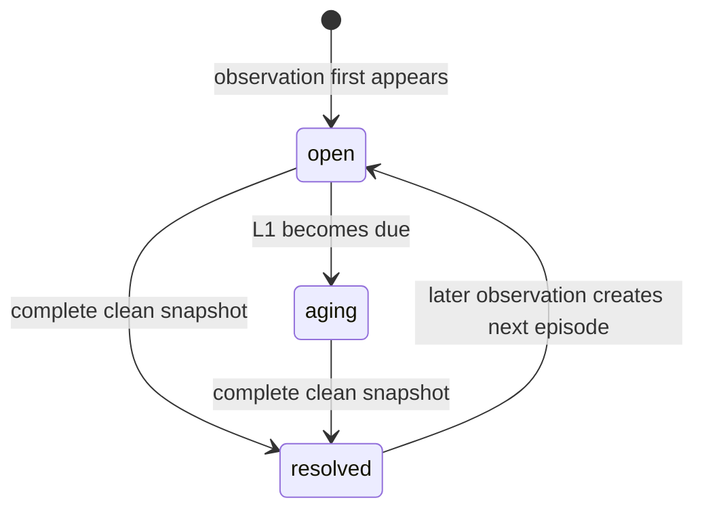
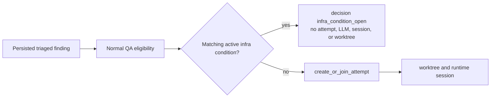

## Context

Deployment drift and calendar sync deadman currently persist one-shot audit
markers. Their marker absence is not durable current-state authority, and a
degraded or partial check can leave an implementation with no safe way to
distinguish unknown observation from recovery. Separately, `InfraStateSource`
feeds ordinary QA triage, where the existing atomic attempt claim can create
an execution record before a known active infrastructure condition is
recognized. Dashboard lifespan tasks are retained only in a discard-on-done
set, so an expected-infinite loop can return or fail without a restart.

This design establishes a deterministic condition lifecycle. It follows
Non-Negotiable Rule 4: a condition transition, escalation decision, and loop
supervision are deterministic infrastructure; no lifecycle operation invokes
an LLM. RFC 0001's separation of admission decisions from launched execution
also applies to infrastructure-condition suppression.

## Goals / Non-Goals

**Goals:**

- Give every infrastructure condition stable, reproducible identity and
  durable episode history.
- Make recovery an assertion made only by a successful complete snapshot.
- Replace permanent one-shot escalation suppression with bounded,
  concurrency-safe re-escalation while a condition remains active.
- Keep a repeated active `infra_state` finding visible while preventing it
  from becoming a healing attempt or runtime execution.
- Make dashboard lifespan loop failure observable and restartable without
  treating shutdown as a failure.
- Separate heartbeat-derived liveness from the connector's last reported
  operational state.

**Non-Goals:**

- Creating a generic producer registry, producer heartbeat framework,
  `context_producers` work, scheduler/default-schedule work, or new
  runtime/configuration knobs.
- Changing connector heartbeat writers, startup normalization, registration,
  raw historical QA views, or the external monitor/provisioning boundary.
- Changing the active core-daemon/delegation wake-loop work, the
  bu-kqnum.13/bu-kqnum.8 work, PR #3503 connector writer/startup work, PR
  #3514 core-daemon/delegation work, or PR #3516 direct-audit-result work.
- Adding a dashboard condition page, owner-attention redesign, or direct LLM
  remediation from the condition lifecycle.
- Implementing any code, migration, configuration, API, frontend, or runtime
  change in this OpenSpec-only delivery.

## Decisions

### 1. A canonical producer source plus a versioned identity payload names a condition

A condition is keyed by an explicit canonical producer domain (`source`) and a
SHA-256 fingerprint. The source is not a `QaFinding.source_type`, connector
provider/channel, mutable error class, or `healing_dispatch_events.butler_name`.
Each producer supplies a versioned identity payload containing only stable
condition facts. Its recursively sorted keys and set-valued collections are
serialized deterministically as UTF-8 before hashing; the source is included
in that payload and remains a separately stored namespace key.

Timestamps, durations/age strings, expected/current revision values that can
change during the same outage, and mutable error prose are evidence or
sanitized metadata, never identity fields. This keeps a continuing condition
on one episode even as its diagnostic text evolves. Reusing the existing
exception fingerprint is rejected because it names a spawner failure, not a
producer-owned infrastructure condition.

### 2. Episodes are append-per-recurrence and recovery is snapshot-authoritative

The ledger has at most one active episode for a `(source, fingerprint)` pair.
An observed condition creates an `open` episode; its first due escalation moves
it to `aging`. A complete successful snapshot is the only input allowed to
resolve an active condition that is absent from that snapshot's authoritative
scope. A failed, degraded, partial, or otherwise incomplete observation can
confirm evidence for a condition it did observe, but it cannot infer absence
or transition any episode to `resolved`.

The `resolved → open` arrow denotes a new row with the next episode number,
not a mutation that reopens historical evidence. That preserves the original
first-detected, escalation, and recovery timestamps for audit and recurrence
analysis.

### 3. Escalation is a bounded lifecycle schedule, not a permanent marker

The lifecycle service owns due-time calculation and atomically claims each due
transition before a producer performs its source-owned side effect:

| Level | Due time | Meaning |
| --- | --- | --- |
| L0 | first observation | Record evidence; do not escalate. |
| L1 | producer-owned initial grace after L0 | First escalation for this episode. |
| L2 | one day after L1 | First re-escalation. |
| L3 | three additional days after L2 | Second re-escalation. |
| L3 repeat | every seven days after the prior L3 action | Continuing escalation at L3. |

Only the producer supplies the L1 grace and source-specific consequence; the
shared lifecycle has no global default schedule. Every L1, L2, and individual
L3-repeat due transition is emitted once, even with concurrent reconcilers.
The ledger transition is not itself an LLM, healing attempt, worktree, or
notification side effect. Producers may record their own audited consequence
after they receive a due transition; deployment drift retains its current
terminal human-action shape at L1 and records L2+ re-escalations without
creating further healing attempts.

### 4. QA suppresses an already active infrastructure condition before it claims execution

`infra_state` keeps its existing source-type vocabulary and normal triage
visibility. After normal QA eligibility checks (recursion, opt-in, severity,
cooldown, concurrency, circuit-breaker, and model availability) pass, but
before `create_or_join_attempt`, dispatch looks up the matching active
condition by explicit canonical source and fingerprint. If one is `open` or
`aging`, it records exactly one decision-only `healing_dispatch_events` row
with `decision = infra_condition_open`, a condition reason, and null attempt
linkage, updates the finding's explicit suppression reason, and returns.

This ordering prevents creation-and-deletion churn in `healing_attempts` and
preserves RFC 0001's rule that a pre-launch admission result is a decision,
not an execution failure.

### 5. The dashboard supervises named expected-infinite loops

The dashboard lifespan owns one named supervisor registration for each current
expected-infinite loop: `secrets_lifecycle`, `model_verify`, `fleet_events_bridge`,
`settings_console_delta`, `secrets_staleness`, `migration_drift`,
`calendar_sync_deadman`, `external_deadman`, and `restore_drill`. The external
deadman registration remains conditional on its configured URL.

That conditional registration does not turn an unconfigured target into a
failed-ping signal. The existing `staffer-qa` `infra_state`
`external-deadman-stale` contract treats an unconfigured
`EXTERNAL_DEADMAN_URL` as a legitimate absence with no QA finding. The
implemented `infra_state` snapshot also retains a separate, content-blind
`ExternalDeadmanUnconfigured` assurance condition, which records the missing
external witness without LLM execution or an invented outage. This change
preserves both meanings and does not provision an external monitor.

An ordinary return or exception is unexpected: the supervisor logs the loop
name and restarts it after bounded backoff, without allowing concurrent
duplicate instances. During shutdown, the application marks the supervisor as
stopping, cancels, and awaits every registered loop. `CancelledError` caused
by that shutdown is terminal and MUST NOT restart. A generic task-health or
producer-heartbeat framework is rejected because this is limited to the nine
existing dashboard lifespan loops.

### 6. Heartbeat time is liveness authority; stored state is operational health

Every connector reader derives `online`, `stale`, or `offline` from
`last_heartbeat_at` through `derive_liveness`. The heartbeat's stored
`healthy`, `degraded`, or `error` value remains independent source-health
evidence. A recent heartbeat with `state=error` is online-but-error; a
heartbeat beyond the offline threshold is offline even if its stored state is
healthy. Paused and archived/deleted exclusions remain explicit operator or
lifecycle state, not liveness proof.

## Risks / Trade-offs

- **An identity payload includes mutable facts** → Require versioned, sorted
  stable identity inputs and keep timestamps, age, revisions, and error prose
  only as evidence.
- **A degraded scan accidentally closes an outage** → Require the source to
  assert `snapshot_complete` only after successfully enumerating its entire
  authority; otherwise reconcile observations without absence-based resolution.
- **Concurrent reconcilers duplicate escalation** → Serialize active-episode
  reconciliation and atomically advance/claim a due level before side effects.
- **QA suppression hides evidence** → Persist the original finding and an
  explicit decision event separately from execution history.
- **A restart storm masks a permanently failing loop** → Bound supervisor
  backoff and retain loop-name logging; do not introduce unbounded immediate
  restart or a second loop instance.
- **Source-specific behavior leaks into the shared service** → Keep L1 grace
  and consequences producer-owned, while the ledger owns only common state
  and timing semantics.

## Migration Plan

1. Implement the isolated ledger and deterministic reconciliation service
   first (bu-27dxl.6.2), with no producer or QA side effects.
2. Move deployment drift and calendar deadman to complete-snapshot lifecycle
   reconciliation after the ledger and PR #3516's direct-audit-result work
   are available (bu-27dxl.6.3).
3. Reconcile `InfraStateSource` observations and add the pre-claim QA
   suppression (bu-27dxl.6.4).
4. Supervise the nine dashboard lifespan loops without changing their business
   behavior (bu-27dxl.6.5), then audit connector read models for
   heartbeat-derived liveness (bu-27dxl.6.6).
5. Run focused lifecycle, race, recovery, QA, supervisor, and liveness tests,
   then terminal adversarial reconciliation after the implementation slices
   and operator-owned external-monitor prerequisite are complete.

Rollback removes consumers before the ledger schema only if no active
implementation depends on it; it never deletes historical condition,
dispatch-decision, audit, or healing-attempt evidence. A failed or incomplete
snapshot remains non-resolving throughout rollout and rollback.

## Open Questions

None. Source-specific L1 grace belongs to each producer contract; this change
does not create a global default or defer lifecycle correctness to operator
judgment.
