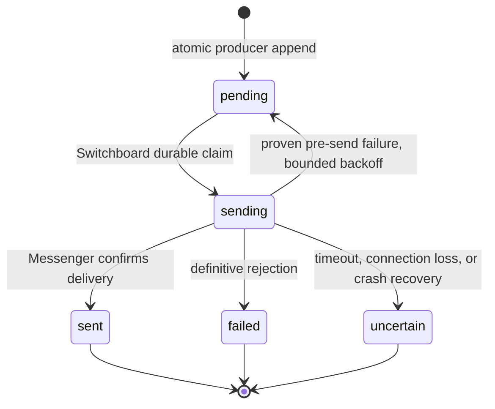

## Context

[Observed] The runtime has one shared `runtime_codex` filesystem volume while
each daemon restored `cli-auth/codex` with local-first credential lookup. A
stale schema-local document could therefore become the last startup writer and
replace the newer public credential. The dashboard used a separate filesystem,
so its direct adapter probe could pass while routed daemon dispatches failed.

[Observed] The breaker is derived from `public.model_dispatch_attempts`, but
the alert path independently checked an audit marker, sent a Telegram message,
then wrote its marker and attention ledger. Concurrent producers could all
pass that check. A Messenger send could also succeed before a routing-log ACL
error caused the caller to regard it as failed and retry.

[Observed] the OpenCode execution mapper stripped `opencode-go/` from a
provider-qualified catalog ID before invoking the CLI. The current CLI requires
`provider/model`, so it parsed the resulting bare value as a provider with an
empty model ID. Catalog, pricing, spend rules, history, and provider discovery
use the provider-qualified IDs as canonical identity. No credential content was
inspected or exposed during diagnosis.

This design must preserve the system's binding boundaries: one authoritative
Tier-1 credential location (security model), deterministic daemon control
logic (Vision Rule 4 and RFC 0001), MCP/Switchboard ownership of inter-butler
delivery (Vision Rule 3 and RFC 0003), and best-effort attention-ledger
observability rather than delivery authority (RFC 0011 Amendment 1).

## Goals / Non-Goals

**Goals:**

- Ensure every Codex CLI-auth restore and rotation uses one explicit shared
  authority in both schema-separated and flat topologies.
- Make a routed dispatch failure atomically create at most one attention
  episode for each closed-to-open breaker transition, including a failed
  half-open probe.
- Give Switchboard sole ownership of external operational-attention delivery,
  while preserving the existing least-privilege runtime roles.
- Favour no duplicate owner page over automatic replay of an ambiguous
  external send, and make the resulting state operable rather than silent.
- Test a catalog entry through the actual daemon runtime environment without
  misrepresenting that probe as a routed breaker recovery.
- Preserve canonical OpenCode Go catalog identity while passing the same
  provider-qualified `provider/model` argument at the execution boundary that
  requires it.

**Non-Goals:**

- Deleting, copying, or revealing existing schema-local credential values.
- Treating a dashboard probe, manual model test, or verification cache update
  as a `model_dispatch_attempts.success` row or as a breaker reset.
- Turning all notifications or all historical direct-delivery callers into the
  new outbox in this change. It introduces the reusable facility and migrates
  only the two operational-attention producers with the demonstrated unsafe
  shape: model breaker and fleet halt.
- Retrying an ambiguous Telegram/Messenger request automatically, introducing
  a generic queue framework, or adding a new LLM session to send attention.
- Backfilling old open breakers into new alert episodes during rollout. The
  dashboard remains the truthful view of those existing incidents and an
  operator can explicitly issue a new page if needed.

## Decisions

### 1. CLI auth gets an explicit authority channel, not a special fallback order

`CredentialStore` will retain its existing local-first `load()`/`resolve()`
semantics for ordinary Tier-1 credentials. It will additionally expose an
explicit authoritative-system pool and strict read/write methods for
system-global values. In flat topology the authority pool may be the same
object as the local pool; it is still explicit and never treated as absent
because it is not a fallback.

`cli-auth/codex` persistence, restore, live Codex reconciliation, dashboard
device auth, Codex runtime probes, and Codex-dependent connector startup will
exclusively use those strict methods. An authority lookup failure returns a safe
unavailable result and never falls back to a schema-local `cli-auth/codex` row.
Local Codex CLI-auth metadata may be read only to report an ignored-scope
conflict without exposing values or token fingerprints. Existing persistence
and authority behavior for other CLI providers, including OpenCode, remains
unchanged in this change.

This is deliberately narrower than changing all `CredentialStore` resolution.
The security model already says each credential has exactly one authoritative
location; `cli-auth/codex` is the demonstrated shared-runtime system credential
that needs this stronger form. It fixes the shared-volume overwrite without
changing established per-domain or other-provider credential resolution.

### 2. Catalog identity is canonical; OpenCode provider/model syntax is an execution-boundary concern

`model_catalog.model_id` remains the canonical provider-qualified identity
used by catalog discovery, pricing, spend rules, token-ledger history, and
routing. In particular, `opencode-go/<native-id>` remains persisted and is not
migrated to a bare ID. No catalog API, migration, or historical-record rewrite
may silently strip that provider namespace.

`OpenCodeAdapter` owns a named, pure canonical-to-execution translation. The
current OpenCode CLI requires `provider/model`, so a resolved
`opencode-go/<native-id>` value is passed unchanged after `--model`; the
adapter retains that canonical value for all caller-visible provenance, pricing,
spend, and history. Other qualified providers and unrelated runtimes pass their
model identifiers unchanged. Existing bare values, if any, retain their
existing execution behavior rather than being broadly normalized.

The catalog test and hourly verification move to a deterministic
Switchboard-owned runtime-probe coordinator that uses the same shared runtime
home, applicable credential authority, adapter construction,
canonical-to-execution mapping, generated OpenCode configuration, and runtime
args as a normal daemon invocation. The separate OpenCode CLI-auth health check
uses the same pure execution mapper but remains an auth-specific check: it does
not create catalog verification or routed dispatch provenance. The coordinator
has no domain MCP tools and does not write dispatch provenance.

The dashboard calls a private authenticated control-plane command, not a
generic Switchboard MCP tool. It is absent from model-visible tool discovery
and accepts only a catalog entry ID: no credential material, model override,
runtime arguments, or arbitrary prompt crosses from the dashboard. A
dashboard-triggered Test or Verify requires the same fail-closed
`require_dashboard_owner_control` gate used for attention reissue before it
contacts Switchboard.

The dashboard server and the trusted verification scheduler call Switchboard
through a dedicated `runtime_probe_control` client using a short-lived signed
control capability, not a shared bearer token. A private
`RUNTIME_PROBE_CONTROL_SIGNING_KEY` is delivered via a deployment-secret mount
only to the Dashboard API process, where its scheduler already runs. The
co-resident all-butlers daemon and its model-runtime children receive only the
corresponding non-secret verification key. This preserves the actual
Switchboard runtime boundary without pretending a file mount can isolate one
module inside the shared all-butlers process.

The Dashboard signer mount is an enforcement artifact, not an inert
representation. Mode `0400` alone does not isolate a file from same-identity
child processes. Before the mount can activate, every Dashboard runtime-CLI
spawn path is either removed or forced through one shared OS launcher that
allocates an exclusive unprivileged UID/GID to each live invocation, clears
supplementary groups, sets `no_new_privs`, uses a per-invocation child-owned
HOME/config directory, and supplies an allowlisted environment containing no
database, owner-control, OAuth, or deployment-secret value. A kernel-enforced
per-invocation Bubblewrap filesystem/process domain denies every peer staging
tree, peer `/proc` state, canonical credential root, and the root-owned
mode-`0400` signer. `Dockerfile.base` installs an exact Bubblewrap package
version and records it in the auditable CLI-version manifest.
The root supervisor allocates one outer UID/GID from reserved range
`61000..61999`, drops to it, and execs `bwrap` with nested user, mount, PID,
IPC, and UTS namespaces; a fresh procfs; a private tmpfs `/tmp`; minimal
`/dev`; one writable bind for that invocation's staged HOME; and read-only
 provider-command/runtime-library, CA, and resolver inputs. It does not unshare
 the network because health and device-auth flows require egress. `/root`,
 `/run`, `/app`, canonical credential homes, peer stages, and host procfs are
 absent. The parent launches Bubblewrap with `close_fds=True` and an exact
 `pass_fds` allowlist containing only stdio plus typed Bubblewrap setup pipes or
 seccomp descriptors created by the trusted launcher; none may reference the
 signer, canonical authority, staging-root descriptors, a peer stage, parent
 procfs, or other credential-bearing material. A repository-owned
 `runtime-cli-sandbox-init` is the namespace PID 1: after the Bubblewrap
 handshake releases it, the shim closes every descriptor above stderr with
 `close_range(3, UINT_MAX, 0)`, verifies that no unexpected descriptor remains,
 and then `execve`s the provider CLI. Thus even the allowlisted setup
 descriptors are unavailable to the runtime payload. Missing `close_range`, a
 missing or mismatched shim, an unsafe stdio/setup descriptor referent, or a
 close/verification failure fails launch and signer activation closed. An
 identity is not reused until its namespace contains no live
descendant and its stage is removed. A fixed shared child UID, directory
permissions, a global lock, or process-group/`setsid` handling alone is
invalid. These controls cover provider health, device-auth, API-key-test, and
Secrets/Settings aliases. Dashboard-local model-verification adapter paths are
removed at the signer cutover rather than sandboxed.

The trusted launcher uses Bubblewrap `--as-pid-1 --die-with-parent` and a
trusted `--info-fd`/`--block-fd` startup handshake; direct payload or outer
Bubblewrap exit is not a terminal result. Before releasing the block fd, the
parent opens a pidfd for the reported namespace PID 1. On success, failure,
cancellation, or timeout it signals that pidfd, escalates to `SIGKILL` after a
bounded grace period, polls pidfd death, and separately waits for its direct
Bubblewrap child. It does not call `waitid` on the non-child namespace PID 1.
Kernel PID-namespace-init death terminates every remaining namespace member,
including forked, double-forked, or `setsid` descendants. Only then does the
parent consider staged output. Device auth is
opened relative to a trusted staging-root file descriptor with
`openat2(RESOLVE_BENEATH|RESOLVE_NO_SYMLINKS)` or a behaviorally equivalent
no-follow primitive. Owner, mode, link count, size, and schema are checked and
the bounded bytes are consumed through that same open descriptor; the parent
never validates by path and reopens. Persistence remains fenced by the
authority compare-and-set. Each provider has an exact disposable scratch-root
allowlist because a CLI may create databases, WAL, logs, config, or package
files under staged HOME. Exactly one expected credential artifact is
persistence-eligible; alternate credential artifacts and writes outside the
scratch allowlist fail closed. All scratch content is discarded. Any
 containment, inherited-descriptor closure, termination, staged-output
 descriptor, or scratch-policy failure persists
 nothing and cleans the stage before releasing the invocation identity.

Default and hotreload Dashboard services use the same repository-owned seccomp
profile permitting only the namespace syscalls Bubblewrap needs plus
`close_range` for the trusted PID1 shim, together with exact
`apparmor:unconfined` and `systempaths=unconfined` settings. They add no
`privileged`, `cap_add`, host PID namespace, or Docker-socket access. Startup
executes a real nested-user/mount/PID-namespace
preflight with the exact image and policy. Unsupported user namespaces,
seccomp/AppArmor denial, missing Bubblewrap, unavailable pidfds, or exhausted
UID range makes CLI-auth launch and signer activation unavailable while the
ordinary Dashboard remains healthy. No legacy direct subprocess fallback is
allowed.

#### Owner-selected Option B: image-owned PID1 shim closure (proposed amendment)

On 2026-09-11 the owner selected Option B: compute the namespace-PID1 shim's
runtime closure during the image build and consume it from the validated
image-owned manifest. This selects the design direction only. The exact
contract in this amendment remains proposed until security/engineering review
and adoption, and it does not authorize source implementation, image build or
deployment, provider/credential operations, or reassignment of the existing
implementation owner. The prior runtime-`ldd` Option A prototype is neither an
implementation input nor a deletion target for this change.

Manifest schema version 3 adds one top-level `shim` object beside the existing
`providers` object:

```json
{
  "version": 3,
  "shim": {
    "name": "runtime-cli-sandbox-init",
    "executable": "/usr/local/libexec/butlers/runtime-cli-sandbox-init",
    "readonly_inputs": [
      {
        "source": "/usr/local/libexec/butlers/runtime-cli-sandbox-init",
        "destination": "/usr/local/libexec/butlers/runtime-cli-sandbox-init"
      },
      {
        "source": "/usr/lib/x86_64-linux-gnu/ld-linux-x86-64.so.2",
        "destination": "/lib64/ld-linux-x86-64.so.2"
      }
    ]
  },
  "providers": {
    "<registered-provider>": {
      "binary": "<declared-binary>",
      "executable": "<absolute-image-path>",
      "readonly_inputs": [
        {"source": "<terminal-source>", "destination": "<logical-path>"}
      ]
    }
  }
}
```

The illustrative loader binding above is not an architecture-specific fixed
library inventory; the generator records the closure present in the exact
image. The field sets and shim identity are fixed. Each binding preserves a
terminal root-owned immutable source and the logical destination named by the
ELF interpreter or loader. The shim list includes its executable, is non-empty,
and is independent of every provider list. The generator reuses the current
recursive shebang/ELF dependency walk in a strict shim mode: an explicit static
executable may have no library bindings beyond itself, but an unexplained
`ldd` failure, unresolved `not found` entry, or destination collision fails the
build. `Dockerfile.base` runs the generator after the final shim copy/chmod and
after provider installation; no later layer replaces the shim before the
manifest is consumed.

`RuntimeCLIInputManifest` remains the sole runtime I/O boundary. It retains the
current `O_NOFOLLOW`, same-descriptor bounded read, owner/mode/link/size checks,
and root-owned non-writable source validation, then validates the exact version-3
shim record and configured shim path. It returns explicit validated shim
bindings before the launcher allocates an identity, creates or writes a staged
HOME, or enters `_launch_invocation`. `build_bubblewrap_launch_plan` receives
those bindings as a mandatory argument; it does not read the manifest or run a subprocess. It combines
payload/provider inputs with shim inputs by logical destination, collapses only
identical source/destination pairs, rejects differing sources for one
destination, and sorts the unique result by destination before deriving parent
directories and `--ro-bind` arguments. This makes planner behavior independent
of caller order and removes the provider-glibc coincidence without creating a
second spawn path. Every exact-image harness uses the same validated shim
resolver: implementation removes the descendant-survival and signer-isolation
hard-coded glibc/loader tuples and the peer-isolation caller-side `ldd` helper
and synchronous `subprocess` import. Planner deduplication is not evidence that
one of those forbidden parallel closure mechanisms may remain.

Version 3 is an intentional image/application compatibility boundary, not a
dual-reader migration. A new reader rejects version 2; an old reader already
rejects version 3. The implementation therefore updates generator, loader,
planner callers, base-image wiring, tests, and documentation in one change and
ships only as a matched image. A mixed image/app combination fails before spawn
with ordinary Dashboard health intact. Roll forward rebuilds the matched base
and application image. Rollback restores a matched prior application/base pair
or retains the matched version-3 sandbox; while a signer mount exists it also
continues to obey the existing rule that the sandbox remains present or the
mount is removed before old code starts. No schema, persistent state, retry,
provider, credential, or live deployment migration is involved.

Parsers, receipt storage, the private endpoint, and the dedicated client MAY
land dark without production key mounts. The canonical launcher may then
perform its normal full-stack stop/start with both key files provisioned. A
started Dashboard loads the signer but its control client remains unavailable
and signs nothing until `GET /_control/runtime-probe/v1/readiness?kid=<kid>` on
the private Switchboard ASGI surface returns HTTP `200` with exactly
`{"status":"ready"}`. The endpoint returns HTTP `503` with exactly
`{"status":"unavailable"}` when the requested key does not match a loaded
verifier that is valid for issuance at the current integer second: the current
entry is eligible only at or after `sign_from`, while the retiring entry is
eligible only at or before `sign_until` and not after `accept_until`. It exposes
no configured key ID or material, accepts no capability, performs no lookup or
launch, and is absent from generic MCP discovery. This readiness gate allows
Dashboard health and `oauth-gate` to bring up all-butlers without a dependency
cycle. While the signer mount is active, rollback retains the child sandbox and
disables Test, verify-all, and scheduled verification, or removes the mount
before restoring an image without those protections.

The dedicated client calls `POST /_control/runtime-probe/v1`. It places one
compact JWS only in `Authorization: Bearer <compact-jws>`; cookies, query
parameters, and request-body capability copies are rejected. The protected JWS
header contains exactly string `alg: "EdDSA"` and string `kid`. The payload
contains exactly string `aud: "switchboard.runtime_probe_control.v1"`, enum
string `caller: "dashboard" | "scheduler"`, canonical lowercase UUID string
`catalog_entry_id`, integer NumericDate-second `iat` and `exp`, and `nonce` as
unpadded base64url encoding of 32 cryptographically random bytes. No extra
header or payload claim is accepted. No token-selected algorithm is trusted,
so `none`, symmetric, and other asymmetric algorithms are rejected. The
verifier permits at most five seconds of clock skew, requires
`iat <= now + 5s`, `exp >= now - 5s`, and `0 < exp - iat <= 60s`.

The private endpoint returns only safe JSON with a typed `status`: HTTP `200`
uses `completed`; `401` uses `unauthorized` for missing/invalid/expired
capability; `409` uses `replay`; `429` uses `busy` when the per-entry or global
bound is occupied; `503` uses `unavailable` for coordinator, catalog, authority,
configuration, or runtime setup; and `504` uses `timeout`. Probe execution
has a 30-second deadline, global concurrency eight, and per-catalog-entry
concurrency one. These observable bounds are protocol, not implementation-only
policy. Error bodies contain no raw provider error, credential, key material,
capability, signature, or nonce.

Switchboard accepts only configured current or retiring verification keys for
the protected key ID, then verifies the signature and every claim, atomically
inserts a SHA-256 nonce digest into a durable unique receipt, commits it before
catalog lookup, runtime launch, or verification persistence, and retains the
receipt at least through `exp + 5s`. Thus two concurrent uses of one capability
have exactly one winner, while a cleanup cannot reopen a still-valid replay
window. The receipt stores neither the raw nonce nor a signature. This makes a
replay fail even across a Switchboard restart; an unknown key ID, invalid
algorithm/signature, invalid time bounds, or duplicate nonce fails closed.

Key rotation installs the new verifier before the Dashboard signer changes key
ID. The retiring signer stops at its configured `sign_until`; the verifier
accepts that key through an `accept_until` at least 70 seconds later (the
60-second maximum lifetime plus two five-second skew allowances) and no more
than five minutes later. The private key is not a
`CredentialStore`/`public.butler_secrets` value or environment-value fallback;
the browser-facing Secrets API rejects the reserved key rather than storing a
shadow credential. Neither private key nor signatures reach browser payloads,
generic MCP clients, model sessions, logs, or the normal MCP client manager.
The scheduled sweep is an explicitly registered trusted caller, not a
generic-MCP exemption. A success is labelled
**runtime probe**, updates verification evidence only, and cannot close a
breaker. A failed, rate-limited, unauthorized, replayed, or absent coordinator
is shown as unavailable/degraded, not as a failed model or a successful probe.

The deployment representation and restart contract are fixed before
implementation. The operator provisions key material outside the application;
the application never generates or persists it. Both files are UTF-8 JSON with
unknown or duplicate fields rejected. Key IDs match `[A-Za-z0-9._-]{1,64}`;
Ed25519 keys are unpadded base64url-encoded raw 32-byte seed/public values; and
times use UTC RFC 3339 seconds (`YYYY-MM-DDTHH:MM:SSZ`). The private signer file
at `/run/secrets/runtime_probe_control_signing_key` has exactly
`version: 1`, `alg: "EdDSA"`, `kid`, `private_key_b64u`, `sign_from`, and
nullable `sign_until`. The public keyring at
`/run/secrets/runtime_probe_control_verifiers` has exactly `version: 1`, one
`current` object (`alg: "EdDSA"`, `kid`, `public_key_b64u`, `sign_from`), and a
`retiring` array of zero or one object (`alg: "EdDSA"`, `kid`,
`public_key_b64u`, `sign_from`, `sign_until`, `accept_until`). Current and
retiring key IDs and public keys are distinct. When retiring exists,
`current.sign_from == retiring.sign_until == T`,
`retiring.sign_from < retiring.sign_until`, and
`accept_until - sign_until` is at least 70 seconds and at most five minutes.

Dashboard alone mounts the signer file as a regular, non-symlink file owned by
its process identity, mode `0400`, on a read-only mount. Dashboard and all-butlers
mount the same public keyring source read-only; all-butlers receives no private
file. Dashboard derives the public key from its seed and requires an exact
matching keyring entry and time bounds before signing. A current signer matches
the current `kid`, algorithm, derived public key, and `sign_from`, and has
`sign_until=null`. A retiring signer matches every retiring field through
`sign_until`, has local `sign_from < sign_until`, and may sign at or before that
integer-second bound. A current signer may sign only at or after its matching `sign_from`.
Switchboard rejects current-key capabilities issued before `sign_from` and
retiring-key capabilities whose integer `iat` is greater than `sign_until`;
`iat == sign_until` is permitted, with no cutover-skew extension. The normal
request `iat`/`exp` skew checks remain separate. Switchboard rejects the
retiring key completely after `accept_until`. Neither file is accepted
through an environment-value, credential-store, database, or generic-Secrets
fallback.

Startup validation is fail-closed for probe control but does not take unrelated
Dashboard or daemon functions down. A missing, unreadable, malformed,
duplicate-key-ID, algorithm-mismatched, or signer/verifier-mismatched file
marks the Dashboard client or Switchboard coordinator unavailable. Test and
Verify return the typed unavailable response, and the scheduler emits safe
operational telemetry for a degraded skip while leaving model verification
history unchanged; no catalog lookup, receipt, runtime launch, or verification
persistence occurs. Key files are immutable process snapshots and are reloaded
only by restarting their owning process. Rotation chooses a UTC cutover `T`,
sets the old key's `sign_until=T`, the new key's `sign_from=T`, and the old
retiring key's `accept_until` in `[T+70s, T+5m]`. Before `T`, the operator
provisions that shared keyring plus the matching old signer bounded by
`sign_until=T`, then uses the canonical full-stack restart. Dashboard signs only
after the restarted Switchboard reports the matching verifier ready. At or
after `T`, the operator provisions the matching new signer and uses the same
full-stack restart; readiness again prevents use of the new key before
Switchboard loads it. V1 rotation is restart-driven: the old process cannot
switch keys at `T`, and the new key is not used until that second restart. A
late restart creates safe probe unavailability, not an extended old-signing
window. Switchboard enforces both
`sign_until` and `accept_until` from its immutable snapshot, so an operator who
misses the later removal restart cannot extend retiring-key acceptance beyond
five minutes. A later all-butlers restart removes the expired entry. Restart
never reconstructs a missing key from another tier and durable replay receipts
continue to deny an already-consumed capability across the restart.

### 3. Record qualifying dispatch outcomes and breaker openings atomically

The spawner's qualifying `runtime_failure` and `success` provenance path will
use one core outcome recorder. It takes a transaction-scoped advisory lock per
`catalog_entry_id`, reads the breaker state before the insert, writes the
attempt with a deterministic timestamp/tie-break ordering, and reads the
resulting state before releasing the lock.

When and only when the state changes closed -> open, the same transaction
appends a `runtime-attention-outbox` record keyed by the triggering dispatch
attempt's immutable bigint ID. A concurrent sixth failure sees the already-open
prior state and cannot create another record. If multiple independently
resolved half-open probes fail concurrently, the serialized first reopening
creates exactly one new episode and every later failure sees the reopened state.
A routed success closes the derived breaker but does not create an alert.

The breaker remains evidence-derived for routing. The outbox is delivery
episode state, not a second source of truth for whether a model is selectable.
`model_dispatch_attempts` ordering gains a stable `id` tie-breaker so concurrent
transaction timestamps cannot make the transition nondeterministic.

An advisory lock was chosen over a `FOR UPDATE` lock on `model_catalog`: runtime
roles intentionally have no catalog-update authority. A unique audit marker
alone was rejected because it cannot identify the state edge and cannot make
external delivery atomic. If the outcome-and-outbox transaction cannot commit,
the spawner preserves the original dispatch failure and normal failover posture,
does not make a direct external delivery attempt, writes neither partial outcome
nor episode, and emits safe degraded-provenance evidence for an operator.

### 4. A durable public attention outbox is append-only for producers and Switchboard-owned for delivery

The core migration creates `public.runtime_attention_outbox` with a stable
episode ID, unique triggering-edge key, source (`model_breaker` or
`fleet_halt`), immutable safe payload, delivery state, timestamps, and optional
terminal delivery evidence. That dormant evidence is a paired, finite
`delivery_error_class`/`delivery_error_detail` vocabulary plus an optional
scalar `notification_ref`; it is not raw provider error text and has no
cross-schema foreign key to `switchboard.notifications`, so a core-only
database remains installable. It is nullable until a later delivery worker
records an authorized terminal outcome. It also has optional manual-reissue
lineage and a fenced delivery claim (`claim_token`, monotonic claim epoch,
claimer instance, and claim timestamp). It stores no secret value and no raw
credential/error payload. Partial unique constraints cover each
`model_breaker` triggering dispatch-attempt ID and each `fleet_halt`
calendar-month breach key; another partial unique constraint on
`manual_reissue_of` permits at most one direct successor per original episode.
An atomic `INSERT ... ON CONFLICT` operation returns that same successor to
concurrent requests.

Producers receive no raw outbox `INSERT` privilege. A narrow fixed-search-path
`SECURITY DEFINER` core producer operation is the only append path: it derives
the deduplication key and safe payload from the just-recorded dispatch attempt
or verified fleet-halt evidence, and establishes the state edge and episode in
one transaction. It accepts no caller-controlled delivery state, recipient,
payload, source key, or arbitrary deduplication key. The migration revokes each
operation from `PUBLIC` before granting execution only to its designated
effective runtime roles. Switchboard alone receives row read/update authority.

This is an operational least-privilege boundary, not a claim of unforgeable
per-butler database identity: the current topology authenticates pools as one
shared login that can `SET ROLE` to runtime roles. The function therefore
enforces server-derived edge/payload integrity and role-grant hygiene, while
the trusted runtime application is responsible for associating normalized
outcomes with its session/butler. A future hostile-component boundary requires
separate database login principals without peer `SET ROLE` membership (or an
equivalent isolated capability issuer); that architectural hardening is
explicitly outside this incident remediation.

The outbox retains an immutable source snapshot and is deliberately not deleted
through `model_catalog` or `model_dispatch_attempts` cascades. A catalog entry
or its dispatch attempts may later be removed under existing policy, while the
episode retains its original attempt/edge identifier and sanitized model/alias
snapshot for operator/audit retention.

Runtime roles receive only permission to invoke the narrowly scoped producer
operation for rows they produce; they do not read, insert directly, claim,
alter, or send outbox rows. In this inert stage, Switchboard receives no update
grant for the delivery-evidence fields and no producer or worker writes them;
their values remain `NULL`. A later worker stage must grant and use only the
finite terminal vocabulary. The dashboard's privileged operator read model
exposes sanitized state. This is a public coordination record analogous to
dispatch provenance, not direct inter-butler data access; the actual delivery
crosses the Switchboard/Messenger boundary.

The deterministic Switchboard worker first owns one Switchboard delivery-service
lease, then claims rows with `FOR UPDATE SKIP LOCKED`, records a fresh fenced
claim token/epoch, and transitions them:



The state and claim are committed as `sending` immediately before external
transport. The worker verifies its delivery-service lease and claim token
immediately before invoking transport; every pending, sent, failed, or
uncertain transition is conditional on that same token. A recovery worker never
reclaims a `sending` row for another send. Only after it owns the delivery
service lease and fences the prior claim may it transition an orphaned sending
row to `uncertain`; a still-live claimant prevents that recovery and reissue
remains unavailable while the row is `sending`.

Once external transport may have begun, a network timeout, process death, or
any other ambiguous outcome is terminal `uncertain` and is never replayed
automatically. A worker may return a claimed row to `pending` with bounded
backoff only when it can prove that it did not begin external transport. A
fenced stale worker must not invoke transport or mutate state. The live
claimant's external call has a bounded deadline and it conditionally marks its
own claim `uncertain` on expiry; row age alone never authorizes another worker
to replay or reissue a live `sending` claim. An operator may explicitly create
one fresh, auditable child episode after viewing the uncertain state; it does
not mutate the original record or reset the breaker. Such a manual child is
deliberately a new owner-visible attempt: `uncertain` remains honest that the
original may have been delivered or may still have been in flight when its
claimant died.

This is at-most-once **per episode**, not impossible exactly-once semantics
across Telegram and PostgreSQL. The owner accepted the intentional trade-off:
a rare missing page is safer than another duplicate deluge.

### 5. Delivery result is authoritative before observability bookkeeping

The Switchboard worker invokes the existing Messenger route using the
Switchboard pool. `route()` separates the external result from routing-log,
registry-last-seen, notification-log, audit, and attention-ledger work. Once
Messenger confirms a send, later telemetry errors are caught, logged with the
outbox ID, and cannot turn the response into a failure or trigger a retry.

The attention ledger and audit log are written after a durable outbox terminal
transition as best-effort observations. `uncertain` is represented honestly in
the ledger's existing failure vocabulary with a machine-readable uncertainty
reason; it is not silently marked delivered or deferred. Neither table is used
to deduplicate, claim, or retry delivery.

Fleet halt adopts the same producer and outbox path with its calendar-month
episode key. This removes the sibling audit-marker pattern without widening
the change to unrelated notification flows.

### 6. Operator UX reports independent facts and makes the one manual action deliberate

The Models page keeps verification, routing eligibility, breaker state, and
attention-delivery state visually and semantically distinct:

- a runtime probe reports the exact environment it checked and says explicitly
  that it does not clear an open breaker;
- an open breaker reports that only a subsequent routed success will recover
  routing eligibility;
- a pending/sent/failed/uncertain alert episode is visible with timestamp and
  safe reason;
- only an `uncertain` episode offers one explicit, confirmation-gated **Send a
  new alert** commit action for the authenticated dashboard owner. It is
  disabled while its request is in flight and reports the new episode ID/result
  immediately. The Models attention observation and reissue endpoints use a
  fail-closed `require_dashboard_owner_control` boundary: a configured
  `DASHBOARD_API_KEY` is the single-owner credential, a missing or wrong key is
  rejected, and an absent key configuration reports the sensitive control as
  unavailable rather than inheriting the dashboard's opt-in general API auth.
  The server applies that check before it exposes episode data or enqueues a
  send; the UI is never the authorization boundary.

The existing Dispatch language applies: canonical status indicators, no
invented severity colors, concise operator copy, visible keyboard focus, and
no fake success toast. The Models page remains read-first and control-second;
it does not grow a generic alert administration surface.

## Risks / Trade-offs

- **An at-most-once claim can leave a page unconfirmed after a crash** -> mark
  the episode `uncertain`, expose it to the owner, and require an explicit,
  audited new send rather than guessing.
- **An advisory lock delays a hot failure path** -> lock only one catalog UUID,
  keep the transaction index-bound to the last five qualifying attempts, and
  preserve best-effort provenance behavior when the database itself is down.
- **A shared authority is unavailable at startup** -> fail closed for auth
  restore, log safe authority-unavailable context, and never resurrect stale
  schema-local CLI auth; existing CLI filesystem state is not deleted.
- **The CLI's execution syntax diverges from catalog discovery** -> retain the
  canonical provider-qualified catalog key and test the narrow OpenCode adapter
  translation with the exact observed Minimax and Mimo aliases, qualified
  non-Go controls, pricing lookup, and the current generated runtime
  configuration. That configuration has no selected-model field and does not
  invent one; provider-registration-specific transforms remain outside the
  canonical-to-execution mapper.
- **New public table grants widen a runtime role** -> producers receive only
  validated producer-function execution and cannot inspect payloads, insert
  directly, or transition state; Switchboard is the only delivery claimant.
- **The dashboard is disconnected from Switchboard during a probe** -> show a
  degraded coordinator state and preserve existing verification evidence rather
  than reporting a false model failure or success.
- **Old application code is started after producer cutover** -> core_199 installs
  a transaction-local recorder ABI fence on dispatch-attempt ingress. A canonical
  runtime that lacks ABI v2 receives only fixed audit markers that make the two
  retired direct helpers suppress themselves before transport. The fence stores
  no recipient or provider detail, and remains installed when producers are
  disabled for rollback.

## Migration Plan

1. Merge and adopt the process-bound deployment-control doctrine/source
   correction; keep every implementation lane held until fresh graph GO.
2. Add the inert attention representation: outbox, claim/reissue constraints,
   deterministic attempt ordering, validated producer functions, targeted
   grants, and nullable finite terminal delivery-evidence/reference columns.
   Do not activate a producer or worker, grant evidence updates, or backfill
   history.
3. In parallel after the gate, deploy explicit Codex authority and the pure
   canonical-to-execution OpenCode mapper. Do not rewrite catalog, pricing, or
   historical identities.
4. Activate the serialized breaker and fleet-halt producers together, removing
   both legacy direct-delivery paths while leaving the worker disabled until
   the producer transaction contract is proven.
5. Activate the Switchboard worker and typed terminal route semantics. Preserve
   confirmed transport despite bookkeeping failure; fence recovery and never
   replay an ambiguous send.
6. In parallel with stages 4-5 once stage 2 establishes the core migration
   convention, add the inert runtime-probe trust representation: exact
   signer/keyring schemas and loaders, replay receipts, narrow grants, Secrets
   reservation, and redaction. Do not add production signer or verifier mounts
   and do not change an endpoint or dashboard caller in this step.
7. Land the signed private coordinator and dedicated client dark, still without
   production key mounts. Fixture-backed tests exercise the exact Codex
   authority, OpenCode mapper, runtime home/configuration, receipt, and
   verification persistence; the deployed coordinator path remains unavailable
   while existing Test/verify/scheduler callers retain their direct-adapter
   deployment shape but use the explicit Codex authority.
8. Before any production mount, route every non-verification Dashboard CLI-auth
   child through the per-invocation identity/containment launcher, remove Dashboard
   Codex prewarm and other non-verification adapter invocation, sanitize child
   environments, and prove the root-owned signer path is unreadable from every
   provider-list, health, device-auth, API-key-test, Settings, and Secrets alias.
   Adversarial concurrent-child and daemonized-descendant tests in both exact
   Dashboard Compose variants prove peer
   staging and peer process state are inaccessible, the complete descendant
   domain is dead before same-descriptor validation, and no failed containment
   path can persist or release an identity early.
   Inventory the exact model-settings Test/verify adapter callsites as the only
   local paths deferred for coordinator/sandbox removal in stage 9; retain
   explicit Codex-authority propagation while they remain unmounted.
9. In one deployable cutover, provision the Dashboard signer and shared verifier
   mounts and use the canonical full-stack restart. Dashboard control remains
   unavailable and signs nothing until Switchboard's non-secret readiness check
   confirms the matching verifier key ID. Cut Test, verify-all, and scheduled
   verification over together and remove every dashboard-local adapter-probe
   path. Default and hotreload launcher tests prove startup and rollback without
   a dependency cycle. Typed control failures preserve prior verification
   evidence and probe success never resets a breaker.
10. Add the sanitized Models/Spend attention truth and owner-controlled reissue
   only after worker fencing and probe cutover are stable. Gen-1 reconciliation
   MAY prepare static/test evidence before deployment, but cannot complete until
   separately authorized exact-runtime evidence is obtained. Execute the epic
   report only after that completed reconciliation.

Rollback stops new producers/workers before removing consumers and leaves
outbox rows readable for operator diagnosis. The privileged core_199 downgrade
sets producer control inactive while retaining the v2 functions and executable
old-binary fence; it never restores the legacy read-send-write paths. A further
core_198 teardown is rejected while that fence exists. It never deletes evidence
or secret rows. Probe-control rollback keeps the runtime-child sandbox in place
and disables its callers, or removes the private mount before any legacy
Dashboard binary can run. An image without the sandbox and local-adapter
removal cannot start while the signer mount exists.

## Open Questions

None. The documented at-most-once policy is the explicit owner decision for
ambiguous transport outcomes.
